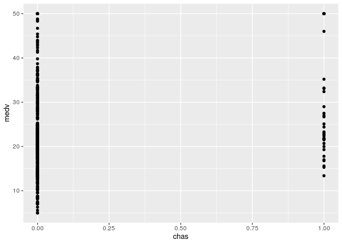
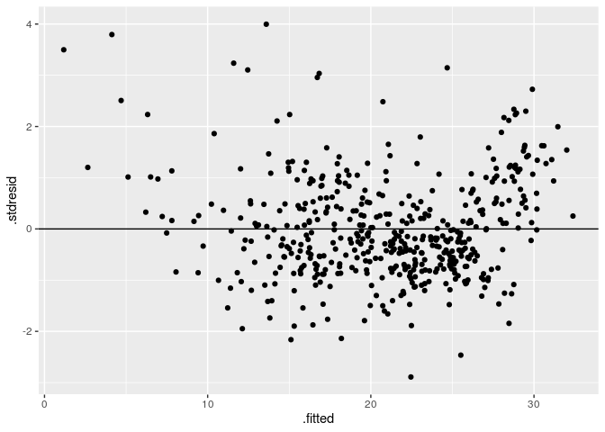

# Intro


This data frame contains the following columns:

* `crim`- per capita crime rate by town.
* `zn`- proportion of residential land zoned for lots over 25,000 sq.ft.
* `indus` - proportion of non-retail business acres per town.
* `chas` - Charles River dummy variable (= 1 if tract bounds river; 0 otherwise).
* `nox` - nitrogen oxides concentration (parts per 10 million).
* `rm` - average number of rooms per dwelling.
* `age` - proportion of owner-occupied units built prior to 1940.
* `dis` - weighted mean of distances to five Boston employment centres.
* `rad` - index of accessibility to radial highways.
* `tax` - full-value property-tax rate per \$10,000.
* `ptratio` - pupil-teacher ratio by town.
* `black` - 1000(Bk - 0.63)^2 where Bk is the proportion of blacks by town.
* `lstat` - lower status of the population (percent).
* `medv` - median value of owner-occupied homes in \$1000s.

# Explore variables

Here we see at our data metrics and try to understand, what they are

```r
str(data) # structure of dataset
```

```
## 'data.frame':	506 obs. of  14 variables:
##  $ crim   : num  0.00632 0.02731 0.02729 0.03237 0.06905 ...
##  $ zn     : num  18 0 0 0 0 0 12.5 12.5 12.5 12.5 ...
##  $ indus  : num  2.31 7.07 7.07 2.18 2.18 2.18 7.87 7.87 7.87 7.87 ...
##  $ chas   : int  0 0 0 0 0 0 0 0 0 0 ...
##  $ nox    : num  0.538 0.469 0.469 0.458 0.458 0.458 0.524 0.524 0.524 0.524 ...
##  $ rm     : num  6.58 6.42 7.18 7 7.15 ...
##  $ age    : num  65.2 78.9 61.1 45.8 54.2 58.7 66.6 96.1 100 85.9 ...
##  $ dis    : num  4.09 4.97 4.97 6.06 6.06 ...
##  $ rad    : int  1 2 2 3 3 3 5 5 5 5 ...
##  $ tax    : num  296 242 242 222 222 222 311 311 311 311 ...
##  $ ptratio: num  15.3 17.8 17.8 18.7 18.7 18.7 15.2 15.2 15.2 15.2 ...
##  $ black  : num  397 397 393 395 397 ...
##  $ lstat  : num  4.98 9.14 4.03 2.94 5.33 ...
##  $ medv   : num  24 21.6 34.7 33.4 36.2 28.7 22.9 27.1 16.5 18.9 ...
```

```r
sum(is.na(data)) # are there any NAs?
```

```
## [1] 0
```

Explore correlation in our data:


```r
corrplot(cor(data), method = "number", type = "lower", tl.col = 'black', number.cex=0.5)
```

<!-- -->


# Main part: linear model

So, we definetely know that `chas` is factor variable - let use it in a model as a factor. Also we have `rad` and there situation is more complex: if we transform it into factor, we will have this levels:


```r
levels(as.factor(data$rad))
```

```
## [1] "1"  "2"  "3"  "4"  "5"  "6"  "7"  "8"  "24"
```
24 looks like outlier, but the distribution is quite strange: there is high amount of data with rad = 24.
 

```r
histogram(Boston$rad)
```

<!-- -->
 
I think, now we will save it as a plain data, not as a factor, and will work with it in an Additional part

## Standartization of predictors, full linear model

Here we standartise all our variables (except that, what we believe is a factor and our data for prediction), calculate linear model for all predictors and see at summary of a model


```r
norm.data <- data %>% mutate_each_(list(~scale(.) %>% as.vector), vars=vars(-c("medv", "chas")))
norm.data$chas <- as.factor(norm.data$chas)

standartised.model <- lm(medv ~ ., norm.data)
summary(standartised.model)
```

```
## 
## Call:
## lm(formula = medv ~ ., data = norm.data)
## 
## Residuals:
##     Min      1Q  Median      3Q     Max 
## -15.595  -2.730  -0.518   1.777  26.199 
## 
## Coefficients:
##             Estimate Std. Error t value Pr(>|t|)    
## (Intercept) 22.34697    0.21921 101.943  < 2e-16 ***
## crim        -0.92906    0.28269  -3.287 0.001087 ** 
## zn           1.08264    0.32016   3.382 0.000778 ***
## indus        0.14104    0.42188   0.334 0.738288    
## chas1        2.68673    0.86158   3.118 0.001925 ** 
## nox         -2.05875    0.44262  -4.651 4.25e-06 ***
## rm           2.67688    0.29364   9.116  < 2e-16 ***
## age          0.01949    0.37184   0.052 0.958229    
## dis         -3.10712    0.41999  -7.398 6.01e-13 ***
## rad          2.66485    0.57770   4.613 5.07e-06 ***
## tax         -2.07884    0.63379  -3.280 0.001112 ** 
## ptratio     -2.06265    0.28323  -7.283 1.31e-12 ***
## black        0.85011    0.24521   3.467 0.000573 ***
## lstat       -3.74733    0.36216 -10.347  < 2e-16 ***
## ---
## Signif. codes:  0 '***' 0.001 '**' 0.01 '*' 0.05 '.' 0.1 ' ' 1
## 
## Residual standard error: 4.745 on 492 degrees of freedom
## Multiple R-squared:  0.7406,	Adjusted R-squared:  0.7338 
## F-statistic: 108.1 on 13 and 492 DF,  p-value: < 2.2e-16
```

Ok, two variables, `indus` and `age` are not significant. Remove them (and fortify data in this step)


```r
standartised.model.2 <- update(standartised.model, .~. - indus - age)
summary(standartised.model.2)
```

```
## 
## Call:
## lm(formula = medv ~ crim + zn + chas + nox + rm + dis + rad + 
##     tax + ptratio + black + lstat, data = norm.data)
## 
## Residuals:
##      Min       1Q   Median       3Q      Max 
## -15.5984  -2.7386  -0.5046   1.7273  26.2373 
## 
## Coefficients:
##             Estimate Std. Error t value Pr(>|t|)    
## (Intercept)  22.3448     0.2187 102.178  < 2e-16 ***
## crim         -0.9325     0.2820  -3.307 0.001010 ** 
## zn            1.0692     0.3154   3.390 0.000754 ***
## chas1         2.7187     0.8542   3.183 0.001551 ** 
## nox          -2.0135     0.4097  -4.915 1.21e-06 ***
## rm            2.6711     0.2855   9.356  < 2e-16 ***
## dis          -3.1432     0.3911  -8.037 6.84e-15 ***
## rad           2.6088     0.5521   4.726 3.00e-06 ***
## tax          -1.9850     0.5684  -3.493 0.000521 ***
## ptratio      -2.0492     0.2794  -7.334 9.24e-13 ***
## black         0.8482     0.2441   3.475 0.000557 ***
## lstat        -3.7316     0.3387 -11.019  < 2e-16 ***
## ---
## Signif. codes:  0 '***' 0.001 '**' 0.01 '*' 0.05 '.' 0.1 ' ' 1
## 
## Residual standard error: 4.736 on 494 degrees of freedom
## Multiple R-squared:  0.7406,	Adjusted R-squared:  0.7348 
## F-statistic: 128.2 on 11 and 494 DF,  p-value: < 2.2e-16
```

```r
model <- fortify(standartised.model.2)
```

Ok, here is our model. Adjusted R-squared is 0,734 and p-value is less of threshold, so we can start to analyse it

## Diagnostic of linear model

### Linearity check


```r
ggplot(data = model, aes(x = .fitted, y = .stdresid)) + 
  geom_point() + 
  geom_hline(yintercept = 0) +
  geom_hline(yintercept = 2, color = "red") +
  geom_hline(yintercept = -2, color = "red")
```

<!-- -->

Our correspondense is close, but not linear. Perhaps, we should use better model :/

### Significant values (Cook's distance)


```r
ggplot(model, aes(x = 1:nrow(model), y = .cooksd)) + 
  geom_bar(stat = "identity") + 
  geom_hline(yintercept = 2, color = "red")
```

<!-- -->

All is good. No heavy observations.

## Independence of predictors


```r
predictors.from.model <- c("crim","zn","chas","nox","rm","dis","rad","tax","ptratio","black","lstat")

draw_residual <- function(column){
  ggplot(data = model, aes(x = data[,column], y = .stdresid)) + 
  geom_point() +  geom_smooth(method = "lm") + labs(x = column)
}

lapply(predictors.from.model, draw_residual)
```

```
## [[1]]
```

<!-- -->

```
## 
## [[2]]
```

<!-- -->

```
## 
## [[3]]
```

<!-- -->

```
## 
## [[4]]
```

<!-- -->

```
## 
## [[5]]
```

<!-- -->

```
## 
## [[6]]
```

<!-- -->

```
## 
## [[7]]
```

<!-- -->

```
## 
## [[8]]
```

<!-- -->

```
## 
## [[9]]
```

<!-- -->

```
## 
## [[10]]
```

<!-- -->

```
## 
## [[11]]
```

<!-- -->

Everything looks good

## Normality check and dispersion of residuals


```r
qqPlot(model$.fitted)
```

<!-- -->

```
## [1] 415 284
```

```r
ggplot(data = model, aes(x = .fitted, y = .stdresid)) + 
  geom_point() + 
  geom_hline(yintercept = 0)
```

<!-- -->

Fine - expected values are normal. But dispersion distribution have troubles.

## Draw expected price

maximum influence is in `lstat` variable, so, draw a graph of predictted price from percent lower status of the population


```r
expect.dataset <- norm.data
expect.dataset <- expect.dataset %>% mutate_at(.vars=c("crim","zn","nox","rm","dis","rad","tax","ptratio","black"), .funs = mean) %>% mutate(chas = as.factor(0))

Predictions <- predict(standartised.model.2, newdata = expect.dataset,  interval = 'confidence')
expect.dataset <- data.frame(expect.dataset, Predictions)


ggplot(expect.dataset, aes(x = lstat, y = fit)) +
  geom_ribbon(alpha = 0.2, aes(ymin = lwr, ymax = upr)) +
  geom_line() + 
  ggtitle("Multiple linear model: M(lstat)")
```

<!-- -->

# Additional part: free explore

Here we will try to find optimal model for our data. 

## Explore and modify data

First of all, explore our data again:


```r
full.predictors <- c("crim","zn","chas","nox","rm","dis","rad","tax","ptratio","black","lstat", "indus", "age")

draw_correlation <- function(column){
  ggplot(data = data, aes(x = data[,column], y = medv)) + 
  geom_point() + labs(x = column)
}

lapply(full.predictors, draw_correlation)
```

```
## [[1]]
```

<!-- -->

```
## 
## [[2]]
```

<!-- -->

```
## 
## [[3]]
```

<!-- -->

```
## 
## [[4]]
```

<!-- -->

```
## 
## [[5]]
```

<!-- -->

```
## 
## [[6]]
```

<!-- -->

```
## 
## [[7]]
```

<!-- -->

```
## 
## [[8]]
```

<!-- -->

```
## 
## [[9]]
```

<!-- -->

```
## 
## [[10]]
```

<!-- -->

```
## 
## [[11]]
```

<!-- -->

```
## 
## [[12]]
```

<!-- -->

```
## 
## [[13]]
```

<!-- -->

What we should do:

* take log from `crime`
* take 1/x from `dis`
* group `rad` to two-level factor
* `black` looks strange - why it is so complex? Squared variable from average in formula makes me cry: is it a black hood, or block of white collars - digits are same. It also do not show more, than a traces of correlation - I think, in this form it's sensless data, and I'll remove it entirely


```r
data$crim.log <- log(data$crim)
draw_correlation('crim.log')
```

<!-- -->

```r
data$dis.rev <- 1/data$dis
draw_correlation('dis.rev')
```

<!-- -->

```r
data$rad.lev <- data$rad
data$rad.lev[data$rad.lev > 20] <- 24
data$rad.lev[data$rad.lev < 20] <- 4
data$rad.lev <- as.factor(data$rad.lev)
draw_correlation('rad.lev')
```

<!-- -->

```r
data$chas <- as.factor(data$chas)
```

So, our predictors are: `crim.log`,`zn`,`chas`(factor),`nox`,`rm`,`dis.rev`,`rad.lev`(factor),`tax`,`ptratio`, `lstat`, `indus` and `age`


## Create a model


```r
free.model <- lm(medv ~ crim.log + zn + chas + nox + rm + dis.rev + rad.lev + tax + ptratio + lstat + indus + age, data)
summary(free.model)
```

```
## 
## Call:
## lm(formula = medv ~ crim.log + zn + chas + nox + rm + dis.rev + 
##     rad.lev + tax + ptratio + lstat + indus + age, data = data)
## 
## Residuals:
##      Min       1Q   Median       3Q      Max 
## -16.0088  -2.5365  -0.4087   2.1931  22.7534 
## 
## Coefficients:
##               Estimate Std. Error t value Pr(>|t|)    
## (Intercept)  30.393083   4.719945   6.439 2.85e-10 ***
## crim.log      0.142859   0.256524   0.557 0.577845    
## zn            0.002314   0.012823   0.180 0.856869    
## chas1         3.132862   0.843223   3.715 0.000226 ***
## nox         -24.071362   3.947227  -6.098 2.17e-09 ***
## rm            4.190225   0.404459  10.360  < 2e-16 ***
## dis.rev      22.985760   2.356469   9.754  < 2e-16 ***
## rad.lev24     3.039983   1.365832   2.226 0.026483 *  
## tax          -0.012594   0.003574  -3.524 0.000465 ***
## ptratio      -0.858682   0.130839  -6.563 1.34e-10 ***
## lstat        -0.617026   0.049226 -12.534  < 2e-16 ***
## indus        -0.039839   0.059501  -0.670 0.503455    
## age          -0.008341   0.013035  -0.640 0.522526    
## ---
## Signif. codes:  0 '***' 0.001 '**' 0.01 '*' 0.05 '.' 0.1 ' ' 1
## 
## Residual standard error: 4.668 on 493 degrees of freedom
## Multiple R-squared:  0.7485,	Adjusted R-squared:  0.7424 
## F-statistic: 122.3 on 12 and 493 DF,  p-value: < 2.2e-16
```

Compare with same for normalised data


```r
n.data <- data %>% mutate_each_(list(~scale(.) %>% as.vector), vars=vars(-c("medv", "chas", "rad.lev")))
free.nmodel <- lm(medv ~ crim.log + zn + chas + nox + rm + dis.rev + rad.lev + tax + ptratio + lstat + indus + age, n.data)
summary(free.nmodel)
```

```
## 
## Call:
## lm(formula = medv ~ crim.log + zn + chas + nox + rm + dis.rev + 
##     rad.lev + tax + ptratio + lstat + indus + age, data = n.data)
## 
## Residuals:
##      Min       1Q   Median       3Q      Max 
## -16.0088  -2.5365  -0.4087   2.1931  22.7534 
## 
## Coefficients:
##             Estimate Std. Error t value Pr(>|t|)    
## (Intercept) 21.52307    0.41373  52.022  < 2e-16 ***
## crim.log     0.30887    0.55462   0.557 0.577845    
## zn           0.05397    0.29908   0.180 0.856869    
## chas1        3.13286    0.84322   3.715 0.000226 ***
## nox         -2.78933    0.45740  -6.098 2.17e-09 ***
## rm           2.94412    0.28418  10.360  < 2e-16 ***
## dis.rev      4.12575    0.42297   9.754  < 2e-16 ***
## rad.lev24    3.03998    1.36583   2.226 0.026483 *  
## tax         -2.12263    0.60238  -3.524 0.000465 ***
## ptratio     -1.85900    0.28326  -6.563 1.34e-10 ***
## lstat       -4.40622    0.35153 -12.534  < 2e-16 ***
## indus       -0.27331    0.40820  -0.670 0.503455    
## age         -0.23479    0.36691  -0.640 0.522526    
## ---
## Signif. codes:  0 '***' 0.001 '**' 0.01 '*' 0.05 '.' 0.1 ' ' 1
## 
## Residual standard error: 4.668 on 493 degrees of freedom
## Multiple R-squared:  0.7485,	Adjusted R-squared:  0.7424 
## F-statistic: 122.3 on 12 and 493 DF,  p-value: < 2.2e-16
```

All the same, so, in a name of Ockham, we will use non-normalised data. Remove non-significant:


```r
free.model <- lm(medv ~ chas + nox + rm + dis.rev + tax + ptratio + lstat + rad.lev + chas, data)
summary(free.model)
```

```
## 
## Call:
## lm(formula = medv ~ chas + nox + rm + dis.rev + tax + ptratio + 
##     lstat + rad.lev + chas, data = data)
## 
## Residuals:
##      Min       1Q   Median       3Q      Max 
## -15.9999  -2.6462  -0.4694   2.2108  22.5553 
## 
## Coefficients:
##               Estimate Std. Error t value Pr(>|t|)    
## (Intercept)  31.178287   4.215230   7.397 5.99e-13 ***
## chas1         3.048610   0.835427   3.649 0.000291 ***
## nox         -25.019363   3.444863  -7.263 1.47e-12 ***
## rm            4.165703   0.388831  10.713  < 2e-16 ***
## dis.rev      22.272025   2.146023  10.378  < 2e-16 ***
## tax          -0.013225   0.003256  -4.061 5.67e-05 ***
## ptratio      -0.900220   0.118053  -7.626 1.24e-13 ***
## lstat        -0.624050   0.045827 -13.618  < 2e-16 ***
## rad.lev24     3.662066   1.168769   3.133 0.001831 ** 
## ---
## Signif. codes:  0 '***' 0.001 '**' 0.01 '*' 0.05 '.' 0.1 ' ' 1
## 
## Residual standard error: 4.655 on 497 degrees of freedom
## Multiple R-squared:  0.7479,	Adjusted R-squared:  0.7439 
## F-statistic: 184.3 on 8 and 497 DF,  p-value: < 2.2e-16
```

Adjusted R is better after removing of predictors, so, we do right things!

## Multicollinear check

We will drop one-by one most collinear predictors and see ar R-squared of model - if it drops, it would be a sign no think twice about predictor


```r
vif(free.model)
```

```
##     chas      nox       rm  dis.rev      tax  ptratio    lstat  rad.lev 
## 1.049480 3.714101 1.739677 3.458338 7.020185 1.522497 2.496184 6.151364
```

```r
free.model <- update(free.model, .~. - rad.lev)
summary(free.model)$adj.r.squared
```

```
## [1] 0.7393239
```

```r
vif(free.model)
```

```
##     chas      nox       rm  dis.rev      tax  ptratio    lstat 
## 1.047944 3.709493 1.688255 3.455647 2.431617 1.461552 2.485637
```

```r
free.model <- update(free.model, .~. - nox)
summary(free.model)$adj.r.squared
```

```
## [1] 0.7135542
```

```r
vif(free.model)
```

```
##     chas       rm  dis.rev      tax  ptratio    lstat 
## 1.039102 1.688060 2.136932 2.189340 1.417652 2.415405
```

```r
free.model <- update(free.model, .~. - lstat)
summary(free.model)$adj.r.squared
```

```
## [1] 0.601055
```

Oops - `lstat` we should save. Try another one:


```r
free.model <- update(free.model, .~. + lstat)
summary(free.model)$adj.r.squared
```

```
## [1] 0.7135542
```

```r
free.model <- update(free.model, .~. - tax)
summary(free.model)$adj.r.squared
```

```
## [1] 0.7007131
```

```r
vif(free.model)
```

```
##     chas       rm  dis.rev  ptratio    lstat 
## 1.036411 1.673553 1.583874 1.210931 2.344895
```

Ok, `lstat` is significant for us and not critical by VIF, so, our potential model is


```r
summary(free.model)
```

```
## 
## Call:
## lm(formula = medv ~ chas + rm + dis.rev + ptratio + lstat, data = data)
## 
## Residuals:
##      Min       1Q   Median       3Q      Max 
## -18.8710  -2.9889  -0.4036   2.1774  24.8447 
## 
## Coefficients:
##             Estimate Std. Error t value Pr(>|t|)    
## (Intercept) 18.60637    3.76781   4.938 1.08e-06 ***
## chas1        2.81640    0.89741   3.138   0.0018 ** 
## rm           4.22297    0.41224  10.244  < 2e-16 ***
## dis.rev      8.20877    1.56988   5.229 2.51e-07 ***
## ptratio     -0.90534    0.11381  -7.955 1.20e-14 ***
## lstat       -0.70914    0.04801 -14.770  < 2e-16 ***
## ---
## Signif. codes:  0 '***' 0.001 '**' 0.01 '*' 0.05 '.' 0.1 ' ' 1
## 
## Residual standard error: 5.031 on 500 degrees of freedom
## Multiple R-squared:  0.7037,	Adjusted R-squared:  0.7007 
## F-statistic: 237.5 on 5 and 500 DF,  p-value: < 2.2e-16
```

```r
free.model.f <- fortify(free.model)
```

## Diagnostic of free linear model

### Linearity check


```r
ggplot(data = free.model.f, aes(x = .fitted, y = .stdresid)) + 
  geom_point() + 
  geom_hline(yintercept = 0) +
  geom_hline(yintercept = 2, color = "red") +
  geom_hline(yintercept = -2, color = "red")
```

<!-- -->

Same pattern - our best model isn`t better in this case :/

### Significant values (Cook's distance)


```r
ggplot(free.model.f, aes(x = 1:nrow(free.model.f), y = .cooksd)) + 
  geom_bar(stat = "identity") + 
  geom_hline(yintercept = 2, color = "red")
```

<!-- -->

All is good.

## Independence of predictors


```r
predictors.from.model <- c("chas", "rm", "dis.rev", "ptratio", "lstat")

draw_residual <- function(column){
  ggplot(data = free.model.f, aes(x = free.model.f[,column], y = .stdresid)) + 
  geom_point() +  geom_smooth(method = "lm") + labs(x = column)
}

lapply(predictors.from.model, draw_residual)
```

```
## [[1]]
```

<!-- -->

```
## 
## [[2]]
```

<!-- -->

```
## 
## [[3]]
```

<!-- -->

```
## 
## [[4]]
```

<!-- -->

```
## 
## [[5]]
```

<!-- -->

Fine

## Normality check and dispersion of residuals


```r
qqPlot(free.model.f$.fitted)
```

<!-- -->

```
## [1] 375 415
```

```r
ggplot(data = free.model.f, aes(x = .fitted, y = .stdresid)) + 
  geom_point() + 
  geom_hline(yintercept = 0)
```

<!-- -->

Expected values are normal. But dispersion distribution still have troubles.

# Short run along the price

What exactly are our prices?


```r
histogram(data$medv)
```

<!-- -->

Perhaps, we should split our dataset to common and expensive houses?


```r
data.common <- data %>% filter(medv <= 40)
data.expensive <- data %>% filter(medv > 40)

histogram(data.common$medv)
```

<!-- -->

```r
nrow(data.common)
```

```
## [1] 475
```

```r
histogram(data.expensive$medv)
```

<!-- -->

```r
nrow(data.expensive)
```

```
## [1] 31
```

Too few data for expensive houses. Let's focuse on common. Rebuild our common model


## Create a model


```r
free.common.model <- lm(medv ~ crim.log + zn + chas + nox + rm + dis.rev + rad.lev + tax + ptratio + lstat + indus + age, data.common)
summary(free.common.model)
```

```
## 
## Call:
## lm(formula = medv ~ crim.log + zn + chas + nox + rm + dis.rev + 
##     rad.lev + tax + ptratio + lstat + indus + age, data = data.common)
## 
## Residuals:
##     Min      1Q  Median      3Q     Max 
## -10.874  -2.374  -0.294   2.038  12.294 
## 
## Coefficients:
##               Estimate Std. Error t value Pr(>|t|)    
## (Intercept)  32.476797   3.730367   8.706  < 2e-16 ***
## crim.log     -0.283124   0.201602  -1.404   0.1609    
## zn           -0.003754   0.010211  -0.368   0.7133    
## chas1         1.604838   0.707336   2.269   0.0237 *  
## nox         -12.208792   3.100874  -3.937 9.51e-05 ***
## rm            2.459102   0.359644   6.838 2.56e-11 ***
## dis.rev      10.343360   1.952689   5.297 1.83e-07 ***
## rad.lev24     3.270609   1.071468   3.052   0.0024 ** 
## tax          -0.011425   0.002737  -4.175 3.57e-05 ***
## ptratio      -0.688726   0.102074  -6.747 4.52e-11 ***
## lstat        -0.454773   0.040336 -11.275  < 2e-16 ***
## indus        -0.053529   0.046497  -1.151   0.2502    
## age          -0.008945   0.010180  -0.879   0.3800    
## ---
## Signif. codes:  0 '***' 0.001 '**' 0.01 '*' 0.05 '.' 0.1 ' ' 1
## 
## Residual standard error: 3.523 on 462 degrees of freedom
## Multiple R-squared:  0.7383,	Adjusted R-squared:  0.7315 
## F-statistic: 108.6 on 12 and 462 DF,  p-value: < 2.2e-16
```

Remove non-significant:


```r
free.common.model <- lm(medv ~ nox + rm + dis.rev + tax + ptratio + lstat + rad.lev, data.common)
summary(free.common.model)
```

```
## 
## Call:
## lm(formula = medv ~ nox + rm + dis.rev + tax + ptratio + lstat + 
##     rad.lev, data = data.common)
## 
## Residuals:
##      Min       1Q   Median       3Q      Max 
## -10.6462  -2.3013  -0.3515   2.0969  12.4824 
## 
## Coefficients:
##               Estimate Std. Error t value Pr(>|t|)    
## (Intercept)  35.001703   3.418192  10.240  < 2e-16 ***
## nox         -14.225984   2.696371  -5.276 2.03e-07 ***
## rm            2.481338   0.346437   7.162 3.10e-12 ***
## dis.rev       8.845003   1.821075   4.857 1.63e-06 ***
## tax          -0.013063   0.002519  -5.185 3.22e-07 ***
## ptratio      -0.736433   0.093262  -7.896 2.07e-14 ***
## lstat        -0.477936   0.037582 -12.717  < 2e-16 ***
## rad.lev24     2.890054   0.911184   3.172  0.00161 ** 
## ---
## Signif. codes:  0 '***' 0.001 '**' 0.01 '*' 0.05 '.' 0.1 ' ' 1
## 
## Residual standard error: 3.538 on 467 degrees of freedom
## Multiple R-squared:  0.7332,	Adjusted R-squared:  0.7292 
## F-statistic: 183.4 on 7 and 467 DF,  p-value: < 2.2e-16
```

## Multicollinear check


```r
vif(free.common.model)
```

```
##      nox       rm  dis.rev      tax  ptratio    lstat  rad.lev 
## 3.782038 1.608760 3.894203 6.866324 1.390128 2.625645 6.172032
```

```r
free.common.model <- update(free.common.model, .~. - rad.lev)
summary(free.common.model)$adj.r.squared
```

```
## [1] 0.7239865
```

```r
vif(free.common.model)
```

```
##      nox       rm  dis.rev      tax  ptratio    lstat 
## 3.767174 1.560356 3.883382 2.351799 1.334751 2.609012
```

```r
free.common.model <- update(free.common.model, .~. - dis.rev)
summary(free.common.model)$adj.r.squared
```

```
## [1] 0.7118414
```

```r
vif(free.common.model)
```

```
##      nox       rm      tax  ptratio    lstat 
## 2.246515 1.560324 2.311249 1.334577 2.397589
```

```r
free.common.model <- update(free.common.model, .~. - nox)
summary(free.common.model)$adj.r.squared
```

```
## [1] 0.7081805
```

```r
vif(free.common.model)
```

```
##       rm      tax  ptratio    lstat 
## 1.560033 1.656168 1.268040 2.102408
```

Our potential model for common buildings is


```r
summary(free.common.model)
```

```
## 
## Call:
## lm(formula = medv ~ rm + tax + ptratio + lstat, data = data.common)
## 
## Residuals:
##      Min       1Q   Median       3Q      Max 
## -10.5561  -2.5523  -0.6564   1.9347  13.9076 
## 
## Coefficients:
##              Estimate Std. Error t value Pr(>|t|)    
## (Intercept) 25.080695   2.979069   8.419 4.63e-16 ***
## rm           2.691814   0.354161   7.601 1.61e-13 ***
## tax         -0.007794   0.001284  -6.068 2.67e-09 ***
## ptratio     -0.626729   0.092470  -6.778 3.67e-11 ***
## lstat       -0.452687   0.034912 -12.967  < 2e-16 ***
## ---
## Signif. codes:  0 '***' 0.001 '**' 0.01 '*' 0.05 '.' 0.1 ' ' 1
## 
## Residual standard error: 3.673 on 470 degrees of freedom
## Multiple R-squared:  0.7106,	Adjusted R-squared:  0.7082 
## F-statistic: 288.6 on 4 and 470 DF,  p-value: < 2.2e-16
```

```r
free.common.model.f <- fortify(free.common.model)
```

### Linearity check


```r
ggplot(data = free.common.model.f, aes(x = .fitted, y = .stdresid)) + 
  geom_point() + 
  geom_hline(yintercept = 0) +
  geom_hline(yintercept = 2, color = "red") +
  geom_hline(yintercept = -2, color = "red")
```

<!-- -->

Actually, the same troubles :(

### Significant values (Cook's distance)


```r
ggplot(free.common.model.f, aes(x = 1:nrow(free.common.model.f), y = .cooksd)) + 
  geom_bar(stat = "identity") + 
  geom_hline(yintercept = 2, color = "red")
```

<!-- -->

All is good.

## Independence of predictors


```r
predictors.from.model <- c("tax", "rm", "ptratio", "lstat")

draw_residual <- function(column){
  ggplot(data = free.common.model.f, aes(x = free.common.model.f[,column], y = .stdresid)) + 
  geom_point() +  geom_smooth(method = "lm") + labs(x = column)
}

lapply(predictors.from.model, draw_residual)
```

```
## [[1]]
```

<!-- -->

```
## 
## [[2]]
```

<!-- -->

```
## 
## [[3]]
```

<!-- -->

```
## 
## [[4]]
```

<!-- -->


## Normality check and dispersion of residuals


```r
qqPlot(free.common.model.f$.fitted)
```

<!-- -->

```
## [1] 344 384
```

```r
ggplot(data = free.common.model.f, aes(x = .fitted, y = .stdresid)) + 
  geom_point() + 
  geom_hline(yintercept = 0)
```

<!-- -->

Still not good


# Recommendation for building

So, our models are:


```r
summary(free.model) # "chas", "rm", "dis.rev", "ptratio", "lstat"
```

```
## 
## Call:
## lm(formula = medv ~ chas + rm + dis.rev + ptratio + lstat, data = data)
## 
## Residuals:
##      Min       1Q   Median       3Q      Max 
## -18.8710  -2.9889  -0.4036   2.1774  24.8447 
## 
## Coefficients:
##             Estimate Std. Error t value Pr(>|t|)    
## (Intercept) 18.60637    3.76781   4.938 1.08e-06 ***
## chas1        2.81640    0.89741   3.138   0.0018 ** 
## rm           4.22297    0.41224  10.244  < 2e-16 ***
## dis.rev      8.20877    1.56988   5.229 2.51e-07 ***
## ptratio     -0.90534    0.11381  -7.955 1.20e-14 ***
## lstat       -0.70914    0.04801 -14.770  < 2e-16 ***
## ---
## Signif. codes:  0 '***' 0.001 '**' 0.01 '*' 0.05 '.' 0.1 ' ' 1
## 
## Residual standard error: 5.031 on 500 degrees of freedom
## Multiple R-squared:  0.7037,	Adjusted R-squared:  0.7007 
## F-statistic: 237.5 on 5 and 500 DF,  p-value: < 2.2e-16
```

```r
summary(free.common.model) # "tax", "rm", "ptratio", "lstat"
```

```
## 
## Call:
## lm(formula = medv ~ rm + tax + ptratio + lstat, data = data.common)
## 
## Residuals:
##      Min       1Q   Median       3Q      Max 
## -10.5561  -2.5523  -0.6564   1.9347  13.9076 
## 
## Coefficients:
##              Estimate Std. Error t value Pr(>|t|)    
## (Intercept) 25.080695   2.979069   8.419 4.63e-16 ***
## rm           2.691814   0.354161   7.601 1.61e-13 ***
## tax         -0.007794   0.001284  -6.068 2.67e-09 ***
## ptratio     -0.626729   0.092470  -6.778 3.67e-11 ***
## lstat       -0.452687   0.034912 -12.967  < 2e-16 ***
## ---
## Signif. codes:  0 '***' 0.001 '**' 0.01 '*' 0.05 '.' 0.1 ' ' 1
## 
## Residual standard error: 3.673 on 470 degrees of freedom
## Multiple R-squared:  0.7106,	Adjusted R-squared:  0.7082 
## F-statistic: 288.6 on 4 and 470 DF,  p-value: < 2.2e-16
```

Actualy, both models have `rm`, `ptratio` and `lstat`. Both have same adj-Rsq, and both, as we saw, fail dispersion distribution test. So, both of them isn't really good. But, if we believe in them...

## Building recomendation

If you want to build just a house, there is recomendations:

* build house near the river - it's better (`chas`)
* make more rooms per person (so unexpected) (`rm`)
* build it near employment center(`dis.rev`)
* find a place with maximum amount of teachers per pupil (`ptratio`)
* find place with lowest percent of lower-status sitizens (`lstat`)

## Common building recommendation

If you want to build a regular (not expensive) house, there is another cases:

* build in a location with lower property-tax rate (`tax`)
* make more rooms per person (`rm`)
* find a place with maximum amount of teachers per pupil (`ptratio`)
* find place with lowest percent of lower-status sitizens (`lstat`)

