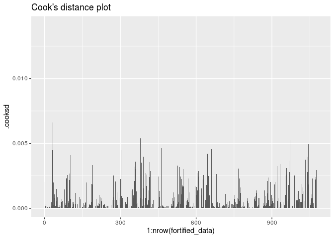
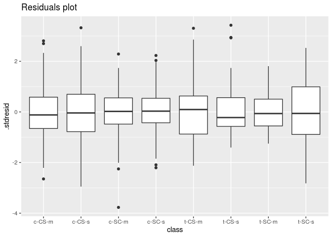
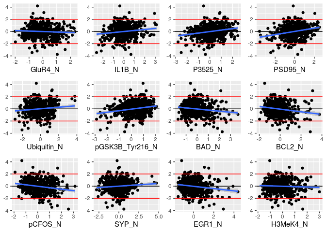
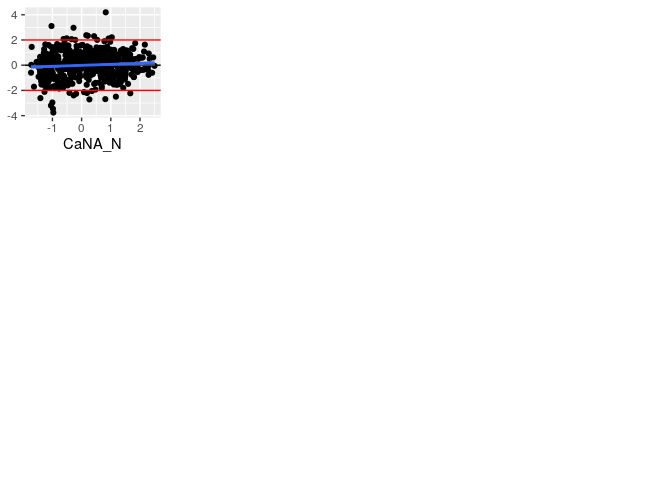

# Libraries, load data

Load requred libraries, load data and move factor columns ahead. 


```r
library(readxl)
library(tidyverse)
library(car)
library(Hmisc)
library(multcomp)
library(gridExtra)
library(vegan)
library(ggpubr)
library(plotly)
library(DESeq2)


setwd('/home/alexey/BI/R/Project_3/')
download.file(url='https://archive.ics.uci.edu/ml/machine-learning-databases/00342/Data_Cortex_Nuclear.xls',
              destfile='Data_Cortex_Nuclear.xls')
data <- read_xls('Data_Cortex_Nuclear.xls')

# Factors first
data <- data %>% 
  relocate(where(is.numeric), .after = where(is.character)) %>% 
  mutate(across(where(is.character), as.factor))

data[1:10,1:10]
```

```
## # A tibble: 10 x 10
##    MouseID Genotype Treatment Behavior class DYRK1A_N ITSN1_N BDNF_N NR1_N
##    <fct>   <fct>    <fct>     <fct>    <fct>    <dbl>   <dbl>  <dbl> <dbl>
##  1 309_1   Control  Memantine C/S      c-CS…    0.504   0.747  0.430  2.82
##  2 309_2   Control  Memantine C/S      c-CS…    0.515   0.689  0.412  2.79
##  3 309_3   Control  Memantine C/S      c-CS…    0.509   0.730  0.418  2.69
##  4 309_4   Control  Memantine C/S      c-CS…    0.442   0.617  0.359  2.47
##  5 309_5   Control  Memantine C/S      c-CS…    0.435   0.617  0.359  2.37
##  6 309_6   Control  Memantine C/S      c-CS…    0.448   0.628  0.367  2.39
##  7 309_7   Control  Memantine C/S      c-CS…    0.428   0.574  0.343  2.33
##  8 309_8   Control  Memantine C/S      c-CS…    0.417   0.564  0.328  2.26
##  9 309_9   Control  Memantine C/S      c-CS…    0.386   0.538  0.318  2.13
## 10 309_10  Control  Memantine C/S      c-CS…    0.381   0.499  0.362  2.10
## # … with 1 more variable: NR2A_N <dbl>
```

---


# Describe dataset

So, what is our data?

* Proteins! Lots of proteins! More precisely, we have 77 different proteins' levels.
* **MouseID** is a uniq ID for every mouse: length is 1080 in 1080 levels. Not really useful for us.
* **Genotype** is a genotype of the mouse. It has 2 levels, "Control" for normal mice (82 mice), and "Ts65Dn" as model line for Down syndrome mice (82 mice)
* **Treatment** is a description of treatment for mice. Also it has 2 levels, "Memantine" (82 mice) and "Saline" (82 mice) treatment
* **Behavior** some mice have been stimulated to learn (context-shock, or "C/S" - 82 mice) and others have not (shock-context, "S/C" - 82 mice)
* **class** is the most interesting column, described three previous groups in one. It combines from three factors: control (c) or trisomy (t); context-shock (CS) or shock-context (SC); memantine (m) or saline (s) treatment. Afterwards we will use it for analysis, so, look at it closely:


```r
res <- merge(data %>% group_by(class) %>% summarise(Total_entries = n(), .groups = "keep"),
             na.omit(data) %>% group_by(class) %>% summarise(Entries_without_NA = n(), .groups = "keep"),
             by = "class")
res$class <- as.character(res$class)

res %>%  rbind(c('All classes', nrow(data), nrow(na.omit(data))))
```

```
##         class Total_entries Entries_without_NA
## 1      c-CS-m           150                 45
## 2      c-CS-s           135                 75
## 3      c-SC-m           150                 60
## 4      c-SC-s           135                 75
## 5      t-CS-m           135                 90
## 6      t-CS-s           105                 75
## 7      t-SC-m           135                 60
## 8      t-SC-s           135                 72
## 9 All classes          1080                552
```

So, roughly half of our data contain one or more NAs in protein levels; every class have from 135 to 150 mice, including 45 to 90 mice without any NA in 77 proteins.

---


# Is there any differences in BDNF_N in different classes

For this question, we should use one-way variance analysis. Filter data from NA and see at our abundances.


```r
aov_data <- data %>% dplyr::select(class, BDNF_N) %>% na.omit
aov_data %>% group_by(class) %>% summarise(n = n(), .groups = "keep")
```

```
## # A tibble: 8 x 2
## # Groups:   class [8]
##   class      n
##   <fct>  <int>
## 1 c-CS-m   150
## 2 c-CS-s   135
## 3 c-SC-m   150
## 4 c-SC-s   135
## 5 t-CS-m   135
## 6 t-CS-s   105
## 7 t-SC-m   135
## 8 t-SC-s   132
```

105 and 150 looks non-equal, but we don't have strict criteria for number of elements, ant it is not more than 1.5 times, so, go ahead with this data.

## AOV


```r
aov_fit <- aov(BDNF_N ~ class, data = aov_data)
summary(aov_fit)
```

```
##               Df Sum Sq Mean Sq F value Pr(>F)    
## class          7 0.2878 0.04112   18.82 <2e-16 ***
## Residuals   1069 2.3362 0.00219                   
## ---
## Signif. codes:  0 '***' 0.001 '**' 0.01 '*' 0.05 '.' 0.1 ' ' 1
```

Also check, can we use variance analysis at all. Check normality of residues and Cook's distance


```r
fortified_data <- fortify(aov_fit)

ggplot(fortified_data, aes(x = 1:nrow(fortified_data), y = .cooksd)) + geom_bar(stat = "identity") + ggtitle("Cook's distance plot")
```

<!-- -->

```r
ggplot(fortified_data, aes(x = class, y = .stdresid)) + geom_boxplot() + ggtitle("Residuals plot")
```

<!-- -->

```r
qqPlot(aov_fit, id = FALSE, main = "Residuals plot")
```

<!-- -->

Ok, Cook's distance is lower, than 0.015 (we havn't outliers), and residuals distributed normally. We can use aov.

## Post-hoc tests

Ok, there is significant difference in BDNF_N level in different classes. In which pairs exactly they are? Perform post-hoc tests:


```r
post_hoch <- glht(aov_fit, linfct = mcp(class = "Tukey"))
summary(post_hoch)
```

```
## Warning in RET$pfunction("adjusted", ...): Completion with error > abseps

## Warning in RET$pfunction("adjusted", ...): Completion with error > abseps
```

```
## 
## 	 Simultaneous Tests for General Linear Hypotheses
## 
## Multiple Comparisons of Means: Tukey Contrasts
## 
## 
## Fit: aov(formula = BDNF_N ~ class, data = aov_data)
## 
## Linear Hypotheses:
##                        Estimate Std. Error t value Pr(>|t|)    
## c-CS-s - c-CS-m == 0  0.0030979  0.0055459   0.559  0.99930    
## c-SC-m - c-CS-m == 0 -0.0482717  0.0053980  -8.942  < 0.001 ***
## c-SC-s - c-CS-m == 0 -0.0258249  0.0055459  -4.657  < 0.001 ***
## t-CS-m - c-CS-m == 0 -0.0264852  0.0055459  -4.776  < 0.001 ***
## t-CS-s - c-CS-m == 0 -0.0337570  0.0059483  -5.675  < 0.001 ***
## t-SC-m - c-CS-m == 0 -0.0181541  0.0055459  -3.273  0.02420 *  
## t-SC-s - c-CS-m == 0 -0.0136310  0.0055790  -2.443  0.22105    
## c-SC-m - c-CS-s == 0 -0.0513696  0.0055459  -9.263  < 0.001 ***
## c-SC-s - c-CS-s == 0 -0.0289228  0.0056900  -5.083  < 0.001 ***
## t-CS-m - c-CS-s == 0 -0.0295831  0.0056900  -5.199  < 0.001 ***
## t-CS-s - c-CS-s == 0 -0.0368549  0.0060829  -6.059  < 0.001 ***
## t-SC-m - c-CS-s == 0 -0.0212520  0.0056900  -3.735  0.00486 ** 
## t-SC-s - c-CS-s == 0 -0.0167289  0.0057223  -2.923  0.06872 .  
## c-SC-s - c-SC-m == 0  0.0224468  0.0055459   4.047  0.00147 ** 
## t-CS-m - c-SC-m == 0  0.0217865  0.0055459   3.928  0.00222 ** 
## t-CS-s - c-SC-m == 0  0.0145147  0.0059483   2.440  0.22245    
## t-SC-m - c-SC-m == 0  0.0301176  0.0055459   5.431  < 0.001 ***
## t-SC-s - c-SC-m == 0  0.0346406  0.0055790   6.209  < 0.001 ***
## t-CS-m - c-SC-s == 0 -0.0006603  0.0056900  -0.116  1.00000    
## t-CS-s - c-SC-s == 0 -0.0079321  0.0060829  -1.304  0.89721    
## t-SC-m - c-SC-s == 0  0.0076708  0.0056900   1.348  0.87975    
## t-SC-s - c-SC-s == 0  0.0121939  0.0057223   2.131  0.39481    
## t-CS-s - t-CS-m == 0 -0.0072718  0.0060829  -1.195  0.93310    
## t-SC-m - t-CS-m == 0  0.0083311  0.0056900   1.464  0.82588    
## t-SC-s - t-CS-m == 0  0.0128542  0.0057223   2.246  0.32408    
## t-SC-m - t-CS-s == 0  0.0156029  0.0060829   2.565  0.17016    
## t-SC-s - t-CS-s == 0  0.0201260  0.0061130   3.292  0.02269 *  
## t-SC-s - t-SC-m == 0  0.0045231  0.0057223   0.790  0.99360    
## ---
## Signif. codes:  0 '***' 0.001 '**' 0.01 '*' 0.05 '.' 0.1 ' ' 1
## (Adjusted p values reported -- single-step method)
```

## Plot

And sure, draw the plot


```r
ggplot(aov_data, aes(x = class, y = BDNF_N)) + geom_boxplot() + theme(axis.title.x=element_blank())
```

<!-- -->

---


# Make linear model for ERBB4_N according other proteins

Make full model for all proteins in dataset. Remove all NA-values, and make standartisation.


```r
proteins <- data %>% keep(is.numeric)
proteins_scale <- as.data.frame(sapply(proteins, scale)) %>% na.omit()
formula <- as.formula(ERBB4_N ~ .)
fit <- lm(formula, data = proteins_scale)
summary(fit)
```

```
## 
## Call:
## lm(formula = formula, data = proteins_scale)
## 
## Residuals:
##     Min      1Q  Median      3Q     Max 
## -1.5286 -0.2236 -0.0084  0.2038  2.1204 
## 
## Coefficients: (1 not defined because of singularities)
##                  Estimate Std. Error t value Pr(>|t|)    
## (Intercept)     -0.018686   0.030373  -0.615 0.538703    
## DYRK1A_N        -0.112916   0.123677  -0.913 0.361710    
## ITSN1_N          0.135706   0.176665   0.768 0.442776    
## BDNF_N           0.125598   0.062889   1.997 0.046378 *  
## NR1_N           -0.324746   0.154046  -2.108 0.035544 *  
## NR2A_N          -0.006494   0.084269  -0.077 0.938610    
## pAKT_N           0.219939   0.084104   2.615 0.009203 ** 
## pBRAF_N         -0.073621   0.055001  -1.339 0.181356    
## pCAMKII_N       -0.001247   0.068353  -0.018 0.985451    
## pCREB_N         -0.130058   0.062926  -2.067 0.039290 *  
## pELK_N           0.001466   0.031915   0.046 0.963391    
## pERK_N          -0.455159   0.180720  -2.519 0.012109 *  
## pJNK_N          -0.208138   0.087537  -2.378 0.017814 *  
## PKCA_N           0.029035   0.094839   0.306 0.759625    
## pMEK_N           0.026029   0.082902   0.314 0.753676    
## pNR1_N          -0.200848   0.104398  -1.924 0.054968 .  
## pNR2A_N          0.125305   0.090307   1.388 0.165927    
## pNR2B_N          0.346375   0.119623   2.896 0.003959 ** 
## pPKCAB_N         0.183064   0.088648   2.065 0.039457 *  
## pRSK_N           0.044267   0.063137   0.701 0.483573    
## AKT_N           -0.005697   0.069193  -0.082 0.934413    
## BRAF_N           0.222600   0.174199   1.278 0.201926    
## CAMKII_N        -0.011911   0.069865  -0.170 0.864700    
## CREB_N          -0.025378   0.054087  -0.469 0.639135    
## ELK_N            0.078202   0.082869   0.944 0.345811    
## ERK_N            0.202047   0.121582   1.662 0.097208 .  
## GSK3B_N         -0.094835   0.110826  -0.856 0.392588    
## JNK_N           -0.026715   0.075987  -0.352 0.725317    
## MEK_N            0.023943   0.059893   0.400 0.689510    
## TRKA_N           0.045878   0.131966   0.348 0.728257    
## RSK_N           -0.042932   0.073088  -0.587 0.557214    
## APP_N           -0.021694   0.074076  -0.293 0.769751    
## Bcatenin_N       0.032010   0.153167   0.209 0.834546    
## SOD1_N          -0.116180   0.074190  -1.566 0.118018    
## MTOR_N           0.180821   0.071743   2.520 0.012048 *  
## P38_N           -0.095941   0.079871  -1.201 0.230267    
## pMTOR_N         -0.077431   0.062293  -1.243 0.214475    
## DSCR1_N         -0.045716   0.068264  -0.670 0.503374    
## AMPKA_N          0.104715   0.095270   1.099 0.272263    
## NR2B_N           0.043254   0.053527   0.808 0.419449    
## pNUMB_N         -0.027045   0.083900  -0.322 0.747326    
## RAPTOR_N         0.170702   0.088604   1.927 0.054629 .  
## TIAM1_N         -0.146606   0.087340  -1.679 0.093892 .  
## pP70S6_N         0.028382   0.054994   0.516 0.606022    
## NUMB_N          -0.064220   0.073553  -0.873 0.383042    
## P70S6_N         -0.049965   0.058704  -0.851 0.395118    
## pGSK3B_N         0.165450   0.052053   3.179 0.001577 ** 
## pPKCG_N         -0.293093   0.075289  -3.893 0.000113 ***
## CDK5_N           0.001764   0.024323   0.073 0.942225    
## S6_N             0.142854   0.069736   2.049 0.041059 *  
## ADARB1_N        -0.062631   0.048972  -1.279 0.201557    
## AcetylH3K9_N     0.025985   0.135676   0.192 0.848199    
## RRP1_N          -0.031502   0.021968  -1.434 0.152232    
## BAX_N           -0.162854   0.044251  -3.680 0.000260 ***
## ARC_N            0.159773   0.063924   2.499 0.012775 *  
## nNOS_N          -0.007853   0.047195  -0.166 0.867918    
## Tau_N            0.324281   0.082865   3.913 0.000104 ***
## GFAP_N          -0.041293   0.047418  -0.871 0.384291    
## GluR3_N         -0.016512   0.056395  -0.293 0.769812    
## GluR4_N         -0.125414   0.060173  -2.084 0.037672 *  
## IL1B_N           0.154896   0.058877   2.631 0.008794 ** 
## P3525_N          0.099458   0.048249   2.061 0.039810 *  
## pCASP9_N         0.133665   0.050126   2.667 0.007923 ** 
## PSD95_N          0.401534   0.064325   6.242 9.55e-10 ***
## SNCA_N          -0.018225   0.055822  -0.326 0.744195    
## Ubiquitin_N      0.026834   0.056238   0.477 0.633468    
## pGSK3B_Tyr216_N  0.175747   0.062933   2.793 0.005439 ** 
## SHH_N            0.094333   0.038435   2.454 0.014471 *  
## BAD_N           -0.070404   0.068748  -1.024 0.306311    
## BCL2_N           0.011231   0.056615   0.198 0.842840    
## pS6_N                  NA         NA      NA       NA    
## pCFOS_N         -0.019510   0.049260  -0.396 0.692240    
## SYP_N            0.059670   0.047577   1.254 0.210395    
## H3AcK18_N        0.009463   0.099598   0.095 0.924349    
## EGR1_N          -0.016129   0.070213  -0.230 0.818406    
## H3MeK4_N         0.045206   0.079340   0.570 0.569097    
## CaNA_N          -0.036804   0.071937  -0.512 0.609159    
## ---
## Signif. codes:  0 '***' 0.001 '**' 0.01 '*' 0.05 '.' 0.1 ' ' 1
## 
## Residual standard error: 0.3905 on 476 degrees of freedom
## Multiple R-squared:  0.8641,	Adjusted R-squared:  0.8427 
## F-statistic: 40.37 on 75 and 476 DF,  p-value: < 2.2e-16
```

NAs for pS6_N protein is strange - perhaps, this one aliased by another predictor?


```r
attributes(alias(fit)$Complete)$dimnames[[1]]
```

```
## [1] "pS6_N"
```

```r
apply(proteins_scale, 2, function(col)cor(col, proteins_scale$pS6_N))
```

```
##        DYRK1A_N         ITSN1_N          BDNF_N           NR1_N          NR2A_N 
##    -0.363711184    -0.223362718     0.242241256     0.404419650     0.372721618 
##          pAKT_N         pBRAF_N       pCAMKII_N         pCREB_N          pELK_N 
##     0.434484415     0.355164671     0.475099641     0.440425689    -0.034131024 
##          pERK_N          pJNK_N          PKCA_N          pMEK_N          pNR1_N 
##    -0.388125679     0.484425623     0.033929900     0.490697989     0.447917932 
##         pNR2A_N         pNR2B_N        pPKCAB_N          pRSK_N           AKT_N 
##     0.625902235     0.494241838    -0.300561178     0.008747293     0.624537450 
##          BRAF_N        CAMKII_N          CREB_N           ELK_N           ERK_N 
##    -0.379818814     0.426300117     0.260584566     0.358499140     0.274766842 
##         GSK3B_N           JNK_N           MEK_N          TRKA_N           RSK_N 
##    -0.167603930     0.218392878     0.418963882     0.279564901     0.224140611 
##           APP_N      Bcatenin_N          SOD1_N          MTOR_N           P38_N 
##     0.072285884     0.431648030     0.615216495     0.428779533     0.476743809 
##         pMTOR_N         DSCR1_N         AMPKA_N          NR2B_N         pNUMB_N 
##     0.568276940     0.282901796     0.375464887     0.500962579    -0.059493121 
##        RAPTOR_N         TIAM1_N        pP70S6_N          NUMB_N         P70S6_N 
##     0.328641375     0.296692236    -0.028621124     0.115344538     0.400447005 
##        pGSK3B_N         pPKCG_N          CDK5_N            S6_N        ADARB1_N 
##    -0.100835693    -0.181076929     0.034639173    -0.149459188     0.218258161 
##    AcetylH3K9_N          RRP1_N           BAX_N           ARC_N         ERBB4_N 
##     0.080345273     0.041362658     0.374905849     1.000000000     0.708290886 
##          nNOS_N           Tau_N          GFAP_N         GluR3_N         GluR4_N 
##     0.683079589     0.234490417    -0.085638927     0.182006656     0.243438877 
##          IL1B_N         P3525_N        pCASP9_N         PSD95_N          SNCA_N 
##     0.618194657     0.355734908     0.452368140     0.651626726     0.600497580 
##     Ubiquitin_N pGSK3B_Tyr216_N           SHH_N           BAD_N          BCL2_N 
##     0.705410687     0.044204014     0.383026252    -0.021234815     0.205289439 
##           pS6_N         pCFOS_N           SYP_N       H3AcK18_N          EGR1_N 
##     1.000000000     0.055734370     0.395031542     0.203910599     0.224491255 
##        H3MeK4_N          CaNA_N 
##     0.199488168    -0.374123955
```

Yep. ARC_N and pS6_N are fully correlated, so, they are aliases. We haven't any information about significance of every protein, so, drop last one - pS6_N - and revaluate the model.


```r
fit <- update(fit, . ~ . -pS6_N)
summary(fit)
```

```
## 
## Call:
## lm(formula = ERBB4_N ~ DYRK1A_N + ITSN1_N + BDNF_N + NR1_N + 
##     NR2A_N + pAKT_N + pBRAF_N + pCAMKII_N + pCREB_N + pELK_N + 
##     pERK_N + pJNK_N + PKCA_N + pMEK_N + pNR1_N + pNR2A_N + pNR2B_N + 
##     pPKCAB_N + pRSK_N + AKT_N + BRAF_N + CAMKII_N + CREB_N + 
##     ELK_N + ERK_N + GSK3B_N + JNK_N + MEK_N + TRKA_N + RSK_N + 
##     APP_N + Bcatenin_N + SOD1_N + MTOR_N + P38_N + pMTOR_N + 
##     DSCR1_N + AMPKA_N + NR2B_N + pNUMB_N + RAPTOR_N + TIAM1_N + 
##     pP70S6_N + NUMB_N + P70S6_N + pGSK3B_N + pPKCG_N + CDK5_N + 
##     S6_N + ADARB1_N + AcetylH3K9_N + RRP1_N + BAX_N + ARC_N + 
##     nNOS_N + Tau_N + GFAP_N + GluR3_N + GluR4_N + IL1B_N + P3525_N + 
##     pCASP9_N + PSD95_N + SNCA_N + Ubiquitin_N + pGSK3B_Tyr216_N + 
##     SHH_N + BAD_N + BCL2_N + pCFOS_N + SYP_N + H3AcK18_N + EGR1_N + 
##     H3MeK4_N + CaNA_N, data = proteins_scale)
## 
## Residuals:
##     Min      1Q  Median      3Q     Max 
## -1.5286 -0.2236 -0.0084  0.2038  2.1204 
## 
## Coefficients:
##                  Estimate Std. Error t value Pr(>|t|)    
## (Intercept)     -0.018686   0.030373  -0.615 0.538703    
## DYRK1A_N        -0.112916   0.123677  -0.913 0.361710    
## ITSN1_N          0.135706   0.176665   0.768 0.442776    
## BDNF_N           0.125598   0.062889   1.997 0.046378 *  
## NR1_N           -0.324746   0.154046  -2.108 0.035544 *  
## NR2A_N          -0.006494   0.084269  -0.077 0.938610    
## pAKT_N           0.219939   0.084104   2.615 0.009203 ** 
## pBRAF_N         -0.073621   0.055001  -1.339 0.181356    
## pCAMKII_N       -0.001247   0.068353  -0.018 0.985451    
## pCREB_N         -0.130058   0.062926  -2.067 0.039290 *  
## pELK_N           0.001466   0.031915   0.046 0.963391    
## pERK_N          -0.455159   0.180720  -2.519 0.012109 *  
## pJNK_N          -0.208138   0.087537  -2.378 0.017814 *  
## PKCA_N           0.029035   0.094839   0.306 0.759625    
## pMEK_N           0.026029   0.082902   0.314 0.753676    
## pNR1_N          -0.200848   0.104398  -1.924 0.054968 .  
## pNR2A_N          0.125305   0.090307   1.388 0.165927    
## pNR2B_N          0.346375   0.119623   2.896 0.003959 ** 
## pPKCAB_N         0.183064   0.088648   2.065 0.039457 *  
## pRSK_N           0.044267   0.063137   0.701 0.483573    
## AKT_N           -0.005697   0.069193  -0.082 0.934413    
## BRAF_N           0.222600   0.174199   1.278 0.201926    
## CAMKII_N        -0.011911   0.069865  -0.170 0.864700    
## CREB_N          -0.025378   0.054087  -0.469 0.639135    
## ELK_N            0.078202   0.082869   0.944 0.345811    
## ERK_N            0.202047   0.121582   1.662 0.097208 .  
## GSK3B_N         -0.094835   0.110826  -0.856 0.392588    
## JNK_N           -0.026715   0.075987  -0.352 0.725317    
## MEK_N            0.023943   0.059893   0.400 0.689510    
## TRKA_N           0.045878   0.131966   0.348 0.728257    
## RSK_N           -0.042932   0.073088  -0.587 0.557214    
## APP_N           -0.021694   0.074076  -0.293 0.769751    
## Bcatenin_N       0.032010   0.153167   0.209 0.834546    
## SOD1_N          -0.116180   0.074190  -1.566 0.118018    
## MTOR_N           0.180821   0.071743   2.520 0.012048 *  
## P38_N           -0.095941   0.079871  -1.201 0.230267    
## pMTOR_N         -0.077431   0.062293  -1.243 0.214475    
## DSCR1_N         -0.045716   0.068264  -0.670 0.503374    
## AMPKA_N          0.104715   0.095270   1.099 0.272263    
## NR2B_N           0.043254   0.053527   0.808 0.419449    
## pNUMB_N         -0.027045   0.083900  -0.322 0.747326    
## RAPTOR_N         0.170702   0.088604   1.927 0.054629 .  
## TIAM1_N         -0.146606   0.087340  -1.679 0.093892 .  
## pP70S6_N         0.028382   0.054994   0.516 0.606022    
## NUMB_N          -0.064220   0.073553  -0.873 0.383042    
## P70S6_N         -0.049965   0.058704  -0.851 0.395118    
## pGSK3B_N         0.165450   0.052053   3.179 0.001577 ** 
## pPKCG_N         -0.293093   0.075289  -3.893 0.000113 ***
## CDK5_N           0.001764   0.024323   0.073 0.942225    
## S6_N             0.142854   0.069736   2.049 0.041059 *  
## ADARB1_N        -0.062631   0.048972  -1.279 0.201557    
## AcetylH3K9_N     0.025985   0.135676   0.192 0.848199    
## RRP1_N          -0.031502   0.021968  -1.434 0.152232    
## BAX_N           -0.162854   0.044251  -3.680 0.000260 ***
## ARC_N            0.159773   0.063924   2.499 0.012775 *  
## nNOS_N          -0.007853   0.047195  -0.166 0.867918    
## Tau_N            0.324281   0.082865   3.913 0.000104 ***
## GFAP_N          -0.041293   0.047418  -0.871 0.384291    
## GluR3_N         -0.016512   0.056395  -0.293 0.769812    
## GluR4_N         -0.125414   0.060173  -2.084 0.037672 *  
## IL1B_N           0.154896   0.058877   2.631 0.008794 ** 
## P3525_N          0.099458   0.048249   2.061 0.039810 *  
## pCASP9_N         0.133665   0.050126   2.667 0.007923 ** 
## PSD95_N          0.401534   0.064325   6.242 9.55e-10 ***
## SNCA_N          -0.018225   0.055822  -0.326 0.744195    
## Ubiquitin_N      0.026834   0.056238   0.477 0.633468    
## pGSK3B_Tyr216_N  0.175747   0.062933   2.793 0.005439 ** 
## SHH_N            0.094333   0.038435   2.454 0.014471 *  
## BAD_N           -0.070404   0.068748  -1.024 0.306311    
## BCL2_N           0.011231   0.056615   0.198 0.842840    
## pCFOS_N         -0.019510   0.049260  -0.396 0.692240    
## SYP_N            0.059670   0.047577   1.254 0.210395    
## H3AcK18_N        0.009463   0.099598   0.095 0.924349    
## EGR1_N          -0.016129   0.070213  -0.230 0.818406    
## H3MeK4_N         0.045206   0.079340   0.570 0.569097    
## CaNA_N          -0.036804   0.071937  -0.512 0.609159    
## ---
## Signif. codes:  0 '***' 0.001 '**' 0.01 '*' 0.05 '.' 0.1 ' ' 1
## 
## Residual standard error: 0.3905 on 476 degrees of freedom
## Multiple R-squared:  0.8641,	Adjusted R-squared:  0.8427 
## F-statistic: 40.37 on 75 and 476 DF,  p-value: < 2.2e-16
```

Next step - remove multicollinearity


```r
vif(fit)
```

```
##        DYRK1A_N         ITSN1_N          BDNF_N           NR1_N          NR2A_N 
##       23.736607       59.473637       16.669610       96.311682       25.127918 
##          pAKT_N         pBRAF_N       pCAMKII_N         pCREB_N          pELK_N 
##       21.880134        9.671403       19.251803       17.421324        2.584965 
##          pERK_N          pJNK_N          PKCA_N          pMEK_N          pNR1_N 
##       55.739024       26.508561       38.653895       23.634116       44.380168 
##         pNR2A_N         pNR2B_N        pPKCAB_N          pRSK_N           AKT_N 
##       33.053974       55.826515       33.036076       15.913962       17.993694 
##          BRAF_N        CAMKII_N          CREB_N           ELK_N           ERK_N 
##       41.690503       16.062122        9.992444       29.844699       55.249434 
##         GSK3B_N           JNK_N           MEK_N          TRKA_N           RSK_N 
##       32.819856       18.997732       15.629309       72.480935       16.236937 
##           APP_N      Bcatenin_N          SOD1_N          MTOR_N           P38_N 
##       21.563500       91.994091       20.108411       17.860768       19.953844 
##         pMTOR_N         DSCR1_N         AMPKA_N          NR2B_N         pNUMB_N 
##       17.905757       14.567686       27.108067       11.017845       20.067495 
##        RAPTOR_N         TIAM1_N        pP70S6_N          NUMB_N         P70S6_N 
##       19.127590       21.793679        9.784679       23.482651       13.516220 
##        pGSK3B_N         pPKCG_N          CDK5_N            S6_N        ADARB1_N 
##       12.102837       22.052092        2.976573       17.503666        9.335931 
##    AcetylH3K9_N          RRP1_N           BAX_N           ARC_N          nNOS_N 
##       42.778299        1.716449        8.071101       14.624584        9.589675 
##           Tau_N          GFAP_N         GluR3_N         GluR4_N          IL1B_N 
##       17.829428        5.422842       10.719066        8.004983        9.575112 
##         P3525_N        pCASP9_N         PSD95_N          SNCA_N     Ubiquitin_N 
##        7.896508        9.082792       14.501625        9.291047       10.532632 
## pGSK3B_Tyr216_N           SHH_N           BAD_N          BCL2_N         pCFOS_N 
##       11.355079        5.101022       13.413137        8.480518        6.364879 
##           SYP_N       H3AcK18_N          EGR1_N        H3MeK4_N          CaNA_N 
##        9.429731       36.335690       13.981307       15.299243       19.739341
```

Lots and lots of collinear predictors. Bad for us. Try to make auto drop for every predictor until vif() will be less than 2.


```r
refit <- function(df){
  ## God, I hate update() function: it works wrong, when you try to pass a name of 
  ## predictor to remove, and do not return an error, where it must. 
  predictors <- colnames(df)
  # remove alias and our protein
  predictors <- predictors[predictors != "ERBB4_N"]
  predictors <- predictors[predictors != "pS6_N"]
  # create lm
  fit <- lm(as.formula(paste("ERBB4_N ~ ", paste0(predictors, collapse="+"))), data = df)
  vif <- vif(fit)
  # predictor with highest VIF
  predictor <- vif[vif == max(vif)]
  while(predictor >= 2){
    print(paste(names(predictor), "- removed with VIF ", unname(predictor)))
    predictors <- predictors[predictors != names(predictor)]
    formula <- paste("ERBB4_N ~ ", paste(predictors, collapse="+"),sep = "")
    fit <- lm(formula, data = df)
    vif <- vif(fit)
    predictor <- vif[vif == max(vif(fit))]
  }
  predictors
}

good_predictors <- refit(proteins_scale)
```

```
## [1] "NR1_N - removed with VIF  96.3116818563355"
## [1] "Bcatenin_N - removed with VIF  80.185395754743"
## [1] "TRKA_N - removed with VIF  68.7125497229012"
## [1] "ITSN1_N - removed with VIF  57.1982298340348"
## [1] "pERK_N - removed with VIF  51.2405869584966"
## [1] "pNR2B_N - removed with VIF  46.8357130093968"
## [1] "AcetylH3K9_N - removed with VIF  41.5845752162506"
## [1] "ERK_N - removed with VIF  39.7205044147796"
## [1] "PKCA_N - removed with VIF  37.3065887090433"
## [1] "ELK_N - removed with VIF  28.116283092608"
## [1] "pNR1_N - removed with VIF  23.3735321503139"
## [1] "GSK3B_N - removed with VIF  22.6660059168382"
## [1] "AMPKA_N - removed with VIF  21.2365225537289"
## [1] "pJNK_N - removed with VIF  21.0481571552638"
## [1] "NUMB_N - removed with VIF  20.8675977435915"
## [1] "pPKCAB_N - removed with VIF  18.9821861663082"
## [1] "DYRK1A_N - removed with VIF  18.0752682287076"
## [1] "pAKT_N - removed with VIF  17.2691438495695"
## [1] "JNK_N - removed with VIF  16.7194557418703"
## [1] "RAPTOR_N - removed with VIF  16.2282384000947"
## [1] "MTOR_N - removed with VIF  15.8528103748328"
## [1] "CaNA_N - removed with VIF  15.4444949118682"
## [1] "NR2A_N - removed with VIF  15.343761866049"
## [1] "pMEK_N - removed with VIF  13.7359014796248"
## [1] "H3MeK4_N - removed with VIF  13.3509829243519"
## [1] "pPKCG_N - removed with VIF  13.0995724187498"
## [1] "BDNF_N - removed with VIF  12.9091231449963"
## [1] "TIAM1_N - removed with VIF  12.6995851122132"
## [1] "pMTOR_N - removed with VIF  12.6015242679877"
## [1] "ARC_N - removed with VIF  12.3383491154238"
## [1] "MEK_N - removed with VIF  11.923004066665"
## [1] "EGR1_N - removed with VIF  11.8167260554141"
## [1] "CAMKII_N - removed with VIF  10.6323500515232"
## [1] "pCREB_N - removed with VIF  10.3260375314912"
## [1] "pNR2A_N - removed with VIF  9.52985009727428"
## [1] "NR2B_N - removed with VIF  8.50935947978871"
## [1] "CREB_N - removed with VIF  7.90086554849432"
## [1] "Ubiquitin_N - removed with VIF  7.66557004242396"
## [1] "pRSK_N - removed with VIF  7.3979818344419"
## [1] "BAD_N - removed with VIF  7.13628175472155"
## [1] "Tau_N - removed with VIF  6.89207485191464"
## [1] "pNUMB_N - removed with VIF  6.54094589915653"
## [1] "S6_N - removed with VIF  6.37878140046559"
## [1] "pBRAF_N - removed with VIF  6.28454019125777"
## [1] "pGSK3B_N - removed with VIF  5.76002644992395"
## [1] "GluR3_N - removed with VIF  5.37980828624963"
## [1] "P70S6_N - removed with VIF  4.83423607678496"
## [1] "P38_N - removed with VIF  4.57682740619134"
## [1] "nNOS_N - removed with VIF  4.45584083654734"
## [1] "IL1B_N - removed with VIF  4.19530094810221"
## [1] "AKT_N - removed with VIF  4.04897235157331"
## [1] "BCL2_N - removed with VIF  3.81577483065807"
## [1] "BRAF_N - removed with VIF  3.71514077587936"
## [1] "PSD95_N - removed with VIF  3.35832664299129"
## [1] "P3525_N - removed with VIF  3.20195587736889"
## [1] "SYP_N - removed with VIF  3.08932735156774"
## [1] "pCFOS_N - removed with VIF  2.83206948086796"
## [1] "BAX_N - removed with VIF  2.55337975610498"
## [1] "GluR4_N - removed with VIF  2.53439354905622"
## [1] "APP_N - removed with VIF  2.3867554632591"
## [1] "pGSK3B_Tyr216_N - removed with VIF  2.06324072435886"
```

```r
print(good_predictors)
```

```
##  [1] "pCAMKII_N" "pELK_N"    "RSK_N"     "SOD1_N"    "DSCR1_N"   "pP70S6_N" 
##  [7] "CDK5_N"    "ADARB1_N"  "RRP1_N"    "GFAP_N"    "pCASP9_N"  "SNCA_N"   
## [13] "SHH_N"     "H3AcK18_N"
```

Recalculate reduced LM with good predictors only


```r
formula <- paste("ERBB4_N ~ ", paste(good_predictors, collapse="+"),sep = "")
fit_red <- lm(formula, data = proteins_scale)

summary(fit_red)
```

```
## 
## Call:
## lm(formula = formula, data = proteins_scale)
## 
## Residuals:
##      Min       1Q   Median       3Q      Max 
## -2.13486 -0.35001  0.01093  0.34896  2.30041 
## 
## Coefficients:
##             Estimate Std. Error t value Pr(>|t|)    
## (Intercept) -0.05471    0.02751  -1.989  0.04724 *  
## pCAMKII_N    0.06976    0.03160   2.207  0.02772 *  
## pELK_N       0.04066    0.03405   1.194  0.23291    
## RSK_N        0.19523    0.03548   5.502 5.81e-08 ***
## SOD1_N       0.07818    0.03230   2.421  0.01582 *  
## DSCR1_N     -0.06860    0.03495  -1.963  0.05019 .  
## pP70S6_N    -0.06879    0.03473  -1.981  0.04814 *  
## CDK5_N       0.06013    0.02689   2.236  0.02575 *  
## ADARB1_N     0.28033    0.02841   9.867  < 2e-16 ***
## RRP1_N      -0.02269    0.02807  -0.808  0.41922    
## GFAP_N      -0.14566    0.04048  -3.598  0.00035 ***
## pCASP9_N     0.43074    0.03050  14.121  < 2e-16 ***
## SNCA_N       0.12312    0.03738   3.294  0.00105 ** 
## SHH_N        0.25811    0.03022   8.540  < 2e-16 ***
## H3AcK18_N    0.27615    0.03124   8.840  < 2e-16 ***
## ---
## Signif. codes:  0 '***' 0.001 '**' 0.01 '*' 0.05 '.' 0.1 ' ' 1
## 
## Residual standard error: 0.5753 on 537 degrees of freedom
## Multiple R-squared:  0.6672,	Adjusted R-squared:  0.6585 
## F-statistic: 76.91 on 14 and 537 DF,  p-value: < 2.2e-16
```

```r
vif(fit_red)
```

```
## pCAMKII_N    pELK_N     RSK_N    SOD1_N   DSCR1_N  pP70S6_N    CDK5_N  ADARB1_N 
##  1.895677  1.354908  1.762407  1.755229  1.759048  1.797288  1.675283  1.447068 
##    RRP1_N    GFAP_N  pCASP9_N    SNCA_N     SHH_N H3AcK18_N 
##  1.290564  1.820407  1.549181  1.918910  1.452835  1.646402
```

Remove non-significant and predictors until all of them are significant at 0.05 or less (one by one, but in code next it done in bulk for shortage)


```r
fit_red <- fit_red %>% update(.~.-pELK_N -RRP1_N)
fit_red <- fit_red %>% update(.~.-DSCR1_N -pCAMKII_N -pP70S6_N)
summary(fit_red)
```

```
## 
## Call:
## lm(formula = ERBB4_N ~ RSK_N + SOD1_N + CDK5_N + ADARB1_N + GFAP_N + 
##     pCASP9_N + SNCA_N + SHH_N + H3AcK18_N, data = proteins_scale)
## 
## Residuals:
##      Min       1Q   Median       3Q      Max 
## -2.15625 -0.34013 -0.00287  0.35036  2.40904 
## 
## Coefficients:
##             Estimate Std. Error t value Pr(>|t|)    
## (Intercept) -0.04841    0.02711  -1.785  0.07476 .  
## RSK_N        0.17514    0.02975   5.888 6.88e-09 ***
## SOD1_N       0.08899    0.03220   2.764  0.00591 ** 
## CDK5_N       0.05865    0.02627   2.232  0.02602 *  
## ADARB1_N     0.29353    0.02612  11.239  < 2e-16 ***
## GFAP_N      -0.16036    0.03786  -4.236 2.67e-05 ***
## pCASP9_N     0.45504    0.02786  16.334  < 2e-16 ***
## SNCA_N       0.10454    0.03563   2.934  0.00348 ** 
## SHH_N        0.25409    0.02987   8.508  < 2e-16 ***
## H3AcK18_N    0.26532    0.02999   8.848  < 2e-16 ***
## ---
## Signif. codes:  0 '***' 0.001 '**' 0.01 '*' 0.05 '.' 0.1 ' ' 1
## 
## Residual standard error: 0.5783 on 542 degrees of freedom
## Multiple R-squared:  0.6607,	Adjusted R-squared:  0.6551 
## F-statistic: 117.3 on 9 and 542 DF,  p-value: < 2.2e-16
```

Our model is not good (explain just 0.66 of all variance), but let's test it - perhapse, it isn't useful at all.

## Test model


```r
fortified_fit_red <- data.frame(fortify(fit_red), proteins_scale)

gg_resid <- ggplot(data = fortified_fit_red, aes(x = .fitted, y = .stdresid)) + 
  geom_point() + 
  geom_hline(yintercept = 0) +
  geom_smooth(method = "lm") +
  geom_hline(yintercept = 2, color = "red") +
  geom_hline(yintercept = -2, color = "red")
gg_resid
```

```
## `geom_smooth()` using formula 'y ~ x'
```

<!-- -->

Residuals demonstrate heavy outliers. Model should be corrected (perhaps, add back some of discarded predictors)


```r
ggplot(fortified_fit_red, aes(x = 1:nrow(fortified_fit_red), y = .cooksd)) + 
  geom_bar(stat = "identity") + 
  geom_hline(yintercept = 2, color = "red")
```

<!-- -->

Ok, no overweighted values


```r
qqPlot(fortified_fit_red$.stdresid)
```

<!-- -->

```
## [1] 37 88
```

Not very good, but looks like


```r
predictors <- colnames(proteins_scale %>% dplyr::select(-pS6_N, -ERBB4_N))
dropped_predictors <- predictors[!(predictors %in% good_predictors)]
draw_it <- function(i){
  gg_resid + aes(x = fortified_fit_red[,i]) + xlab(i) + theme(axis.title.y=element_blank())
}
plots <- lapply(dropped_predictors, draw_it)
ggarrange(plotlist = plots, ncol = 4, nrow = 3)
```

```
## $`1`
```

<!-- -->

```
## 
## $`2`
```

<!-- -->

```
## 
## $`3`
```

<!-- -->

```
## 
## $`4`
```

<!-- -->

```
## 
## $`5`
```

<!-- -->

```
## 
## $`6`
```

<!-- -->

```
## 
## attr(,"class")
## [1] "list"      "ggarrange"
```

Okay, there is correlation with several excluded predictors (for example, PSD95_N, pCFOS_N and other), which should be included back to model again. But we will not do it here.

## Should we use LM or not?

We have lots of multicollinear predictors in a dataset. But even we drop 3/4 of them, we have model with quite large residuals, and our best result explain about 0.66 of all variability - so, I think, LM isn't good choice.

---


# PCA 

Make an ordinations


```r
pca <- rda(proteins_scale)
head(summary(pca))
```

```
## 
## Call:
## rda(X = proteins_scale) 
## 
## Partitioning of variance:
##               Inertia Proportion
## Total           72.73          1
## Unconstrained   72.73          1
## 
## Eigenvalues, and their contribution to the variance 
## 
## Importance of components:
##                           PC1     PC2     PC3     PC4     PC5     PC6     PC7
## Eigenvalue            23.7479 11.7196 7.13238 6.60687 2.70290 2.68669 2.23181
## Proportion Explained   0.3265  0.1611 0.09806 0.09084 0.03716 0.03694 0.03068
## Cumulative Proportion  0.3265  0.4876 0.58570 0.67654 0.71370 0.75064 0.78132
##                           PC8     PC9    PC10    PC11    PC12    PC13     PC14
## Eigenvalue            1.74769 1.65562 1.24899 1.05229 0.95354 0.87466 0.721917
## Proportion Explained  0.02403 0.02276 0.01717 0.01447 0.01311 0.01203 0.009926
## Cumulative Proportion 0.80535 0.82812 0.84529 0.85976 0.87287 0.88489 0.894817
##                           PC15     PC16     PC17     PC18     PC19     PC20
## Eigenvalue            0.590981 0.549009 0.468580 0.457849 0.428005 0.398369
## Proportion Explained  0.008125 0.007548 0.006442 0.006295 0.005885 0.005477
## Cumulative Proportion 0.902942 0.910490 0.916933 0.923228 0.929112 0.934590
##                           PC21     PC22     PC23     PC24     PC25     PC26
## Eigenvalue            0.358522 0.329703 0.304326 0.284594 0.229786 0.219260
## Proportion Explained  0.004929 0.004533 0.004184 0.003913 0.003159 0.003015
## Cumulative Proportion 0.939519 0.944052 0.948236 0.952149 0.955308 0.958323
##                           PC27     PC28     PC29     PC30     PC31     PC32
## Eigenvalue            0.202036 0.192831 0.161839 0.159576 0.141616 0.127370
## Proportion Explained  0.002778 0.002651 0.002225 0.002194 0.001947 0.001751
## Cumulative Proportion 0.961101 0.963752 0.965977 0.968171 0.970118 0.971869
##                           PC33     PC34     PC35     PC36    PC37    PC38
## Eigenvalue            0.123317 0.119153 0.111057 0.103473 0.09236 0.08948
## Proportion Explained  0.001695 0.001638 0.001527 0.001423 0.00127 0.00123
## Cumulative Proportion 0.973565 0.975203 0.976730 0.978152 0.97942 0.98065
##                           PC39     PC40     PC41     PC42      PC43      PC44
## Eigenvalue            0.084482 0.080133 0.076943 0.076131 0.0688252 0.0659858
## Proportion Explained  0.001162 0.001102 0.001058 0.001047 0.0009463 0.0009072
## Cumulative Proportion 0.981814 0.982916 0.983974 0.985020 0.9859666 0.9868738
##                            PC45      PC46      PC47      PC48      PC49
## Eigenvalue            0.0633949 0.0627262 0.0593197 0.0526344 0.0510792
## Proportion Explained  0.0008716 0.0008624 0.0008156 0.0007237 0.0007023
## Cumulative Proportion 0.9877455 0.9886079 0.9894234 0.9901471 0.9908494
##                            PC50      PC51      PC52      PC53      PC54
## Eigenvalue            0.0479737 0.0452658 0.0441243 0.0428464 0.0409369
## Proportion Explained  0.0006596 0.0006224 0.0006067 0.0005891 0.0005628
## Cumulative Proportion 0.9915090 0.9921313 0.9927380 0.9933271 0.9938899
##                            PC55      PC56      PC57      PC58      PC59
## Eigenvalue            0.0367938 0.0359695 0.0340511 0.0325540 0.0308476
## Proportion Explained  0.0005059 0.0004945 0.0004682 0.0004476 0.0004241
## Cumulative Proportion 0.9943958 0.9948903 0.9953585 0.9958061 0.9962302
##                            PC60      PC61      PC62      PC63      PC64
## Eigenvalue            0.0291207 0.0266732 0.0252606 0.0226115 0.0215873
## Proportion Explained  0.0004004 0.0003667 0.0003473 0.0003109 0.0002968
## Cumulative Proportion 0.9966306 0.9969973 0.9973446 0.9976555 0.9979523
##                            PC65      PC66      PC67      PC68      PC69
## Eigenvalue            0.0191436 0.0188885 0.0180865 0.0165203 0.0146492
## Proportion Explained  0.0002632 0.0002597 0.0002487 0.0002271 0.0002014
## Cumulative Proportion 0.9982155 0.9984752 0.9987239 0.9989510 0.9991524
##                            PC70     PC71      PC72      PC73      PC74
## Eigenvalue            0.0127597 0.012004 0.0097787 0.0094075 6.621e-03
## Proportion Explained  0.0001754 0.000165 0.0001344 0.0001293 9.103e-05
## Cumulative Proportion 0.9993279 0.999493 0.9996273 0.9997567 9.998e-01
##                            PC75      PC76
## Eigenvalue            6.205e-03 4.871e-03
## Proportion Explained  8.531e-05 6.697e-05
## Cumulative Proportion 9.999e-01 1.000e+00
## 
## Scaling 2 for species and site scores
## * Species are scaled proportional to eigenvalues
## * Sites are unscaled: weighted dispersion equal on all dimensions
## * General scaling constant of scores:  14.14884 
## 
## 
## Species scores
## 
##              PC1     PC2      PC3      PC4      PC5       PC6
## DYRK1A_N -0.2295 -0.6686  0.06313 -0.37251  0.26677 -0.009456
## ITSN1_N  -0.4979 -0.7818  0.03282 -0.26909  0.34936  0.100461
## BDNF_N   -1.5676 -0.3441  0.06403 -0.44447  0.15261 -0.066180
## NR1_N    -1.5706 -0.2778  0.51765 -0.01343 -0.11566  0.075059
## NR2A_N   -1.3212 -0.3145  0.67291 -0.05494 -0.04272 -0.015097
## pAKT_N   -0.9396  0.8154 -0.50893 -0.42398 -0.21462  0.216800
## ....                                                         
## 
## 
## Site scores (weighted sums of species scores)
## 
##          PC1     PC2    PC3    PC4     PC5     PC6
## 76   -0.7937 -0.5367 0.4364 0.4141  0.2217 -0.8140
## 77   -0.7374 -0.4628 0.3746 0.5014  0.3151 -1.0306
## 78   -0.8675 -0.4535 0.3847 0.3733  0.4134 -0.9041
## 79   -0.2998 -0.5313 0.3439 0.1274 -0.4611 -0.5489
## 80   -0.3628 -0.4460 0.1840 0.2636 -0.2013 -0.8447
## 81   -0.3663 -0.4273 0.1751 0.3349 -0.1623 -0.7517
## ....
```

Plot factors' biplot and total biplot


```r
biplot(pca, scaling = "species", display = "species")
```

<!-- -->

```r
biplot(pca)
```

<!-- -->

Plot explained by PCA proportions (just for first 10 axes)


```r
pca_summary <- summary(pca)
pca_result <- as.data.frame(pca_summary$cont)
plot_data <- as.data.frame(t(as.matrix(pca_result[c("Proportion Explained"),])))
plot_data$component <- rownames(plot_data)
plot_data$component  <- factor(plot_data$component , levels = plot_data$component)

ggplot(plot_data[1:10,], aes(component, `Proportion Explained`)) + 
  geom_bar(stat = "identity") + 
  scale_x_discrete(guide = guide_axis(angle = 90))
```

<!-- -->

Draw plots, and 3D plot for first 3 axes


```r
df_scores <- data.frame(scores(pca, display = "sites", choices = c(1, 2, 3), scaling = "sites"), data %>% na.omit)

p_genotype <- ggplot(df_scores, aes(x = PC1, y = PC2)) + 
  geom_point(aes(color = Genotype), alpha = 0.5)
p_treatment <- ggplot(df_scores, aes(x = PC1, y = PC2)) + 
  geom_point(aes(color = Treatment), alpha = 0.5)
p_behavior <- ggplot(df_scores, aes(x = PC1, y = PC2)) + 
  geom_point(aes(color = Behavior), alpha = 0.5)

ggarrange(p_genotype, p_treatment, p_behavior, nrow = 2, ncol = 2)
```

<!-- -->

```r
plot_ly(x=df_scores$PC1, y=df_scores$PC2, z=df_scores$PC3, color = df_scores$class, colors = "Dark2", type="scatter3d", mode="markers", size = 1) %>%
  layout(title = "PCA 3d scatter plot",
  scene = list(
    xaxis = list(title = "PC1"),
    yaxis = list(title = "PC2"),
    zaxis = list(title = "PC3")
  ))
```

```
## Warning: `arrange_()` is deprecated as of dplyr 0.7.0.
## Please use `arrange()` instead.
## See vignette('programming') for more help
## This warning is displayed once every 8 hours.
## Call `lifecycle::last_warnings()` to see where this warning was generated.
```

<!--html_preserve--><div id="htmlwidget-10c55d1f77aa105b1250" style="width:672px;height:480px;" class="plotly html-widget"></div>
<script type="application/json" data-for="htmlwidget-10c55d1f77aa105b1250">{"x":{"visdat":{"16f56c38566e":["function () ","plotlyVisDat"]},"cur_data":"16f56c38566e","attrs":{"16f56c38566e":{"x":[-0.45350331791592,-0.421366918559489,-0.495718783141378,-0.171336404432451,-0.207284165570115,-0.209306914834234,0.0600901797531652,0.102738579190665,0.00403862428941111,0.305993953722126,0.235293927542696,0.209038230864988,0.679453528755919,0.655031131776971,0.615299519604691,-0.174584400765743,-0.220057337421497,-0.210548184802244,0.125925965763184,0.116031709067735,0.0935985338620179,0.419516220092143,0.391546672987303,0.294962742494639,0.515604435266682,0.498565554397772,0.410555546429662,0.660974571293807,0.660177292353342,0.660352996046391,-0.457529967837921,-0.483902145945993,-0.408236055074603,-0.299286931371078,-0.283211566621819,-0.247943845462449,-0.115062372012675,-0.0977153868530038,-0.0737933673562341,-0.0316087155723874,-0.0615368254123912,-0.0967428743022602,0.0911501976934172,0.0457115685608179,0.118201962266876,-0.216694932521697,-0.206747846250853,-0.223198917784321,-0.181719340614915,-0.195239963376584,-0.147470789999317,-0.14180475860777,-0.11598035680556,-0.103172562750776,-0.134653863409361,-0.114132320125315,-0.107973270202988,-0.168730909839079,-0.188100145986879,-0.233706067448216,-0.0537484583497123,0.0365137556993762,-0.0169963102690864,0.23594236065909,0.211307340694059,0.203940878395891,0.441080497697657,0.444992194197917,0.428273469700067,0.596574970979577,0.617819024525879,0.459615270228713,0.814777939184482,0.71676867357227,0.530281185280153,-0.346642676233069,-0.123844044776141,-0.167156912180725,-0.129949332929154,0.0103683782227648,-0.0131121726929615,-0.023029169583332,0.128647260850295,0.0704232445213765,0.0926774016437272,0.169911537992128,0.245765674056263,0.0992999699028785,0.163171667207304,0.163821867348554,0.0916980619957652,0.101256232514452,0.165991385436671,0.258126932678034,0.261837418961962,0.296716541777111,0.377387353344168,0.40653750516397,0.30940981438445,0.289884236830971,0.356134975227955,0.38081559196373,0.23949747984554,0.333070639200356,0.401073312514548,-0.480018795679093,-0.607997072840256,-0.713087193465275,-0.26096199664855,-0.322350398108059,-0.385982395831243,-0.0430987290392178,-0.160661998108214,-0.197817725954695,0.118722873226096,0.186370593480169,0.0817691987933264,0.174947216010386,0.15870412351921,0.130333179340303,-0.0747014445040798,-0.0913927166193127,0.00692082245666753,0.0924479405628914,0.135391181254448,0.142736158015797,0.287306154566985,0.325953745048528,0.309654359140287,0.461731581765516,0.416169338357844,0.457711092379678,0.635000924751577,0.541446056910223,0.665812879467134,-1.01109549928404,-0.0187497233664319,-0.473054964724284,-0.674600004358708,0.095733935210663,-0.378592901965639,-0.389478263231208,0.525590544119329,-0.115348886208593,-0.00802360888273283,0.875286065809317,0.113684819293381,0.0446510991267922,0.483511546573834,0.13241938180417,-0.900432800205158,-0.746463902776377,-0.629451840332972,-0.440578341332958,-0.372290404187931,-0.158587606390157,-0.128879969597019,-0.0335743892117459,-0.0332106810953992,0.128855256574522,0.247198276049901,0.304348825930766,0.236744140791286,0.367151100634219,0.366724223094302,-0.482515949143586,-0.45264528374609,-0.434881928195835,-0.120433218303851,-0.0406647633404526,-0.0827450253537383,0.0585235120760289,0.117997253979447,0.162733430973007,0.260413283849598,0.319657103344075,0.362395128863409,0.391992296004386,0.451621284484923,0.476834050152182,-0.137882997531461,-0.155119023445453,-0.198712270202654,-0.0152226447287475,-0.104718804352343,-0.135417529153468,0.00984960120149764,0.0077975073849447,-0.040287912568929,0.077906315145692,0.0613942290880051,0.00818382211237226,0.192590129397759,0.150751598898881,0.0658382875734596,-0.608371834647099,-0.610016645989941,-0.650213405969658,-0.464762275305852,-0.524354609173322,-0.494881092116725,-0.315964555430064,-0.253259079877617,-0.323807716761273,-0.247063324907783,-0.126987433094576,-0.172401750457286,-0.125963921554803,-0.219109236942608,-0.200513924166699,-0.074599866882979,-0.0570999629860127,-0.0987301647425828,0.101050937664246,0.128651290159459,0.151190826029202,0.257541856351795,0.269192468105043,0.28459428069739,0.315301715175629,0.372395580686817,0.30688157367514,0.38085787284732,0.380686379640377,0.366032032085197,-0.304756169096819,-0.336428651836116,-0.251852792342696,-0.147196116639728,-0.033864960183276,-0.0562895249236464,-0.0692130906970574,0.030676930640466,0.0202460002808677,-0.0498911497319673,-0.00107360084425426,0.0308161803614195,-0.0347612314577702,-0.0697184189784603,0.146491340255236,-0.428522924758068,-0.491138939687711,-0.564551780432817,-0.230430763526,-0.216475409611632,-0.340843500551878,-0.040453282721412,-0.0453005181198225,-0.116909823066604,0.377704497912178,0.350804823564911,0.104239286574853,0.455560868275696,0.402164664285911,0.157997046583328,0.189271852179488,0.173062471245755,0.18010851623844,0.311378148427906,0.276288242289201,0.308958020908295,0.457395505281252,0.488186738184335,0.414539246042676,0.518055352700166,0.495212697469024,0.45957628756324,0.689423005612639,0.62192601220908,0.644493890747137,0.0589681390666534,0.10187162755579,0.142012572608711,0.248534818486321,0.307934557401796,0.289544840313492,0.381934764703123,0.453192690248426,0.539293826546132,0.496454743035455,0.554091992486597,0.637148639207167,0.67302383407999,0.735609928202997,0.814877778739517,-0.676716341241686,-0.613669275518254,-0.528420209210669,-0.267394256634472,-0.246409347601518,-0.213200599814143,-0.203411457421571,-0.113296168355475,-0.00240716966969397,0.0547720910636662,-0.0442864007420929,0.117908329099408,0.136385487828911,0.0866857594665594,0.130538362204899,-0.505837388697306,-0.427956626744335,-0.457112973365998,-0.140776662969109,-0.108326919878114,-0.0422601014886958,0.0338039975754355,0.0589015374142184,0.127790468564126,-0.0981090236367497,0.0695689707081285,0.0167213409184773,-0.0652558492755198,0.171886925288044,0.0324176259946848,-0.452117451210204,-0.503652665997359,-0.485302925031609,-0.272658240663775,-0.37249107209954,-0.375379308004872,-0.152295711963816,-0.14978560340308,-0.124710138230473,0.0378428119121209,0.000556089495760222,-0.0410019583820884,0.0841658989011504,-0.0147795775636353,-0.00715162689678575,-0.209527959677409,-0.180119188653108,-0.267622558598498,-0.0533596113087859,-0.106365970663956,-0.0162664326388245,-0.139255782902032,-0.0865350213080594,-0.0330555255744165,-0.0245728958706274,-0.0583924796116244,-0.0915014089348951,-0.0321361217858236,-0.121400391036793,-0.135957943958332,-0.399753646934881,-0.23298401185169,-0.168478655599288,-0.16791236774163,-0.248391344574793,-0.121555871746613,-0.10833927281331,-0.012431132369191,0.0417554850279022,0.0226799046118377,-0.0100655165077026,0.0257914518966772,0.00801135490454176,0.0491099887843355,-0.0483450658921028,-0.528600912111584,-0.609036813310977,-0.702194808300654,-0.444126820656128,-0.521905772674932,-0.654694427082724,-0.378502740367289,-0.382700964143426,-0.518769221027014,-0.365376742802796,-0.369620795855205,-0.483091162367642,-0.323583280664199,-0.395936037948973,-0.484981772519709,-0.279663504249177,-0.284377850377581,-0.346945484925985,-0.267002225909017,-0.214536114125586,-0.206018905232795,-0.21431430182404,-0.189243593260605,-0.120670982431159,-0.0792932362160325,-0.116287870909912,-0.102400107658824,-0.103817243054078,-0.194958352132576,-0.231289144775526,-0.246036187937791,-0.173731300331494,-0.271013590095181,-0.0189319017988189,0.0858046104182818,-0.00875796493516803,0.129047432462931,0.170484738436131,0.149181800784774,0.210532194913773,0.157173712747043,0.241227198778521,0.349485871287944,0.206063150705842,0.325172089783016,-0.477938257680375,-0.484459347755933,-0.578747699521278,-0.11821372365874,-0.131881766534441,-0.200068841503489,-0.09327572480642,-0.104629299724083,-0.0522506940370485,-0.0603104621884577,-0.0124137591526804,0.169716022488394,0.0581419409510843,0.0405097331825473,0.275275300595346,-0.0931020552651474,-0.0413276138982769,-0.0378496262667577,0.290912228797018,0.287923489943301,0.269466204627863,0.395935633134784,0.417832511235015,0.387872067399557,0.609408082856292,0.623311045873703,0.618550385330563,0.651477345834005,0.670918426253267,0.655371531584871,-0.126298862474418,-0.144568632815409,-0.152823655076102,0.0772934645425747,0.0966996563183346,0.111657213745225,0.28728366642678,0.277622846915205,0.20018129629375,0.613602679304179,0.629653867271576,0.545041296246938,0.499327378721963,0.468306037278212,0.493189411880795,-0.608185054768752,-0.635456098333136,-0.553609226943507,-0.324919057569456,-0.321529320618898,-0.207412389026243,-0.138705026601706,-0.129501187215383,-0.104728179798618,-0.00214982519406491,-0.0604275582370282,0.0714140863914989,0.152540984615214,0.12203742358625,-0.0111733155189858,-0.37291990845488,-0.336242051067796,-0.37036092751129,-0.122348770550189,-0.111283175985002,-0.065844894635556,0.100139243091055,0.029712130410802,0.0775163966218881,0.228290690145875,0.194000366319448,0.114359996301234,0.199763036781266,0.179696440124725,0.0992271584681895,0.0328308987376317,0.0476150325991482,-0.0406985226215384,0.167259590390672,0.173645013056368,0.113079434848567,0.512215403043738,0.400337375422537,0.315334712639682,0.557566831122602,0.552712423260431,0.350391734151928,0.650614216274103,0.642853232462753,0.389799857468515,-0.161864304645595,-0.0484067138670764,-0.0296888001649142,0.0949058636900388,0.193609127173678,0.199807601142548,0.29072781000497,0.493780191800003,0.455285520144607,0.468410224659219,0.566267643985665,0.541284237888041,0.72161585942012,0.700688716973981,0.735113818113597,-0.511528321737165,-0.438504478362316,-0.478636158803254,-0.390303058606597,-0.25645133529963,-0.344882382496911,-0.176654021726192,-0.0421658430460537,-0.145066693858303,-0.0389920365858574,-0.000334632989465415,-0.073861398296164,-0.548810137995062,-0.585787628943886,-0.663987098894884,-0.375740037020241,-0.35306452144294,-0.309774552728832,-0.156225559041923,-0.132362578246845,-0.0181684998218475,-0.223034654574795,-0.183231732177588,-0.150570035973183,-0.211460085000893,-0.168971185821396,0.024693440605296,-0.686629296878178,-0.800223756564898,-0.879073902794629,-0.524306321456651,-0.651070520396931,-0.781455310173916,-0.446284963322688,-0.612179586606327,-0.612812587077325,-0.531966090482388,-0.531166337671481,-0.59154049864635,-0.424954868344743,-0.509242758847034,-0.551725736688871],"y":[-0.215441475515764,-0.185774103135114,-0.182030154711601,-0.213260629327167,-0.179011318513677,-0.171532570378278,-0.129604703449045,-0.113548465660303,-0.0971953152091606,-0.0386956005907834,0.0272096460711718,0.0455640932559389,-0.112042789713078,-0.0449198606473581,-0.0291024116838318,-0.222890324588762,-0.206320896633957,-0.229203866539677,-0.213886340502861,-0.195835040691729,-0.22260779497858,-0.18236509476112,-0.151500032190347,-0.133621598145446,-0.0727231595863887,-0.0579277267819693,-0.0502198278525247,0.0527077156904475,0.10114009507292,0.106975028728273,-0.238125990234047,-0.210043362239224,-0.230103373465337,-0.189468705179282,-0.172457950065839,-0.197831326295365,-0.175393730574998,-0.176723947233939,-0.180739774251408,-0.116775864445239,-0.130703371123277,-0.0803684019417167,-0.0425038959001128,-0.0306280182974848,-0.054453253405276,0.231834932616995,0.222054061111472,0.230134041412955,0.305856090332084,0.301698194909071,0.286265176620122,0.39670978399888,0.35529480661567,0.373109140105828,0.4734691220169,0.477252267056646,0.471948213094737,0.651030082423625,0.691113125596726,0.673018642263278,0.171422329787179,0.204252012348722,0.160730991794364,0.121763847008903,0.105923451202234,0.120341646368099,0.10078516697075,0.116060067962506,0.114758374569143,0.143404265929775,0.143140878604725,0.189051467808058,0.148235213435024,0.19763652946432,0.254912937754162,0.176720358864668,0.128280394121222,0.130167963965095,0.213022619945985,0.172215521191854,0.1908572665397,0.257878474916506,0.228307933511742,0.235008167607868,0.304424433532241,0.322491105901091,0.300930039048367,0.426731573766347,0.42015912155568,0.440081261069401,0.121933334555232,0.144637108725406,0.11860946485253,0.149995676815097,0.167263517578411,0.138714672991507,0.197639585309487,0.219337281972862,0.245366814708772,0.373265347467384,0.353740262208636,0.379513175391699,0.442788648086857,0.476417921342357,0.450132014091059,-0.24551038009949,-0.217874867520257,-0.194911796452857,-0.158012106121858,-0.138322796884339,-0.123278556770043,-0.111650965750537,-0.0707447748438793,-0.0663397795598167,-0.15051748579345,-0.143288799983274,-0.100478292524482,-0.0498862651404128,-0.0465890341079335,-0.0192854327870505,-0.297829347324748,-0.310582310174156,-0.323345734100806,-0.257679245194098,-0.26943010823573,-0.267416753822905,-0.210843460709448,-0.24190350770075,-0.205116712644225,-0.195529020938019,-0.175237140275353,-0.15408129366499,-0.147473289476204,-0.286474240030726,-0.085720451678639,-0.209317451207447,-0.32210372154908,-0.284274620514827,-0.168101264615007,-0.27406214467729,-0.204603724829546,-0.0717519510522017,-0.217878712716833,-0.133888576014967,-0.016124420121044,-0.176705993426326,-0.02721997030462,0.0995830214855905,-0.021341972308876,0.0764595596099986,-0.276909604502237,-0.236060815942264,-0.295113646527087,-0.274848898005332,-0.266953055362473,-0.326475063653307,-0.266835476061676,-0.266606421459572,-0.282349221154706,-0.225330576210783,-0.219022420552935,-0.243947386205411,-0.183457717113289,-0.190473210260707,-0.21086310846621,-0.327889118057999,-0.332025978739993,-0.340278280921836,-0.33748698607598,-0.335314805249683,-0.3344522001492,-0.284947060127078,-0.281979061511053,-0.308816936510837,-0.22868674178296,-0.229575223839332,-0.214191719677646,-0.173414147414504,-0.189210429073793,-0.19323693098385,0.243084447023494,0.265063353961218,0.282193485154078,0.249717485620012,0.304024182927273,0.308983039742764,0.358272961174058,0.363213627398943,0.388150729489084,0.483039107147331,0.501695090799811,0.536847999738493,0.514595548178712,0.597301391062212,0.624084260026522,0.147562900557838,0.164335052387672,0.203757981238297,0.143326029022156,0.186275402499222,0.159936891211049,0.148602121917223,0.174004874694584,0.189073544665666,0.198568311265564,0.197927170805329,0.178255603697276,0.257884533089968,0.3191561386819,0.265546666251693,0.146267049803323,0.157061623110278,0.16494893149283,0.164359605042188,0.186067544174621,0.16428283935639,0.183561180090542,0.237991144340634,0.20844253623579,0.280224442133917,0.282603045619325,0.302398999466155,0.387438719228933,0.421453472284285,0.414624226436716,0.119126088190362,0.117090040243063,0.106611368087594,0.110696737420726,0.0735801512876518,0.087766141807191,0.125583634538748,0.101355280899131,0.0668969652444797,0.19848010184205,0.172270075709743,0.155718172296952,0.259519374177317,0.303067887112218,0.214370141328313,0.130226261942925,0.109116770416857,0.124108052470197,0.123813126295818,0.120133624463519,0.138317709606005,0.11712715727364,0.118813468513796,0.126228248721376,0.0810529178515953,0.0901779338874155,0.133924566946355,0.19466086790555,0.181999761065227,0.24429658730314,-0.273331350774461,-0.257021286706049,-0.288671933979846,-0.168955896704621,-0.16192974052515,-0.185307008450334,-0.0554382938500301,-0.0420493188011441,-0.0523712145934702,0.0860201387773107,0.148404092945686,0.125713082972946,0.0862167077978487,0.154327619534872,0.124101234623935,-0.377410807479893,-0.355929370411036,-0.396806653791181,-0.2989525716883,-0.308653339009135,-0.322533393399582,-0.264610872393568,-0.249842802650723,-0.274410299476417,-0.159998642251201,-0.130486253492847,-0.17327149447717,-0.0576815686363163,-0.0347820394490682,-0.0806614545008504,-0.375503152750625,-0.374840555295207,-0.360310995675844,-0.372905842075185,-0.35750423185598,-0.345173845742956,-0.321246172122549,-0.324178779127165,-0.355176933298206,-0.278409777492847,-0.249372541630569,-0.255616912823479,-0.266985080621733,-0.2410974313844,-0.226481726910335,-0.276386830121706,-0.265340316192134,-0.249540749765779,-0.223468779313658,-0.21404898059547,-0.209220345593736,-0.18884965666762,-0.189502330343916,-0.175113638982592,-0.0669837089986193,-0.0938187597132383,-0.0734657314210047,0.0491792703532822,-0.00253796043823042,0.00109956126677224,-0.313019519289327,-0.298618640684716,-0.312051973533276,-0.214254281610132,-0.207840814351952,-0.212833741141622,-0.123835341067028,-0.14068759063206,-0.156949519061293,-0.128576072551471,-0.104280890444596,-0.113132332796718,-0.0270690591758209,0.0171985462719245,-0.0221905837616533,-0.332239229417762,-0.368303028901004,-0.332862365922863,-0.265983567088525,-0.265665860799915,-0.26115920741346,-0.144832568423692,-0.164198982247786,-0.15806832849558,-0.0251420925728157,-0.0436751461799602,-0.0329938847275952,0.107615506896297,0.144172918877577,0.100103303455836,0.19749332959943,0.177017531275402,0.162838757651946,0.170257967923758,0.197906080779441,0.176009705366766,0.185199601366113,0.1659213535852,0.16158837460458,0.241887456395139,0.280927871432505,0.253947466216275,0.296601533957105,0.321062842516061,0.337923196377044,0.156382532742799,0.178500781606795,0.171384648878314,0.195947352244583,0.222382346806574,0.229884278238908,0.30909031246254,0.309991568402565,0.299552367273633,0.402048531648539,0.379601014670749,0.397570161422226,0.506726135608776,0.489536901315967,0.531729145117857,0.130992199641347,0.141474210631829,0.140031700751786,0.233787919688356,0.234390303004527,0.232550547104939,0.280049808094979,0.306493372924725,0.270208973582637,0.382474263859292,0.377233809215882,0.427006796440689,0.514146542273048,0.55284302863675,0.568968536514473,0.163081667478114,0.159348169288683,0.188680403673755,0.139664836648559,0.139646990734267,0.151591093626309,0.205933401261598,0.225253056747005,0.210832325396482,0.277088813244129,0.314286792368732,0.285662458781659,0.318589349871562,0.386961444523258,0.357152973386232,-0.239910117237613,-0.249458648141157,-0.213312024518682,-0.195657046342549,-0.186424607345153,-0.18753762972442,-0.138179887693329,-0.129617646531548,-0.159109550442541,-0.099190781422867,-0.102945579917366,-0.119393368977644,-0.0201660079764342,0.008262112166859,-0.0534818974113731,-0.468039674995846,-0.440380250584439,-0.483014379055257,-0.371871484168302,-0.353411633263333,-0.388479819879263,-0.343359005586609,-0.301455241201101,-0.329417087594689,-0.206994555865581,-0.189030266436223,-0.197264080978984,-0.159355451390313,-0.0980450247390573,-0.128788047833039,-0.395084857020951,-0.364292540306154,-0.349229594195787,-0.318298965192826,-0.29111556737012,-0.286584030639322,-0.253071743728851,-0.218833167475419,-0.199738963008489,-0.216337162313582,-0.183760821387173,-0.169476589557565,-0.0757325541931719,-0.0432432488411628,-0.0543030155277908,-0.384530304942774,-0.373392211813102,-0.385800935745244,-0.373879468331531,-0.36168622985351,-0.378131895544863,-0.355638554156041,-0.328918505611142,-0.361186223448637,-0.30965658832623,-0.285842762206036,-0.3026528648177,-0.285492861821043,-0.270540424489158,-0.26574362198226,-0.368002391400698,-0.362138921739283,-0.340871140273347,-0.27237456806486,-0.258965361538799,-0.292938786829331,-0.191793611603196,-0.207617285714672,-0.242382488641097,-0.253783344442452,-0.24481610662778,-0.182199172478459,-0.0963816190219628,-0.11004029925469,-0.0925474994552906,0.0152490767328335,0.0148767455683475,0.0136982518696321,0.0641463819476246,0.047419425512232,0.0519199929045862,0.0385414488303763,0.0700801851174468,0.0811942617971733,0.132823614931078,0.113831217089666,0.157199834668611,0.146116553709325,0.172860374447507,0.258310711068957,-0.0315562691540776,-0.0484588182624476,-0.100546453815403,-0.0493213154405875,-0.0521506113334776,-0.0881383307553915,-0.00677460740634899,-0.0286062902185693,-0.0407938738835156,0.0769704326094737,0.0633842961061592,0.0573732088195451,0.0628144703728477,0.11371775136731,0.116821960620287,-0.117543113554228,-0.105292973199143,-0.0770465463590491,-0.0857449424932054,-0.0449380169202215,-0.0616324698622185,-0.0822002564686851,-0.0833046344928917,-0.0578831319723617,0.00120174597504262,-0.00505017466186076,0.0221015021802357,-0.0194579017895743,-0.0038044227577785,0.0294365553656358,0.0272490038929173,0.0426697436116693,0.0531344210427369,0.0218875975866353,0.0479752855117252,0.0482455558113523,0.130493162081395,0.0780193553689515,0.089616020569486,0.189205570223646,0.197735981463704,0.17108910243481,0.111373695698098,0.107916371027435,0.124472970804337,0.123057812275122,0.155225072649597,0.180351951366354,0.146163284700301,0.193895567268116,0.194594585145593,0.249017783944693,0.274722031204736,0.289546052351159,0.299373665540452,0.344183677265465,0.363433660309007],"z":[0.136651820498187,0.117301682799146,0.120481163170969,0.107688810223189,0.0576210546193914,0.0548186286597693,0.0853297134002499,0.0310831591059608,0.0239702466777957,0.0443775039069111,-0.0198436328274174,-0.0413559062503026,0.31091573470459,0.271973615714267,0.214258835540025,0.0485689671183065,0.0544118808765555,0.0464997222972426,0.00353787539890291,0.0238706304729123,0.00118237407524538,-0.0099692108172415,-0.0201904562760842,-0.0240629065073396,0.0173445335707617,0.00205575969835906,-0.0101933124843846,-0.0542903385356697,-0.0819764426686009,-0.102717469927426,0.12486267655062,0.132810894552727,0.117429688263902,0.0342802307456526,0.0138993228239139,0.0253920037792662,-0.0326048520695751,-0.0385799634936898,-0.0422153575561407,-0.0929380870199327,-0.1025305506112,-0.0956393653022194,-0.0971122859227214,-0.109562789450322,-0.13901915180373,0.0283134395925639,0.0883507277119642,0.125066967290066,-0.0712393409594475,-0.0438232763147882,-0.0570495290264815,-0.0927607584943125,-0.0481020202225646,-0.0658808799731605,-0.188034731963616,-0.193110524625235,-0.146165811366805,-0.270799196748427,-0.319870209065282,-0.223859941938603,0.215727159237795,0.165862364128538,0.152965647675519,0.224928064717923,0.185126108614648,0.168769934571936,0.216652757792517,0.175211077197709,0.153371750775406,0.197411547727047,0.187277233994474,0.156280415112949,0.18771179049606,0.148123062113962,0.1685065194716,0.165769749123229,0.125319108122462,0.135241635550263,0.0785152724585342,0.0666160918518763,0.066617442773526,0.024577243485075,0.00802642852340213,0.0216671314132829,-0.087902559773661,-0.129152728686511,-0.0886012870641916,-0.164801812634567,-0.186647202203975,-0.195751049961982,0.270621447640742,0.271468253978239,0.273804429184701,0.24798626818126,0.25428672638456,0.250900455781026,0.191265947090438,0.211107632007093,0.21203447911734,0.162729854294131,0.156018455256086,0.117998080837448,0.193387849997945,0.162769960275385,0.115798229355368,0.0764167237683053,0.00219303583359077,0.0461945282550984,-0.04787806355963,-0.0635536136576914,-0.0364056569587283,-0.0718011572476578,-0.0647491366018103,-0.0404624232245497,-0.110799325197548,-0.132944487968471,-0.118726048822899,-0.184704945482146,-0.212036585011739,-0.229054379403117,0.263346278185613,0.274520163832813,0.31633856682431,0.171511259655659,0.202436567037836,0.21535316268643,0.146449531737479,0.143399652527366,0.164299319382195,0.173618034164653,0.142813587955302,0.146260293935553,0.145053925698789,-0.0157295886860243,0.140106740788033,0.592577738748766,0.432278176664558,0.46653150825093,0.500376944510626,0.369656132911806,0.396400923332665,0.378920336799466,0.246583599536209,0.342849615803716,0.350148876860754,0.227202796102189,0.278010844426623,0.20966564821943,0.215762491974397,0.18503287824985,-0.0573574732113831,-0.0744797969710494,-0.0516089019217128,-0.076829186222598,-0.0739951548264699,-0.0527366673692362,-0.0734125667525729,-0.0683870818327707,-0.0496472328571249,-0.108920570922987,-0.113970269544423,-0.0900231084643694,-0.101092768971834,-0.122882851726096,-0.0967755183047421,-0.0331358941448073,-0.0307509829950322,-0.0583152763524662,-0.061411453625209,-0.0647982140460845,-0.0467112117996953,-0.0815557880451813,-0.0776591548846708,-0.0884340390414552,-0.0724686548835543,-0.0798874365334726,-0.104011080111728,-0.0102866683417478,-0.0491850874291462,-0.0520392656747234,0.235632439723376,0.211981711295359,0.2085197157466,0.198430531451609,0.184881004927158,0.196566252816447,0.177429059365231,0.163179674246629,0.122721478611464,0.101893940037465,0.0773217309588521,0.0746576550766362,0.138219982721908,0.0646609329296774,0.0507161365535795,0.269675854310463,0.283305812962721,0.305795962447998,0.221965814670655,0.216575611255917,0.220494680418687,0.150673022448299,0.126645143520976,0.145763078740847,0.0843706450824327,0.0192828478370059,0.070328999567788,0.0294920565259136,-0.0281295324438595,-0.0431995365795904,0.321381110960424,0.314912804418457,0.322485715340834,0.346807960526487,0.323869773164253,0.294756733294581,0.331145043091303,0.266280983112175,0.261769928437722,0.226355314901952,0.178572138570541,0.175250026654275,0.131047766421573,0.133435585664451,0.12416269575666,0.281530281131332,0.33211265800909,0.349618744352089,0.2142768382302,0.221168691025348,0.285784549435775,0.155537451144224,0.146378380605629,0.210174157813351,0.0868348639707487,0.11129697909648,0.13914019899132,0.00374514684042666,-0.0312106110510579,0.0683924357208219,0.200067756801133,0.222513913843345,0.255612563692841,0.144085788548026,0.182192605795719,0.214229400127892,-0.0069273252673014,0.17283522103714,0.191940175597343,-0.0468519563750851,-0.0356614115625551,0.0151996984041825,-0.127082575509161,-0.0808670765437364,-0.0518764509676169,0.2926508108845,0.251858284593106,0.259680282145886,0.245250782507795,0.188702692336759,0.184093068714839,0.18194567731649,0.14638507541135,0.140199349939166,0.178557452565433,0.125317212565372,0.0923747413479332,0.190694615356592,0.127279001003435,0.0933175940730576,0.0749186210828521,0.0707718273375781,0.0655554626986127,0.0560099475574982,0.0442727804145471,0.0238423767831999,0.0217646819161856,0.0317654471562478,-0.00941533146601625,0.00162017755202886,-0.000534193135420275,-0.0440429063684966,-0.0266222149358733,-0.0492813204851297,-0.0648984063270613,0.228968296640724,0.213060899938597,0.209462900791926,0.0918146232937768,0.0990478288116282,0.0821258619765992,0.02380594855019,0.0142246736750967,0.0282986322852825,-0.0149055050522721,-0.0600202182908628,-0.0446677671005728,-0.0482874136965489,-0.105070818017579,-0.107184306677671,0.0427415919901221,0.0137283733192669,-0.0179896041121288,-0.10510237891114,-0.102706319819281,-0.125222815212132,-0.121569135494185,-0.143287707495429,-0.146821502917037,-0.245662329881492,-0.261452220150176,-0.272713383158698,-0.321783482122114,-0.360007376090528,-0.385350655741146,0.137832890550289,0.10161075034784,0.0821521971940257,0.0227790342986747,-0.0236834840777452,0.00691408591581663,-0.0523726837123672,-0.0562548188788439,-0.0653629644231832,-0.153170402655184,-0.177732524929782,-0.167839155111847,-0.216560581957917,-0.254761905478029,-0.252803031458735,-0.130498812346716,-0.13249533015184,-0.174547012084093,-0.237540198959961,-0.244411523687674,-0.263311910725217,-0.289071808029277,-0.294527092305223,-0.288512687061422,-0.345769034923388,-0.320558115041547,-0.356630018190892,-0.428241118828813,-0.41541110423343,-0.429591948969293,0.0160954363917606,-0.0352756997507566,-0.0302713376116577,-0.0483226098228937,-0.116921495079451,-0.120346074038539,-0.140449767518467,-0.210224689426898,-0.120601160602145,-0.20145904911555,-0.322361533304689,-0.300735934374857,-0.331687681084136,-0.377258582926757,-0.369477252373605,0.142354405243353,0.125662553220835,0.129691887722442,0.107558736539677,0.0875589434290249,0.0634359913393498,0.0112822330738952,0.00691086889516425,-0.0127829507506762,-0.1665001603968,-0.233833204188564,-0.207789956745585,-0.205418718315804,-0.256435432639615,-0.276161428831995,0.217852105858506,0.21301364118614,0.21791107777746,0.169191357628924,0.151945943747189,0.146966668164882,0.0829302956763631,0.0422462504886269,0.0453160798236771,-0.0168830522086871,-0.0324457283277247,-0.0654284632499164,-0.222275529353461,-0.263730124989431,-0.204092067500298,0.259995368360941,0.260199517178933,0.270462753252701,0.242561000706152,0.216678498469021,0.225699974850193,0.210769526150374,0.202390363955763,0.209702430892181,0.149374097551259,0.158585343697263,0.13851263660526,0.136554239111354,0.129043301320827,0.125065147721937,-0.163827459985448,-0.152390642614082,-0.112344469778752,-0.276012581895267,-0.238423975050498,-0.251349011126034,-0.281332362215522,-0.219259473884116,-0.243765299945068,-0.413427873421782,-0.400721432568422,-0.374799955256374,-0.477233846479236,-0.380832763435781,-0.373035429604966,-0.277362626363358,-0.274272655252343,-0.265494510587568,-0.250172407196817,-0.272118028323587,-0.235476386076692,-0.187700954060162,-0.286185998481819,-0.21899922221013,-0.0540655273634065,-0.0990646698652006,-0.113496783517103,-0.0859632062887911,-0.143483684969377,-0.153405119357386,0.342020638934131,0.345416791774777,0.320278690299389,0.283548139270464,0.267971643405786,0.272369896376582,0.260266258597608,0.227130853337207,0.217723637396614,0.363339100120539,0.325269302842291,0.281190683466404,0.21214808340481,0.150779480556052,0.121323032845147,0.0782949179615529,0.153737406430201,0.179314840113736,0.0516655901791782,0.0995725448039959,0.105377294058135,0.02230435339364,0.0309060708501192,0.0814584680113237,-0.0471502800680219,-0.0548428089511116,0.0211125223553187,-0.0603934274718451,-0.0548122513084347,0.0128101791992898,-0.081251447420147,-0.0144687995183729,0.0116683602680419,-0.186827025356099,-0.178071902331578,-0.0991704130221483,-0.218941385790201,-0.195966932933545,-0.163159048824064,-0.121576229457132,-0.128995248232344,-0.1070302957389,-0.233682483054306,-0.272226214050828,-0.272879301647533,-0.161200468096238,-0.14573295491899,-0.102502996333884,-0.250901924004542,-0.192378281895115,-0.170555720008514,-0.25528498411837,-0.207940293763214,-0.168029090322088,-0.364528302870913,-0.299844531978469,-0.245065952926906,-0.356681115719795,-0.323249697704361,-0.359634816819214,-0.0700682419610416,-0.0804713986278844,-0.12914353344085,-0.0974072836264149,-0.119926654304351,-0.139542659935103,-0.084741320291541,-0.156903091856833,-0.174405040085542,-0.134096850982137,-0.193054490696623,-0.217353291071643,-0.110836583548433,-0.151953852573344,-0.226711864113868,-0.0278183044434282,-0.0571209121652773,-0.0704623928658252,-0.0898042587364811,-0.155334148654443,-0.139677536779415,-0.136802484043841,-0.194238651062687,-0.191390571573536,-0.221310152629209,-0.233954560415838,-0.27969726723603,-0.0627328868358419,-0.10311054330497,-0.159727141736893,-0.0848982790670825,-0.0918505053539518,-0.149683356425922,-0.124098398228747,-0.178543774125181,-0.200733790815529,-0.174336597254474,-0.242994572935469,-0.252176380536433,-0.279195531722557,-0.300294906201829,-0.261762319697386,-0.0108845132522398,0.0030926529969588,0.00731099663415279,-0.0579927499159536,-0.0854471375814448,-0.0951172887734459,-0.112620720290199,-0.138054958024645,-0.127782251365513,-0.229284628195202,-0.203349302507589,-0.21389592198607,-0.245589766322739,-0.306518850262686,-0.288410764186726],"mode":"markers","color":["c-CS-m","c-CS-m","c-CS-m","c-CS-m","c-CS-m","c-CS-m","c-CS-m","c-CS-m","c-CS-m","c-CS-m","c-CS-m","c-CS-m","c-CS-m","c-CS-m","c-CS-m","c-CS-m","c-CS-m","c-CS-m","c-CS-m","c-CS-m","c-CS-m","c-CS-m","c-CS-m","c-CS-m","c-CS-m","c-CS-m","c-CS-m","c-CS-m","c-CS-m","c-CS-m","c-CS-m","c-CS-m","c-CS-m","c-CS-m","c-CS-m","c-CS-m","c-CS-m","c-CS-m","c-CS-m","c-CS-m","c-CS-m","c-CS-m","c-CS-m","c-CS-m","c-CS-m","c-SC-m","c-SC-m","c-SC-m","c-SC-m","c-SC-m","c-SC-m","c-SC-m","c-SC-m","c-SC-m","c-SC-m","c-SC-m","c-SC-m","c-SC-m","c-SC-m","c-SC-m","c-SC-m","c-SC-m","c-SC-m","c-SC-m","c-SC-m","c-SC-m","c-SC-m","c-SC-m","c-SC-m","c-SC-m","c-SC-m","c-SC-m","c-SC-m","c-SC-m","c-SC-m","c-SC-m","c-SC-m","c-SC-m","c-SC-m","c-SC-m","c-SC-m","c-SC-m","c-SC-m","c-SC-m","c-SC-m","c-SC-m","c-SC-m","c-SC-m","c-SC-m","c-SC-m","c-SC-m","c-SC-m","c-SC-m","c-SC-m","c-SC-m","c-SC-m","c-SC-m","c-SC-m","c-SC-m","c-SC-m","c-SC-m","c-SC-m","c-SC-m","c-SC-m","c-SC-m","c-CS-s","c-CS-s","c-CS-s","c-CS-s","c-CS-s","c-CS-s","c-CS-s","c-CS-s","c-CS-s","c-CS-s","c-CS-s","c-CS-s","c-CS-s","c-CS-s","c-CS-s","c-CS-s","c-CS-s","c-CS-s","c-CS-s","c-CS-s","c-CS-s","c-CS-s","c-CS-s","c-CS-s","c-CS-s","c-CS-s","c-CS-s","c-CS-s","c-CS-s","c-CS-s","c-CS-s","c-CS-s","c-CS-s","c-CS-s","c-CS-s","c-CS-s","c-CS-s","c-CS-s","c-CS-s","c-CS-s","c-CS-s","c-CS-s","c-CS-s","c-CS-s","c-CS-s","c-CS-s","c-CS-s","c-CS-s","c-CS-s","c-CS-s","c-CS-s","c-CS-s","c-CS-s","c-CS-s","c-CS-s","c-CS-s","c-CS-s","c-CS-s","c-CS-s","c-CS-s","c-CS-s","c-CS-s","c-CS-s","c-CS-s","c-CS-s","c-CS-s","c-CS-s","c-CS-s","c-CS-s","c-CS-s","c-CS-s","c-CS-s","c-CS-s","c-CS-s","c-CS-s","c-SC-s","c-SC-s","c-SC-s","c-SC-s","c-SC-s","c-SC-s","c-SC-s","c-SC-s","c-SC-s","c-SC-s","c-SC-s","c-SC-s","c-SC-s","c-SC-s","c-SC-s","c-SC-s","c-SC-s","c-SC-s","c-SC-s","c-SC-s","c-SC-s","c-SC-s","c-SC-s","c-SC-s","c-SC-s","c-SC-s","c-SC-s","c-SC-s","c-SC-s","c-SC-s","c-SC-s","c-SC-s","c-SC-s","c-SC-s","c-SC-s","c-SC-s","c-SC-s","c-SC-s","c-SC-s","c-SC-s","c-SC-s","c-SC-s","c-SC-s","c-SC-s","c-SC-s","c-SC-s","c-SC-s","c-SC-s","c-SC-s","c-SC-s","c-SC-s","c-SC-s","c-SC-s","c-SC-s","c-SC-s","c-SC-s","c-SC-s","c-SC-s","c-SC-s","c-SC-s","c-SC-s","c-SC-s","c-SC-s","c-SC-s","c-SC-s","c-SC-s","c-SC-s","c-SC-s","c-SC-s","c-SC-s","c-SC-s","c-SC-s","c-SC-s","c-SC-s","c-SC-s","t-CS-m","t-CS-m","t-CS-m","t-CS-m","t-CS-m","t-CS-m","t-CS-m","t-CS-m","t-CS-m","t-CS-m","t-CS-m","t-CS-m","t-CS-m","t-CS-m","t-CS-m","t-CS-m","t-CS-m","t-CS-m","t-CS-m","t-CS-m","t-CS-m","t-CS-m","t-CS-m","t-CS-m","t-CS-m","t-CS-m","t-CS-m","t-CS-m","t-CS-m","t-CS-m","t-CS-m","t-CS-m","t-CS-m","t-CS-m","t-CS-m","t-CS-m","t-CS-m","t-CS-m","t-CS-m","t-CS-m","t-CS-m","t-CS-m","t-CS-m","t-CS-m","t-CS-m","t-CS-m","t-CS-m","t-CS-m","t-CS-m","t-CS-m","t-CS-m","t-CS-m","t-CS-m","t-CS-m","t-CS-m","t-CS-m","t-CS-m","t-CS-m","t-CS-m","t-CS-m","t-CS-m","t-CS-m","t-CS-m","t-CS-m","t-CS-m","t-CS-m","t-CS-m","t-CS-m","t-CS-m","t-CS-m","t-CS-m","t-CS-m","t-CS-m","t-CS-m","t-CS-m","t-CS-m","t-CS-m","t-CS-m","t-CS-m","t-CS-m","t-CS-m","t-CS-m","t-CS-m","t-CS-m","t-CS-m","t-CS-m","t-CS-m","t-CS-m","t-CS-m","t-CS-m","t-SC-m","t-SC-m","t-SC-m","t-SC-m","t-SC-m","t-SC-m","t-SC-m","t-SC-m","t-SC-m","t-SC-m","t-SC-m","t-SC-m","t-SC-m","t-SC-m","t-SC-m","t-SC-m","t-SC-m","t-SC-m","t-SC-m","t-SC-m","t-SC-m","t-SC-m","t-SC-m","t-SC-m","t-SC-m","t-SC-m","t-SC-m","t-SC-m","t-SC-m","t-SC-m","t-SC-m","t-SC-m","t-SC-m","t-SC-m","t-SC-m","t-SC-m","t-SC-m","t-SC-m","t-SC-m","t-SC-m","t-SC-m","t-SC-m","t-SC-m","t-SC-m","t-SC-m","t-SC-m","t-SC-m","t-SC-m","t-SC-m","t-SC-m","t-SC-m","t-SC-m","t-SC-m","t-SC-m","t-SC-m","t-SC-m","t-SC-m","t-SC-m","t-SC-m","t-SC-m","t-CS-s","t-CS-s","t-CS-s","t-CS-s","t-CS-s","t-CS-s","t-CS-s","t-CS-s","t-CS-s","t-CS-s","t-CS-s","t-CS-s","t-CS-s","t-CS-s","t-CS-s","t-CS-s","t-CS-s","t-CS-s","t-CS-s","t-CS-s","t-CS-s","t-CS-s","t-CS-s","t-CS-s","t-CS-s","t-CS-s","t-CS-s","t-CS-s","t-CS-s","t-CS-s","t-CS-s","t-CS-s","t-CS-s","t-CS-s","t-CS-s","t-CS-s","t-CS-s","t-CS-s","t-CS-s","t-CS-s","t-CS-s","t-CS-s","t-CS-s","t-CS-s","t-CS-s","t-CS-s","t-CS-s","t-CS-s","t-CS-s","t-CS-s","t-CS-s","t-CS-s","t-CS-s","t-CS-s","t-CS-s","t-CS-s","t-CS-s","t-CS-s","t-CS-s","t-CS-s","t-CS-s","t-CS-s","t-CS-s","t-CS-s","t-CS-s","t-CS-s","t-CS-s","t-CS-s","t-CS-s","t-CS-s","t-CS-s","t-CS-s","t-CS-s","t-CS-s","t-CS-s","t-SC-s","t-SC-s","t-SC-s","t-SC-s","t-SC-s","t-SC-s","t-SC-s","t-SC-s","t-SC-s","t-SC-s","t-SC-s","t-SC-s","t-SC-s","t-SC-s","t-SC-s","t-SC-s","t-SC-s","t-SC-s","t-SC-s","t-SC-s","t-SC-s","t-SC-s","t-SC-s","t-SC-s","t-SC-s","t-SC-s","t-SC-s","t-SC-s","t-SC-s","t-SC-s","t-SC-s","t-SC-s","t-SC-s","t-SC-s","t-SC-s","t-SC-s","t-SC-s","t-SC-s","t-SC-s","t-SC-s","t-SC-s","t-SC-s","t-SC-s","t-SC-s","t-SC-s","t-SC-s","t-SC-s","t-SC-s","t-SC-s","t-SC-s","t-SC-s","t-SC-s","t-SC-s","t-SC-s","t-SC-s","t-SC-s","t-SC-s","t-SC-s","t-SC-s","t-SC-s","t-SC-s","t-SC-s","t-SC-s","t-SC-s","t-SC-s","t-SC-s","t-SC-s","t-SC-s","t-SC-s","t-SC-s","t-SC-s","t-SC-s"],"size":1,"colors":"Dark2","alpha_stroke":1,"sizes":[10,100],"spans":[1,20],"type":"scatter3d"}},"layout":{"margin":{"b":40,"l":60,"t":25,"r":10},"title":"PCA 3d scatter plot","scene":{"xaxis":{"title":"PC1"},"yaxis":{"title":"PC2"},"zaxis":{"title":"PC3"}},"hovermode":"closest","showlegend":true},"source":"A","config":{"showSendToCloud":false},"data":[{"x":[-0.45350331791592,-0.421366918559489,-0.495718783141378,-0.171336404432451,-0.207284165570115,-0.209306914834234,0.0600901797531652,0.102738579190665,0.00403862428941111,0.305993953722126,0.235293927542696,0.209038230864988,0.679453528755919,0.655031131776971,0.615299519604691,-0.174584400765743,-0.220057337421497,-0.210548184802244,0.125925965763184,0.116031709067735,0.0935985338620179,0.419516220092143,0.391546672987303,0.294962742494639,0.515604435266682,0.498565554397772,0.410555546429662,0.660974571293807,0.660177292353342,0.660352996046391,-0.457529967837921,-0.483902145945993,-0.408236055074603,-0.299286931371078,-0.283211566621819,-0.247943845462449,-0.115062372012675,-0.0977153868530038,-0.0737933673562341,-0.0316087155723874,-0.0615368254123912,-0.0967428743022602,0.0911501976934172,0.0457115685608179,0.118201962266876],"y":[-0.215441475515764,-0.185774103135114,-0.182030154711601,-0.213260629327167,-0.179011318513677,-0.171532570378278,-0.129604703449045,-0.113548465660303,-0.0971953152091606,-0.0386956005907834,0.0272096460711718,0.0455640932559389,-0.112042789713078,-0.0449198606473581,-0.0291024116838318,-0.222890324588762,-0.206320896633957,-0.229203866539677,-0.213886340502861,-0.195835040691729,-0.22260779497858,-0.18236509476112,-0.151500032190347,-0.133621598145446,-0.0727231595863887,-0.0579277267819693,-0.0502198278525247,0.0527077156904475,0.10114009507292,0.106975028728273,-0.238125990234047,-0.210043362239224,-0.230103373465337,-0.189468705179282,-0.172457950065839,-0.197831326295365,-0.175393730574998,-0.176723947233939,-0.180739774251408,-0.116775864445239,-0.130703371123277,-0.0803684019417167,-0.0425038959001128,-0.0306280182974848,-0.054453253405276],"z":[0.136651820498187,0.117301682799146,0.120481163170969,0.107688810223189,0.0576210546193914,0.0548186286597693,0.0853297134002499,0.0310831591059608,0.0239702466777957,0.0443775039069111,-0.0198436328274174,-0.0413559062503026,0.31091573470459,0.271973615714267,0.214258835540025,0.0485689671183065,0.0544118808765555,0.0464997222972426,0.00353787539890291,0.0238706304729123,0.00118237407524538,-0.0099692108172415,-0.0201904562760842,-0.0240629065073396,0.0173445335707617,0.00205575969835906,-0.0101933124843846,-0.0542903385356697,-0.0819764426686009,-0.102717469927426,0.12486267655062,0.132810894552727,0.117429688263902,0.0342802307456526,0.0138993228239139,0.0253920037792662,-0.0326048520695751,-0.0385799634936898,-0.0422153575561407,-0.0929380870199327,-0.1025305506112,-0.0956393653022194,-0.0971122859227214,-0.109562789450322,-0.13901915180373],"mode":"markers","type":"scatter3d","name":"c-CS-m","marker":{"color":"rgba(27,158,119,1)","size":[55,55,55,55,55,55,55,55,55,55,55,55,55,55,55,55,55,55,55,55,55,55,55,55,55,55,55,55,55,55,55,55,55,55,55,55,55,55,55,55,55,55,55,55,55],"sizemode":"area","line":{"color":"rgba(27,158,119,1)"}},"textfont":{"color":"rgba(27,158,119,1)","size":55},"error_y":{"color":"rgba(27,158,119,1)","width":55},"error_x":{"color":"rgba(27,158,119,1)","width":55},"line":{"color":"rgba(27,158,119,1)","width":55},"frame":null},{"x":[-0.480018795679093,-0.607997072840256,-0.713087193465275,-0.26096199664855,-0.322350398108059,-0.385982395831243,-0.0430987290392178,-0.160661998108214,-0.197817725954695,0.118722873226096,0.186370593480169,0.0817691987933264,0.174947216010386,0.15870412351921,0.130333179340303,-0.0747014445040798,-0.0913927166193127,0.00692082245666753,0.0924479405628914,0.135391181254448,0.142736158015797,0.287306154566985,0.325953745048528,0.309654359140287,0.461731581765516,0.416169338357844,0.457711092379678,0.635000924751577,0.541446056910223,0.665812879467134,-1.01109549928404,-0.0187497233664319,-0.473054964724284,-0.674600004358708,0.095733935210663,-0.378592901965639,-0.389478263231208,0.525590544119329,-0.115348886208593,-0.00802360888273283,0.875286065809317,0.113684819293381,0.0446510991267922,0.483511546573834,0.13241938180417,-0.900432800205158,-0.746463902776377,-0.629451840332972,-0.440578341332958,-0.372290404187931,-0.158587606390157,-0.128879969597019,-0.0335743892117459,-0.0332106810953992,0.128855256574522,0.247198276049901,0.304348825930766,0.236744140791286,0.367151100634219,0.366724223094302,-0.482515949143586,-0.45264528374609,-0.434881928195835,-0.120433218303851,-0.0406647633404526,-0.0827450253537383,0.0585235120760289,0.117997253979447,0.162733430973007,0.260413283849598,0.319657103344075,0.362395128863409,0.391992296004386,0.451621284484923,0.476834050152182],"y":[-0.24551038009949,-0.217874867520257,-0.194911796452857,-0.158012106121858,-0.138322796884339,-0.123278556770043,-0.111650965750537,-0.0707447748438793,-0.0663397795598167,-0.15051748579345,-0.143288799983274,-0.100478292524482,-0.0498862651404128,-0.0465890341079335,-0.0192854327870505,-0.297829347324748,-0.310582310174156,-0.323345734100806,-0.257679245194098,-0.26943010823573,-0.267416753822905,-0.210843460709448,-0.24190350770075,-0.205116712644225,-0.195529020938019,-0.175237140275353,-0.15408129366499,-0.147473289476204,-0.286474240030726,-0.085720451678639,-0.209317451207447,-0.32210372154908,-0.284274620514827,-0.168101264615007,-0.27406214467729,-0.204603724829546,-0.0717519510522017,-0.217878712716833,-0.133888576014967,-0.016124420121044,-0.176705993426326,-0.02721997030462,0.0995830214855905,-0.021341972308876,0.0764595596099986,-0.276909604502237,-0.236060815942264,-0.295113646527087,-0.274848898005332,-0.266953055362473,-0.326475063653307,-0.266835476061676,-0.266606421459572,-0.282349221154706,-0.225330576210783,-0.219022420552935,-0.243947386205411,-0.183457717113289,-0.190473210260707,-0.21086310846621,-0.327889118057999,-0.332025978739993,-0.340278280921836,-0.33748698607598,-0.335314805249683,-0.3344522001492,-0.284947060127078,-0.281979061511053,-0.308816936510837,-0.22868674178296,-0.229575223839332,-0.214191719677646,-0.173414147414504,-0.189210429073793,-0.19323693098385],"z":[0.0764167237683053,0.00219303583359077,0.0461945282550984,-0.04787806355963,-0.0635536136576914,-0.0364056569587283,-0.0718011572476578,-0.0647491366018103,-0.0404624232245497,-0.110799325197548,-0.132944487968471,-0.118726048822899,-0.184704945482146,-0.212036585011739,-0.229054379403117,0.263346278185613,0.274520163832813,0.31633856682431,0.171511259655659,0.202436567037836,0.21535316268643,0.146449531737479,0.143399652527366,0.164299319382195,0.173618034164653,0.142813587955302,0.146260293935553,0.145053925698789,-0.0157295886860243,0.140106740788033,0.592577738748766,0.432278176664558,0.46653150825093,0.500376944510626,0.369656132911806,0.396400923332665,0.378920336799466,0.246583599536209,0.342849615803716,0.350148876860754,0.227202796102189,0.278010844426623,0.20966564821943,0.215762491974397,0.18503287824985,-0.0573574732113831,-0.0744797969710494,-0.0516089019217128,-0.076829186222598,-0.0739951548264699,-0.0527366673692362,-0.0734125667525729,-0.0683870818327707,-0.0496472328571249,-0.108920570922987,-0.113970269544423,-0.0900231084643694,-0.101092768971834,-0.122882851726096,-0.0967755183047421,-0.0331358941448073,-0.0307509829950322,-0.0583152763524662,-0.061411453625209,-0.0647982140460845,-0.0467112117996953,-0.0815557880451813,-0.0776591548846708,-0.0884340390414552,-0.0724686548835543,-0.0798874365334726,-0.104011080111728,-0.0102866683417478,-0.0491850874291462,-0.0520392656747234],"mode":"markers","type":"scatter3d","name":"c-CS-s","marker":{"color":"rgba(217,95,2,1)","size":[55,55,55,55,55,55,55,55,55,55,55,55,55,55,55,55,55,55,55,55,55,55,55,55,55,55,55,55,55,55,55,55,55,55,55,55,55,55,55,55,55,55,55,55,55,55,55,55,55,55,55,55,55,55,55,55,55,55,55,55,55,55,55,55,55,55,55,55,55,55,55,55,55,55,55],"sizemode":"area","line":{"color":"rgba(217,95,2,1)"}},"textfont":{"color":"rgba(217,95,2,1)","size":55},"error_y":{"color":"rgba(217,95,2,1)","width":55},"error_x":{"color":"rgba(217,95,2,1)","width":55},"line":{"color":"rgba(217,95,2,1)","width":55},"frame":null},{"x":[-0.216694932521697,-0.206747846250853,-0.223198917784321,-0.181719340614915,-0.195239963376584,-0.147470789999317,-0.14180475860777,-0.11598035680556,-0.103172562750776,-0.134653863409361,-0.114132320125315,-0.107973270202988,-0.168730909839079,-0.188100145986879,-0.233706067448216,-0.0537484583497123,0.0365137556993762,-0.0169963102690864,0.23594236065909,0.211307340694059,0.203940878395891,0.441080497697657,0.444992194197917,0.428273469700067,0.596574970979577,0.617819024525879,0.459615270228713,0.814777939184482,0.71676867357227,0.530281185280153,-0.346642676233069,-0.123844044776141,-0.167156912180725,-0.129949332929154,0.0103683782227648,-0.0131121726929615,-0.023029169583332,0.128647260850295,0.0704232445213765,0.0926774016437272,0.169911537992128,0.245765674056263,0.0992999699028785,0.163171667207304,0.163821867348554,0.0916980619957652,0.101256232514452,0.165991385436671,0.258126932678034,0.261837418961962,0.296716541777111,0.377387353344168,0.40653750516397,0.30940981438445,0.289884236830971,0.356134975227955,0.38081559196373,0.23949747984554,0.333070639200356,0.401073312514548],"y":[0.231834932616995,0.222054061111472,0.230134041412955,0.305856090332084,0.301698194909071,0.286265176620122,0.39670978399888,0.35529480661567,0.373109140105828,0.4734691220169,0.477252267056646,0.471948213094737,0.651030082423625,0.691113125596726,0.673018642263278,0.171422329787179,0.204252012348722,0.160730991794364,0.121763847008903,0.105923451202234,0.120341646368099,0.10078516697075,0.116060067962506,0.114758374569143,0.143404265929775,0.143140878604725,0.189051467808058,0.148235213435024,0.19763652946432,0.254912937754162,0.176720358864668,0.128280394121222,0.130167963965095,0.213022619945985,0.172215521191854,0.1908572665397,0.257878474916506,0.228307933511742,0.235008167607868,0.304424433532241,0.322491105901091,0.300930039048367,0.426731573766347,0.42015912155568,0.440081261069401,0.121933334555232,0.144637108725406,0.11860946485253,0.149995676815097,0.167263517578411,0.138714672991507,0.197639585309487,0.219337281972862,0.245366814708772,0.373265347467384,0.353740262208636,0.379513175391699,0.442788648086857,0.476417921342357,0.450132014091059],"z":[0.0283134395925639,0.0883507277119642,0.125066967290066,-0.0712393409594475,-0.0438232763147882,-0.0570495290264815,-0.0927607584943125,-0.0481020202225646,-0.0658808799731605,-0.188034731963616,-0.193110524625235,-0.146165811366805,-0.270799196748427,-0.319870209065282,-0.223859941938603,0.215727159237795,0.165862364128538,0.152965647675519,0.224928064717923,0.185126108614648,0.168769934571936,0.216652757792517,0.175211077197709,0.153371750775406,0.197411547727047,0.187277233994474,0.156280415112949,0.18771179049606,0.148123062113962,0.1685065194716,0.165769749123229,0.125319108122462,0.135241635550263,0.0785152724585342,0.0666160918518763,0.066617442773526,0.024577243485075,0.00802642852340213,0.0216671314132829,-0.087902559773661,-0.129152728686511,-0.0886012870641916,-0.164801812634567,-0.186647202203975,-0.195751049961982,0.270621447640742,0.271468253978239,0.273804429184701,0.24798626818126,0.25428672638456,0.250900455781026,0.191265947090438,0.211107632007093,0.21203447911734,0.162729854294131,0.156018455256086,0.117998080837448,0.193387849997945,0.162769960275385,0.115798229355368],"mode":"markers","type":"scatter3d","name":"c-SC-m","marker":{"color":"rgba(117,112,179,1)","size":[55,55,55,55,55,55,55,55,55,55,55,55,55,55,55,55,55,55,55,55,55,55,55,55,55,55,55,55,55,55,55,55,55,55,55,55,55,55,55,55,55,55,55,55,55,55,55,55,55,55,55,55,55,55,55,55,55,55,55,55],"sizemode":"area","line":{"color":"rgba(117,112,179,1)"}},"textfont":{"color":"rgba(117,112,179,1)","size":55},"error_y":{"color":"rgba(117,112,179,1)","width":55},"error_x":{"color":"rgba(117,112,179,1)","width":55},"line":{"color":"rgba(117,112,179,1)","width":55},"frame":null},{"x":[-0.137882997531461,-0.155119023445453,-0.198712270202654,-0.0152226447287475,-0.104718804352343,-0.135417529153468,0.00984960120149764,0.0077975073849447,-0.040287912568929,0.077906315145692,0.0613942290880051,0.00818382211237226,0.192590129397759,0.150751598898881,0.0658382875734596,-0.608371834647099,-0.610016645989941,-0.650213405969658,-0.464762275305852,-0.524354609173322,-0.494881092116725,-0.315964555430064,-0.253259079877617,-0.323807716761273,-0.247063324907783,-0.126987433094576,-0.172401750457286,-0.125963921554803,-0.219109236942608,-0.200513924166699,-0.074599866882979,-0.0570999629860127,-0.0987301647425828,0.101050937664246,0.128651290159459,0.151190826029202,0.257541856351795,0.269192468105043,0.28459428069739,0.315301715175629,0.372395580686817,0.30688157367514,0.38085787284732,0.380686379640377,0.366032032085197,-0.304756169096819,-0.336428651836116,-0.251852792342696,-0.147196116639728,-0.033864960183276,-0.0562895249236464,-0.0692130906970574,0.030676930640466,0.0202460002808677,-0.0498911497319673,-0.00107360084425426,0.0308161803614195,-0.0347612314577702,-0.0697184189784603,0.146491340255236,-0.428522924758068,-0.491138939687711,-0.564551780432817,-0.230430763526,-0.216475409611632,-0.340843500551878,-0.040453282721412,-0.0453005181198225,-0.116909823066604,0.377704497912178,0.350804823564911,0.104239286574853,0.455560868275696,0.402164664285911,0.157997046583328],"y":[0.243084447023494,0.265063353961218,0.282193485154078,0.249717485620012,0.304024182927273,0.308983039742764,0.358272961174058,0.363213627398943,0.388150729489084,0.483039107147331,0.501695090799811,0.536847999738493,0.514595548178712,0.597301391062212,0.624084260026522,0.147562900557838,0.164335052387672,0.203757981238297,0.143326029022156,0.186275402499222,0.159936891211049,0.148602121917223,0.174004874694584,0.189073544665666,0.198568311265564,0.197927170805329,0.178255603697276,0.257884533089968,0.3191561386819,0.265546666251693,0.146267049803323,0.157061623110278,0.16494893149283,0.164359605042188,0.186067544174621,0.16428283935639,0.183561180090542,0.237991144340634,0.20844253623579,0.280224442133917,0.282603045619325,0.302398999466155,0.387438719228933,0.421453472284285,0.414624226436716,0.119126088190362,0.117090040243063,0.106611368087594,0.110696737420726,0.0735801512876518,0.087766141807191,0.125583634538748,0.101355280899131,0.0668969652444797,0.19848010184205,0.172270075709743,0.155718172296952,0.259519374177317,0.303067887112218,0.214370141328313,0.130226261942925,0.109116770416857,0.124108052470197,0.123813126295818,0.120133624463519,0.138317709606005,0.11712715727364,0.118813468513796,0.126228248721376,0.0810529178515953,0.0901779338874155,0.133924566946355,0.19466086790555,0.181999761065227,0.24429658730314],"z":[0.235632439723376,0.211981711295359,0.2085197157466,0.198430531451609,0.184881004927158,0.196566252816447,0.177429059365231,0.163179674246629,0.122721478611464,0.101893940037465,0.0773217309588521,0.0746576550766362,0.138219982721908,0.0646609329296774,0.0507161365535795,0.269675854310463,0.283305812962721,0.305795962447998,0.221965814670655,0.216575611255917,0.220494680418687,0.150673022448299,0.126645143520976,0.145763078740847,0.0843706450824327,0.0192828478370059,0.070328999567788,0.0294920565259136,-0.0281295324438595,-0.0431995365795904,0.321381110960424,0.314912804418457,0.322485715340834,0.346807960526487,0.323869773164253,0.294756733294581,0.331145043091303,0.266280983112175,0.261769928437722,0.226355314901952,0.178572138570541,0.175250026654275,0.131047766421573,0.133435585664451,0.12416269575666,0.281530281131332,0.33211265800909,0.349618744352089,0.2142768382302,0.221168691025348,0.285784549435775,0.155537451144224,0.146378380605629,0.210174157813351,0.0868348639707487,0.11129697909648,0.13914019899132,0.00374514684042666,-0.0312106110510579,0.0683924357208219,0.200067756801133,0.222513913843345,0.255612563692841,0.144085788548026,0.182192605795719,0.214229400127892,-0.0069273252673014,0.17283522103714,0.191940175597343,-0.0468519563750851,-0.0356614115625551,0.0151996984041825,-0.127082575509161,-0.0808670765437364,-0.0518764509676169],"mode":"markers","type":"scatter3d","name":"c-SC-s","marker":{"color":"rgba(231,41,138,1)","size":[55,55,55,55,55,55,55,55,55,55,55,55,55,55,55,55,55,55,55,55,55,55,55,55,55,55,55,55,55,55,55,55,55,55,55,55,55,55,55,55,55,55,55,55,55,55,55,55,55,55,55,55,55,55,55,55,55,55,55,55,55,55,55,55,55,55,55,55,55,55,55,55,55,55,55],"sizemode":"area","line":{"color":"rgba(231,41,138,1)"}},"textfont":{"color":"rgba(231,41,138,1)","size":55},"error_y":{"color":"rgba(231,41,138,1)","width":55},"error_x":{"color":"rgba(231,41,138,1)","width":55},"line":{"color":"rgba(231,41,138,1)","width":55},"frame":null},{"x":[0.189271852179488,0.173062471245755,0.18010851623844,0.311378148427906,0.276288242289201,0.308958020908295,0.457395505281252,0.488186738184335,0.414539246042676,0.518055352700166,0.495212697469024,0.45957628756324,0.689423005612639,0.62192601220908,0.644493890747137,0.0589681390666534,0.10187162755579,0.142012572608711,0.248534818486321,0.307934557401796,0.289544840313492,0.381934764703123,0.453192690248426,0.539293826546132,0.496454743035455,0.554091992486597,0.637148639207167,0.67302383407999,0.735609928202997,0.814877778739517,-0.676716341241686,-0.613669275518254,-0.528420209210669,-0.267394256634472,-0.246409347601518,-0.213200599814143,-0.203411457421571,-0.113296168355475,-0.00240716966969397,0.0547720910636662,-0.0442864007420929,0.117908329099408,0.136385487828911,0.0866857594665594,0.130538362204899,-0.505837388697306,-0.427956626744335,-0.457112973365998,-0.140776662969109,-0.108326919878114,-0.0422601014886958,0.0338039975754355,0.0589015374142184,0.127790468564126,-0.0981090236367497,0.0695689707081285,0.0167213409184773,-0.0652558492755198,0.171886925288044,0.0324176259946848,-0.452117451210204,-0.503652665997359,-0.485302925031609,-0.272658240663775,-0.37249107209954,-0.375379308004872,-0.152295711963816,-0.14978560340308,-0.124710138230473,0.0378428119121209,0.000556089495760222,-0.0410019583820884,0.0841658989011504,-0.0147795775636353,-0.00715162689678575,-0.209527959677409,-0.180119188653108,-0.267622558598498,-0.0533596113087859,-0.106365970663956,-0.0162664326388245,-0.139255782902032,-0.0865350213080594,-0.0330555255744165,-0.0245728958706274,-0.0583924796116244,-0.0915014089348951,-0.0321361217858236,-0.121400391036793,-0.135957943958332],"y":[-0.273331350774461,-0.257021286706049,-0.288671933979846,-0.168955896704621,-0.16192974052515,-0.185307008450334,-0.0554382938500301,-0.0420493188011441,-0.0523712145934702,0.0860201387773107,0.148404092945686,0.125713082972946,0.0862167077978487,0.154327619534872,0.124101234623935,-0.377410807479893,-0.355929370411036,-0.396806653791181,-0.2989525716883,-0.308653339009135,-0.322533393399582,-0.264610872393568,-0.249842802650723,-0.274410299476417,-0.159998642251201,-0.130486253492847,-0.17327149447717,-0.0576815686363163,-0.0347820394490682,-0.0806614545008504,-0.375503152750625,-0.374840555295207,-0.360310995675844,-0.372905842075185,-0.35750423185598,-0.345173845742956,-0.321246172122549,-0.324178779127165,-0.355176933298206,-0.278409777492847,-0.249372541630569,-0.255616912823479,-0.266985080621733,-0.2410974313844,-0.226481726910335,-0.276386830121706,-0.265340316192134,-0.249540749765779,-0.223468779313658,-0.21404898059547,-0.209220345593736,-0.18884965666762,-0.189502330343916,-0.175113638982592,-0.0669837089986193,-0.0938187597132383,-0.0734657314210047,0.0491792703532822,-0.00253796043823042,0.00109956126677224,-0.313019519289327,-0.298618640684716,-0.312051973533276,-0.214254281610132,-0.207840814351952,-0.212833741141622,-0.123835341067028,-0.14068759063206,-0.156949519061293,-0.128576072551471,-0.104280890444596,-0.113132332796718,-0.0270690591758209,0.0171985462719245,-0.0221905837616533,-0.332239229417762,-0.368303028901004,-0.332862365922863,-0.265983567088525,-0.265665860799915,-0.26115920741346,-0.144832568423692,-0.164198982247786,-0.15806832849558,-0.0251420925728157,-0.0436751461799602,-0.0329938847275952,0.107615506896297,0.144172918877577,0.100103303455836],"z":[0.2926508108845,0.251858284593106,0.259680282145886,0.245250782507795,0.188702692336759,0.184093068714839,0.18194567731649,0.14638507541135,0.140199349939166,0.178557452565433,0.125317212565372,0.0923747413479332,0.190694615356592,0.127279001003435,0.0933175940730576,0.0749186210828521,0.0707718273375781,0.0655554626986127,0.0560099475574982,0.0442727804145471,0.0238423767831999,0.0217646819161856,0.0317654471562478,-0.00941533146601625,0.00162017755202886,-0.000534193135420275,-0.0440429063684966,-0.0266222149358733,-0.0492813204851297,-0.0648984063270613,0.228968296640724,0.213060899938597,0.209462900791926,0.0918146232937768,0.0990478288116282,0.0821258619765992,0.02380594855019,0.0142246736750967,0.0282986322852825,-0.0149055050522721,-0.0600202182908628,-0.0446677671005728,-0.0482874136965489,-0.105070818017579,-0.107184306677671,0.0427415919901221,0.0137283733192669,-0.0179896041121288,-0.10510237891114,-0.102706319819281,-0.125222815212132,-0.121569135494185,-0.143287707495429,-0.146821502917037,-0.245662329881492,-0.261452220150176,-0.272713383158698,-0.321783482122114,-0.360007376090528,-0.385350655741146,0.137832890550289,0.10161075034784,0.0821521971940257,0.0227790342986747,-0.0236834840777452,0.00691408591581663,-0.0523726837123672,-0.0562548188788439,-0.0653629644231832,-0.153170402655184,-0.177732524929782,-0.167839155111847,-0.216560581957917,-0.254761905478029,-0.252803031458735,-0.130498812346716,-0.13249533015184,-0.174547012084093,-0.237540198959961,-0.244411523687674,-0.263311910725217,-0.289071808029277,-0.294527092305223,-0.288512687061422,-0.345769034923388,-0.320558115041547,-0.356630018190892,-0.428241118828813,-0.41541110423343,-0.429591948969293],"mode":"markers","type":"scatter3d","name":"t-CS-m","marker":{"color":"rgba(102,166,30,1)","size":[55,55,55,55,55,55,55,55,55,55,55,55,55,55,55,55,55,55,55,55,55,55,55,55,55,55,55,55,55,55,55,55,55,55,55,55,55,55,55,55,55,55,55,55,55,55,55,55,55,55,55,55,55,55,55,55,55,55,55,55,55,55,55,55,55,55,55,55,55,55,55,55,55,55,55,55,55,55,55,55,55,55,55,55,55,55,55,55,55,55],"sizemode":"area","line":{"color":"rgba(102,166,30,1)"}},"textfont":{"color":"rgba(102,166,30,1)","size":55},"error_y":{"color":"rgba(102,166,30,1)","width":55},"error_x":{"color":"rgba(102,166,30,1)","width":55},"line":{"color":"rgba(102,166,30,1)","width":55},"frame":null},{"x":[-0.477938257680375,-0.484459347755933,-0.578747699521278,-0.11821372365874,-0.131881766534441,-0.200068841503489,-0.09327572480642,-0.104629299724083,-0.0522506940370485,-0.0603104621884577,-0.0124137591526804,0.169716022488394,0.0581419409510843,0.0405097331825473,0.275275300595346,-0.0931020552651474,-0.0413276138982769,-0.0378496262667577,0.290912228797018,0.287923489943301,0.269466204627863,0.395935633134784,0.417832511235015,0.387872067399557,0.609408082856292,0.623311045873703,0.618550385330563,0.651477345834005,0.670918426253267,0.655371531584871,-0.126298862474418,-0.144568632815409,-0.152823655076102,0.0772934645425747,0.0966996563183346,0.111657213745225,0.28728366642678,0.277622846915205,0.20018129629375,0.613602679304179,0.629653867271576,0.545041296246938,0.499327378721963,0.468306037278212,0.493189411880795,-0.608185054768752,-0.635456098333136,-0.553609226943507,-0.324919057569456,-0.321529320618898,-0.207412389026243,-0.138705026601706,-0.129501187215383,-0.104728179798618,-0.00214982519406491,-0.0604275582370282,0.0714140863914989,0.152540984615214,0.12203742358625,-0.0111733155189858,-0.37291990845488,-0.336242051067796,-0.37036092751129,-0.122348770550189,-0.111283175985002,-0.065844894635556,0.100139243091055,0.029712130410802,0.0775163966218881,0.228290690145875,0.194000366319448,0.114359996301234,0.199763036781266,0.179696440124725,0.0992271584681895],"y":[-0.239910117237613,-0.249458648141157,-0.213312024518682,-0.195657046342549,-0.186424607345153,-0.18753762972442,-0.138179887693329,-0.129617646531548,-0.159109550442541,-0.099190781422867,-0.102945579917366,-0.119393368977644,-0.0201660079764342,0.008262112166859,-0.0534818974113731,-0.468039674995846,-0.440380250584439,-0.483014379055257,-0.371871484168302,-0.353411633263333,-0.388479819879263,-0.343359005586609,-0.301455241201101,-0.329417087594689,-0.206994555865581,-0.189030266436223,-0.197264080978984,-0.159355451390313,-0.0980450247390573,-0.128788047833039,-0.395084857020951,-0.364292540306154,-0.349229594195787,-0.318298965192826,-0.29111556737012,-0.286584030639322,-0.253071743728851,-0.218833167475419,-0.199738963008489,-0.216337162313582,-0.183760821387173,-0.169476589557565,-0.0757325541931719,-0.0432432488411628,-0.0543030155277908,-0.384530304942774,-0.373392211813102,-0.385800935745244,-0.373879468331531,-0.36168622985351,-0.378131895544863,-0.355638554156041,-0.328918505611142,-0.361186223448637,-0.30965658832623,-0.285842762206036,-0.3026528648177,-0.285492861821043,-0.270540424489158,-0.26574362198226,-0.368002391400698,-0.362138921739283,-0.340871140273347,-0.27237456806486,-0.258965361538799,-0.292938786829331,-0.191793611603196,-0.207617285714672,-0.242382488641097,-0.253783344442452,-0.24481610662778,-0.182199172478459,-0.0963816190219628,-0.11004029925469,-0.0925474994552906],"z":[-0.163827459985448,-0.152390642614082,-0.112344469778752,-0.276012581895267,-0.238423975050498,-0.251349011126034,-0.281332362215522,-0.219259473884116,-0.243765299945068,-0.413427873421782,-0.400721432568422,-0.374799955256374,-0.477233846479236,-0.380832763435781,-0.373035429604966,-0.277362626363358,-0.274272655252343,-0.265494510587568,-0.250172407196817,-0.272118028323587,-0.235476386076692,-0.187700954060162,-0.286185998481819,-0.21899922221013,-0.0540655273634065,-0.0990646698652006,-0.113496783517103,-0.0859632062887911,-0.143483684969377,-0.153405119357386,0.342020638934131,0.345416791774777,0.320278690299389,0.283548139270464,0.267971643405786,0.272369896376582,0.260266258597608,0.227130853337207,0.217723637396614,0.363339100120539,0.325269302842291,0.281190683466404,0.21214808340481,0.150779480556052,0.121323032845147,0.0782949179615529,0.153737406430201,0.179314840113736,0.0516655901791782,0.0995725448039959,0.105377294058135,0.02230435339364,0.0309060708501192,0.0814584680113237,-0.0471502800680219,-0.0548428089511116,0.0211125223553187,-0.0603934274718451,-0.0548122513084347,0.0128101791992898,-0.081251447420147,-0.0144687995183729,0.0116683602680419,-0.186827025356099,-0.178071902331578,-0.0991704130221483,-0.218941385790201,-0.195966932933545,-0.163159048824064,-0.121576229457132,-0.128995248232344,-0.1070302957389,-0.233682483054306,-0.272226214050828,-0.272879301647533],"mode":"markers","type":"scatter3d","name":"t-CS-s","marker":{"color":"rgba(230,171,2,1)","size":[55,55,55,55,55,55,55,55,55,55,55,55,55,55,55,55,55,55,55,55,55,55,55,55,55,55,55,55,55,55,55,55,55,55,55,55,55,55,55,55,55,55,55,55,55,55,55,55,55,55,55,55,55,55,55,55,55,55,55,55,55,55,55,55,55,55,55,55,55,55,55,55,55,55,55],"sizemode":"area","line":{"color":"rgba(230,171,2,1)"}},"textfont":{"color":"rgba(230,171,2,1)","size":55},"error_y":{"color":"rgba(230,171,2,1)","width":55},"error_x":{"color":"rgba(230,171,2,1)","width":55},"line":{"color":"rgba(230,171,2,1)","width":55},"frame":null},{"x":[-0.399753646934881,-0.23298401185169,-0.168478655599288,-0.16791236774163,-0.248391344574793,-0.121555871746613,-0.10833927281331,-0.012431132369191,0.0417554850279022,0.0226799046118377,-0.0100655165077026,0.0257914518966772,0.00801135490454176,0.0491099887843355,-0.0483450658921028,-0.528600912111584,-0.609036813310977,-0.702194808300654,-0.444126820656128,-0.521905772674932,-0.654694427082724,-0.378502740367289,-0.382700964143426,-0.518769221027014,-0.365376742802796,-0.369620795855205,-0.483091162367642,-0.323583280664199,-0.395936037948973,-0.484981772519709,-0.279663504249177,-0.284377850377581,-0.346945484925985,-0.267002225909017,-0.214536114125586,-0.206018905232795,-0.21431430182404,-0.189243593260605,-0.120670982431159,-0.0792932362160325,-0.116287870909912,-0.102400107658824,-0.103817243054078,-0.194958352132576,-0.231289144775526,-0.246036187937791,-0.173731300331494,-0.271013590095181,-0.0189319017988189,0.0858046104182818,-0.00875796493516803,0.129047432462931,0.170484738436131,0.149181800784774,0.210532194913773,0.157173712747043,0.241227198778521,0.349485871287944,0.206063150705842,0.325172089783016],"y":[0.19749332959943,0.177017531275402,0.162838757651946,0.170257967923758,0.197906080779441,0.176009705366766,0.185199601366113,0.1659213535852,0.16158837460458,0.241887456395139,0.280927871432505,0.253947466216275,0.296601533957105,0.321062842516061,0.337923196377044,0.156382532742799,0.178500781606795,0.171384648878314,0.195947352244583,0.222382346806574,0.229884278238908,0.30909031246254,0.309991568402565,0.299552367273633,0.402048531648539,0.379601014670749,0.397570161422226,0.506726135608776,0.489536901315967,0.531729145117857,0.130992199641347,0.141474210631829,0.140031700751786,0.233787919688356,0.234390303004527,0.232550547104939,0.280049808094979,0.306493372924725,0.270208973582637,0.382474263859292,0.377233809215882,0.427006796440689,0.514146542273048,0.55284302863675,0.568968536514473,0.163081667478114,0.159348169288683,0.188680403673755,0.139664836648559,0.139646990734267,0.151591093626309,0.205933401261598,0.225253056747005,0.210832325396482,0.277088813244129,0.314286792368732,0.285662458781659,0.318589349871562,0.386961444523258,0.357152973386232],"z":[0.0160954363917606,-0.0352756997507566,-0.0302713376116577,-0.0483226098228937,-0.116921495079451,-0.120346074038539,-0.140449767518467,-0.210224689426898,-0.120601160602145,-0.20145904911555,-0.322361533304689,-0.300735934374857,-0.331687681084136,-0.377258582926757,-0.369477252373605,0.142354405243353,0.125662553220835,0.129691887722442,0.107558736539677,0.0875589434290249,0.0634359913393498,0.0112822330738952,0.00691086889516425,-0.0127829507506762,-0.1665001603968,-0.233833204188564,-0.207789956745585,-0.205418718315804,-0.256435432639615,-0.276161428831995,0.217852105858506,0.21301364118614,0.21791107777746,0.169191357628924,0.151945943747189,0.146966668164882,0.0829302956763631,0.0422462504886269,0.0453160798236771,-0.0168830522086871,-0.0324457283277247,-0.0654284632499164,-0.222275529353461,-0.263730124989431,-0.204092067500298,0.259995368360941,0.260199517178933,0.270462753252701,0.242561000706152,0.216678498469021,0.225699974850193,0.210769526150374,0.202390363955763,0.209702430892181,0.149374097551259,0.158585343697263,0.13851263660526,0.136554239111354,0.129043301320827,0.125065147721937],"mode":"markers","type":"scatter3d","name":"t-SC-m","marker":{"color":"rgba(166,118,29,1)","size":[55,55,55,55,55,55,55,55,55,55,55,55,55,55,55,55,55,55,55,55,55,55,55,55,55,55,55,55,55,55,55,55,55,55,55,55,55,55,55,55,55,55,55,55,55,55,55,55,55,55,55,55,55,55,55,55,55,55,55,55],"sizemode":"area","line":{"color":"rgba(166,118,29,1)"}},"textfont":{"color":"rgba(166,118,29,1)","size":55},"error_y":{"color":"rgba(166,118,29,1)","width":55},"error_x":{"color":"rgba(166,118,29,1)","width":55},"line":{"color":"rgba(166,118,29,1)","width":55},"frame":null},{"x":[0.0328308987376317,0.0476150325991482,-0.0406985226215384,0.167259590390672,0.173645013056368,0.113079434848567,0.512215403043738,0.400337375422537,0.315334712639682,0.557566831122602,0.552712423260431,0.350391734151928,0.650614216274103,0.642853232462753,0.389799857468515,-0.161864304645595,-0.0484067138670764,-0.0296888001649142,0.0949058636900388,0.193609127173678,0.199807601142548,0.29072781000497,0.493780191800003,0.455285520144607,0.468410224659219,0.566267643985665,0.541284237888041,0.72161585942012,0.700688716973981,0.735113818113597,-0.511528321737165,-0.438504478362316,-0.478636158803254,-0.390303058606597,-0.25645133529963,-0.344882382496911,-0.176654021726192,-0.0421658430460537,-0.145066693858303,-0.0389920365858574,-0.000334632989465415,-0.073861398296164,-0.548810137995062,-0.585787628943886,-0.663987098894884,-0.375740037020241,-0.35306452144294,-0.309774552728832,-0.156225559041923,-0.132362578246845,-0.0181684998218475,-0.223034654574795,-0.183231732177588,-0.150570035973183,-0.211460085000893,-0.168971185821396,0.024693440605296,-0.686629296878178,-0.800223756564898,-0.879073902794629,-0.524306321456651,-0.651070520396931,-0.781455310173916,-0.446284963322688,-0.612179586606327,-0.612812587077325,-0.531966090482388,-0.531166337671481,-0.59154049864635,-0.424954868344743,-0.509242758847034,-0.551725736688871],"y":[0.0152490767328335,0.0148767455683475,0.0136982518696321,0.0641463819476246,0.047419425512232,0.0519199929045862,0.0385414488303763,0.0700801851174468,0.0811942617971733,0.132823614931078,0.113831217089666,0.157199834668611,0.146116553709325,0.172860374447507,0.258310711068957,-0.0315562691540776,-0.0484588182624476,-0.100546453815403,-0.0493213154405875,-0.0521506113334776,-0.0881383307553915,-0.00677460740634899,-0.0286062902185693,-0.0407938738835156,0.0769704326094737,0.0633842961061592,0.0573732088195451,0.0628144703728477,0.11371775136731,0.116821960620287,-0.117543113554228,-0.105292973199143,-0.0770465463590491,-0.0857449424932054,-0.0449380169202215,-0.0616324698622185,-0.0822002564686851,-0.0833046344928917,-0.0578831319723617,0.00120174597504262,-0.00505017466186076,0.0221015021802357,-0.0194579017895743,-0.0038044227577785,0.0294365553656358,0.0272490038929173,0.0426697436116693,0.0531344210427369,0.0218875975866353,0.0479752855117252,0.0482455558113523,0.130493162081395,0.0780193553689515,0.089616020569486,0.189205570223646,0.197735981463704,0.17108910243481,0.111373695698098,0.107916371027435,0.124472970804337,0.123057812275122,0.155225072649597,0.180351951366354,0.146163284700301,0.193895567268116,0.194594585145593,0.249017783944693,0.274722031204736,0.289546052351159,0.299373665540452,0.344183677265465,0.363433660309007],"z":[-0.161200468096238,-0.14573295491899,-0.102502996333884,-0.250901924004542,-0.192378281895115,-0.170555720008514,-0.25528498411837,-0.207940293763214,-0.168029090322088,-0.364528302870913,-0.299844531978469,-0.245065952926906,-0.356681115719795,-0.323249697704361,-0.359634816819214,-0.0700682419610416,-0.0804713986278844,-0.12914353344085,-0.0974072836264149,-0.119926654304351,-0.139542659935103,-0.084741320291541,-0.156903091856833,-0.174405040085542,-0.134096850982137,-0.193054490696623,-0.217353291071643,-0.110836583548433,-0.151953852573344,-0.226711864113868,-0.0278183044434282,-0.0571209121652773,-0.0704623928658252,-0.0898042587364811,-0.155334148654443,-0.139677536779415,-0.136802484043841,-0.194238651062687,-0.191390571573536,-0.221310152629209,-0.233954560415838,-0.27969726723603,-0.0627328868358419,-0.10311054330497,-0.159727141736893,-0.0848982790670825,-0.0918505053539518,-0.149683356425922,-0.124098398228747,-0.178543774125181,-0.200733790815529,-0.174336597254474,-0.242994572935469,-0.252176380536433,-0.279195531722557,-0.300294906201829,-0.261762319697386,-0.0108845132522398,0.0030926529969588,0.00731099663415279,-0.0579927499159536,-0.0854471375814448,-0.0951172887734459,-0.112620720290199,-0.138054958024645,-0.127782251365513,-0.229284628195202,-0.203349302507589,-0.21389592198607,-0.245589766322739,-0.306518850262686,-0.288410764186726],"mode":"markers","type":"scatter3d","name":"t-SC-s","marker":{"color":"rgba(102,102,102,1)","size":[55,55,55,55,55,55,55,55,55,55,55,55,55,55,55,55,55,55,55,55,55,55,55,55,55,55,55,55,55,55,55,55,55,55,55,55,55,55,55,55,55,55,55,55,55,55,55,55,55,55,55,55,55,55,55,55,55,55,55,55,55,55,55,55,55,55,55,55,55,55,55,55],"sizemode":"area","line":{"color":"rgba(102,102,102,1)"}},"textfont":{"color":"rgba(102,102,102,1)","size":55},"error_y":{"color":"rgba(102,102,102,1)","width":55},"error_x":{"color":"rgba(102,102,102,1)","width":55},"line":{"color":"rgba(102,102,102,1)","width":55},"frame":null}],"highlight":{"on":"plotly_click","persistent":false,"dynamic":false,"selectize":false,"opacityDim":0.2,"selected":{"opacity":1},"debounce":0},"shinyEvents":["plotly_hover","plotly_click","plotly_selected","plotly_relayout","plotly_brushed","plotly_brushing","plotly_clickannotation","plotly_doubleclick","plotly_deselect","plotly_afterplot","plotly_sunburstclick"],"base_url":"https://plot.ly"},"evals":[],"jsHooks":[]}</script><!--/html_preserve-->


---

# Differential expression

DeSEQ2 works only with integer numbers, so the minimum value from dataset is 0.0525284, maximum is 8.4825534. If we multipe it to 20 and round, minimum will be around 1. (Actually, I am not sure, that this rough transformation doesn't ruin all data...)

Let's find out, where we can find significant difference in protein abundance according metadata


```r
d_data <- data.frame(t(as.matrix(data %>% na.omit %>% keep(is.numeric)))) %>% 
  mutate(across(where(is.numeric), function(x){round(100*x)}))

d_metadata <- data %>% na.omit %>% keep(is.factor)
colnames(d_data) <- d_metadata$MouseID
rownames(d_data) <- colnames(proteins_scale)

d_data[1:10,1:10]
```

```
##           3415_1 3415_2 3415_3 3415_4 3415_5 3415_6 3415_7 3415_8 3415_9
## DYRK1A_N      65     62     64     58     54     57     49     49     51
## ITSN1_N       83     84     85     76     76     76     67     63     66
## BDNF_N        41     39     40     35     35     34     31     30     31
## NR1_N        292    286    297    262    263    260    244    232    242
## NR2A_N       517    519    535    473    474    476    426    415    434
## pAKT_N        21     22     21     21     21     20     23     20     21
## pBRAF_N       18     17     17     16     17     16     16     15     15
## pCAMKII_N    373    365    381    378    387    384    373    357    383
## pCREB_N       24     22     22     19     19     19     19     16     17
## pELK_N       167    157    174    151    153    158    131    129    143
##           3415_10
## DYRK1A_N       41
## ITSN1_N        54
## BDNF_N         27
## NR1_N         203
## NR2A_N        339
## pAKT_N         22
## pBRAF_N        16
## pCAMKII_N     307
## pCREB_N        15
## pELK_N        117
```

```r
d_metadata[1:10,]
```

```
## # A tibble: 10 x 5
##    MouseID Genotype Treatment Behavior class 
##    <fct>   <fct>    <fct>     <fct>    <fct> 
##  1 3415_1  Control  Memantine C/S      c-CS-m
##  2 3415_2  Control  Memantine C/S      c-CS-m
##  3 3415_3  Control  Memantine C/S      c-CS-m
##  4 3415_4  Control  Memantine C/S      c-CS-m
##  5 3415_5  Control  Memantine C/S      c-CS-m
##  6 3415_6  Control  Memantine C/S      c-CS-m
##  7 3415_7  Control  Memantine C/S      c-CS-m
##  8 3415_8  Control  Memantine C/S      c-CS-m
##  9 3415_9  Control  Memantine C/S      c-CS-m
## 10 3415_10 Control  Memantine C/S      c-CS-m
```

```r
significant_proteins <- function(model){
  dds <- DESeqDataSetFromMatrix(countData=d_data, 
                              colData=d_metadata, 
                              design=model)
  dds <- DESeq(dds)
  res <- data.frame(results(dds))
  rownames(res) <- rownames(d_data)

  res <- res[res$padj < 0.05,]
  rownames(res)
}

significant_proteins(~Behavior)
```

```
##  [1] "DYRK1A_N"        "ITSN1_N"         "BDNF_N"          "NR1_N"          
##  [5] "NR2A_N"          "pAKT_N"          "pBRAF_N"         "pCAMKII_N"      
##  [9] "pCREB_N"         "pELK_N"          "pERK_N"          "pJNK_N"         
## [13] "PKCA_N"          "pMEK_N"          "pNR2A_N"         "pPKCAB_N"       
## [17] "pRSK_N"          "AKT_N"           "BRAF_N"          "CAMKII_N"       
## [21] "CREB_N"          "ELK_N"           "ERK_N"           "GSK3B_N"        
## [25] "TRKA_N"          "APP_N"           "SOD1_N"          "MTOR_N"         
## [29] "P38_N"           "pMTOR_N"         "DSCR1_N"         "NR2B_N"         
## [33] "pNUMB_N"         "RAPTOR_N"        "pP70S6_N"        "NUMB_N"         
## [37] "pGSK3B_N"        "pPKCG_N"         "CDK5_N"          "S6_N"           
## [41] "ADARB1_N"        "ARC_N"           "ERBB4_N"         "nNOS_N"         
## [45] "Tau_N"           "GFAP_N"          "GluR3_N"         "IL1B_N"         
## [49] "pCASP9_N"        "PSD95_N"         "SNCA_N"          "Ubiquitin_N"    
## [53] "pGSK3B_Tyr216_N" "SHH_N"           "BAD_N"           "BCL2_N"         
## [57] "pS6_N"           "H3AcK18_N"       "EGR1_N"          "H3MeK4_N"       
## [61] "CaNA_N"
```

```r
significant_proteins(~Treatment)
```

```
##  [1] "DYRK1A_N"     "ITSN1_N"      "NR1_N"        "pAKT_N"       "pCAMKII_N"   
##  [6] "pERK_N"       "pJNK_N"       "pNR2A_N"      "pPKCAB_N"     "pRSK_N"      
## [11] "AKT_N"        "BRAF_N"       "ELK_N"        "ERK_N"        "TRKA_N"      
## [16] "Bcatenin_N"   "SOD1_N"       "P38_N"        "pMTOR_N"      "DSCR1_N"     
## [21] "NR2B_N"       "pP70S6_N"     "NUMB_N"       "pGSK3B_N"     "pPKCG_N"     
## [26] "CDK5_N"       "ADARB1_N"     "AcetylH3K9_N" "BAX_N"        "NA"          
## [31] "NA.1"         "GluR3_N"      "NA.2"         "IL1B_N"       "P3525_N"     
## [36] "PSD95_N"      "Ubiquitin_N"  "NA.3"         "NA.4"         "SYP_N"       
## [41] "H3AcK18_N"    "EGR1_N"       "CaNA_N"
```

```r
significant_proteins(~Genotype)
```

```
##  [1] "DYRK1A_N"        "ITSN1_N"         "NR1_N"           "NR2A_N"         
##  [5] "pCREB_N"         "pERK_N"          "pNR1_N"          "pNR2A_N"        
##  [9] "pNR2B_N"         "pRSK_N"          "AKT_N"           "BRAF_N"         
## [13] "GSK3B_N"         "APP_N"           "Bcatenin_N"      "SOD1_N"         
## [17] "MTOR_N"          "P38_N"           "pMTOR_N"         "AMPKA_N"        
## [21] "NR2B_N"          "RAPTOR_N"        "pP70S6_N"        "pPKCG_N"        
## [25] "S6_N"            "AcetylH3K9_N"    "ARC_N"           "Tau_N"          
## [29] "GluR3_N"         "IL1B_N"          "pCASP9_N"        "PSD95_N"        
## [33] "SNCA_N"          "pGSK3B_Tyr216_N" "pS6_N"           "pCFOS_N"        
## [37] "SYP_N"           "H3AcK18_N"       "EGR1_N"          "CaNA_N"
```


