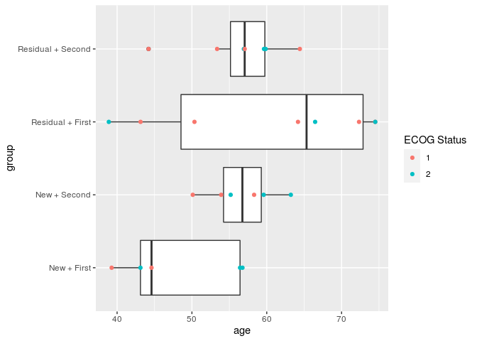
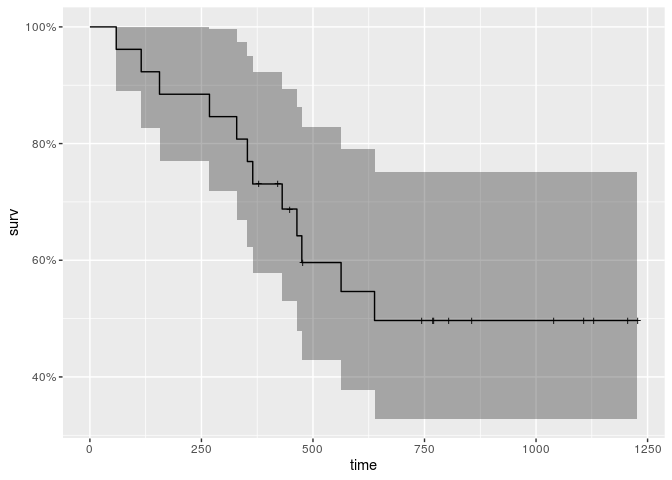
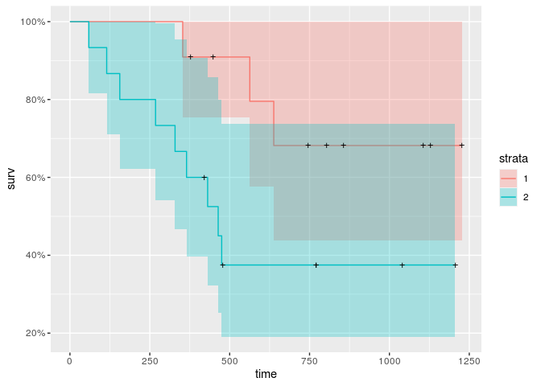
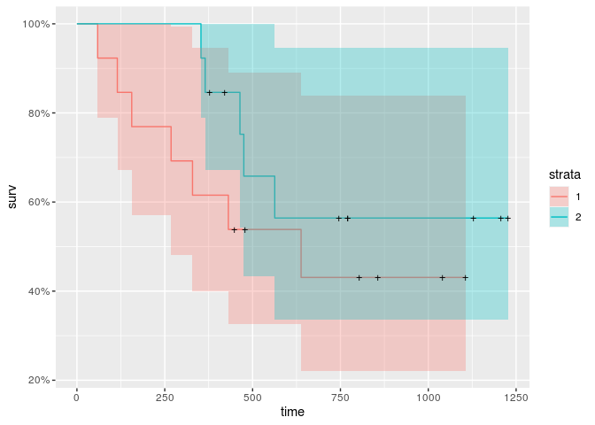
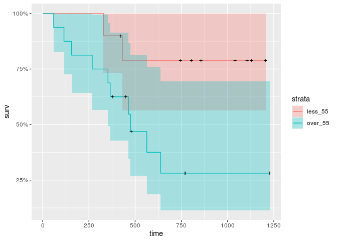
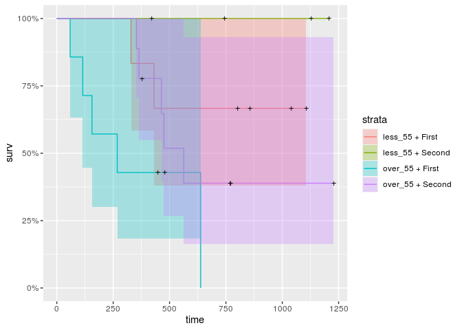
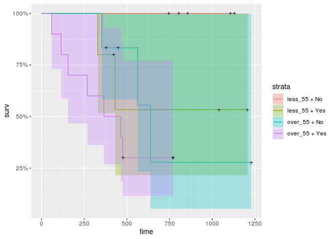
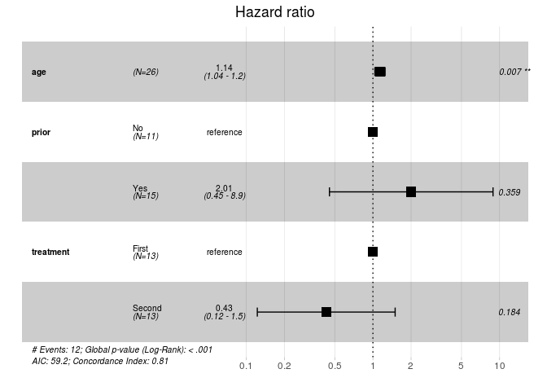

# Intro

We analyse dataset from *survival* library, called *ovarian*. We hawe followed categories:

* futime:	survival or censoring time
* fustat:	censoring status
* age: 	age in years
* resid.ds:	residual disease present (1 = no, 2 = yes)
* rx:	treatment group
* ecog.ps:  ECOG performance status (1 = better, 2 = worse)


```r
data(ovarian)
head(ovarian)
```

```
##   futime fustat     age resid.ds rx ecog.ps
## 1     59      1 72.3315        2  1       1
## 2    115      1 74.4932        2  1       1
## 3    156      1 66.4658        2  1       2
## 4    421      0 53.3644        2  2       1
## 5    431      1 50.3397        2  1       1
## 6    448      0 56.4301        1  1       2
```

# EDA

At all we have 26, without NA 26 - so, we can use all data.
Our data is censored - wisout censoring we have 14 entries
How many groups we have in every category?


```r
ovarian  %>% group_by(fustat, resid.ds, rx, ecog.ps) %>% summarise(n_entries = n(), .groups = 'keep')
```

```
## # A tibble: 14 x 5
## # Groups:   fustat, resid.ds, rx, ecog.ps [14]
##    fustat resid.ds    rx ecog.ps n_entries
##     <dbl>    <dbl> <dbl>   <dbl>     <int>
##  1      0        1     1       1         2
##  2      0        1     1       2         2
##  3      0        1     2       1         3
##  4      0        1     2       2         1
##  5      0        2     1       1         1
##  6      0        2     1       2         1
##  7      0        2     2       1         3
##  8      0        2     2       2         1
##  9      1        1     1       2         1
## 10      1        1     2       2         2
## 11      1        2     1       1         4
## 12      1        2     1       2         2
## 13      1        2     2       1         1
## 14      1        2     2       2         2
```

In range from 1 to 4. Not a lot of data, actually, but without zeros.

Is it any differences by age in different groups?


```r
data <- ovarian %>% mutate(group = factor(paste(ovarian$resid.ds, "+", ovarian$rx),
                           labels = c('New + First', 'New + Second', 'Residual + First', 'Residual + Second')))
ggplot(data, aes(x = age, y = group)) +
  geom_boxplot() + 
  geom_point(aes(color = as.factor(ecog.ps))) +
  scale_color_discrete(name = "ECOG Status")
```

<!-- -->

Perhaps, no

# Caplan-Meyer

At first, calculate total curve and get some data about it


```r
km <- with(ovarian, Surv(futime, fustat))
km_fit <- survfit(Surv(futime, fustat) ~ 1, data=ovarian)

summary(km_fit, times = seq(1, 1200, length.out=12))
```

```
## Call: survfit(formula = Surv(futime, fustat) ~ 1, data = ovarian)
## 
##  time n.risk n.event survival std.err lower 95% CI upper 95% CI
##     1     26       0    1.000  0.0000        1.000        1.000
##   110     25       1    0.962  0.0377        0.890        1.000
##   219     23       2    0.885  0.0627        0.770        1.000
##   328     22       1    0.846  0.0708        0.718        0.997
##   437     16       4    0.688  0.0919        0.529        0.894
##   546     12       2    0.596  0.0999        0.429        0.828
##   655     10       2    0.497  0.1051        0.328        0.752
##   764      9       0    0.497  0.1051        0.328        0.752
##   873      5       0    0.497  0.1051        0.328        0.752
##   982      5       0    0.497  0.1051        0.328        0.752
##  1091      4       0    0.497  0.1051        0.328        0.752
##  1200      2       0    0.497  0.1051        0.328        0.752
```

```r
autoplot(km_fit)
```

<!-- -->

How it can variate by different variables? 


```r
km_fit.desease <- survfit(Surv(futime, fustat) ~ resid.ds, data=ovarian)
autoplot(km_fit.desease)
```

<!-- -->

```r
km_fit.treatment <- survfit(Surv(futime, fustat) ~ rx, data=ovarian)
autoplot(km_fit.treatment)
```

<!-- -->

```r
km_fit.age <- survfit(Surv(futime, fustat) ~ age_f, data=ovarian %>% mutate(age_f = ifelse((age < 55), "less_55", "over_55")))
autoplot(km_fit.age)
```

<!-- -->

Age looks like strong factor, followed by residual desease. Treatment group isn't look as strong factor

But, perhaps, our treatment will be better for different age, or without residual desease?


```r
ovarian_plus <- ovarian %>% mutate(age_cat = ifelse((age < 55), "less_55", "over_55"),
              age_cat = factor(age_cat),
              treatment = factor(rx, labels=c("First","Second")),
              prior = factor(resid.ds, labels=c("No", "Yes")),
              groups1 = factor(paste(age_cat, '+', treatment)),
              groups2 = factor(paste(age_cat, '+', prior)))

km_treatment_fit <- survfit(Surv(futime, fustat) ~ groups1, data=ovarian_plus)
autoplot(km_treatment_fit)
```

<!-- -->

```r
km_prior_fit <- survfit(Surv(futime, fustat) ~ groups2, data=ovarian_plus)
autoplot(km_prior_fit)
```

<!-- -->

* Less, than 55 years and without previous disease - as expected, it is better case
* Less, than 55 years and second treatment is good idea. But how many obserwation we have? 4 - not a lot of (over 55 with second treatment is 9 entries) 

# Groups by survival

Perform logrank test


```r
survdiff(Surv(futime, fustat) ~ treatment, data = ovarian_plus)
```

```
## Call:
## survdiff(formula = Surv(futime, fustat) ~ treatment, data = ovarian_plus)
## 
##                   N Observed Expected (O-E)^2/E (O-E)^2/V
## treatment=First  13        7     5.23     0.596      1.06
## treatment=Second 13        5     6.77     0.461      1.06
## 
##  Chisq= 1.1  on 1 degrees of freedom, p= 0.3
```

```r
survdiff(Surv(futime, fustat) ~ age_cat, data = ovarian_plus)
```

```
## Call:
## survdiff(formula = Surv(futime, fustat) ~ age_cat, data = ovarian_plus)
## 
##                  N Observed Expected (O-E)^2/E (O-E)^2/V
## age_cat=less_55 10        2     5.63      2.34      4.49
## age_cat=over_55 16       10     6.37      2.06      4.49
## 
##  Chisq= 4.5  on 1 degrees of freedom, p= 0.03
```

```r
survdiff(Surv(futime, fustat) ~ prior, data = ovarian_plus)
```

```
## Call:
## survdiff(formula = Surv(futime, fustat) ~ prior, data = ovarian_plus)
## 
##            N Observed Expected (O-E)^2/E (O-E)^2/V
## prior=No  11        3     6.26      1.70      3.62
## prior=Yes 15        9     5.74      1.85      3.62
## 
##  Chisq= 3.6  on 1 degrees of freedom, p= 0.06
```

Ok, age as category is one and only significant group. How about age + treatment combination?


```r
logrank_test(Surv(futime, fustat) ~ groups1, data = ovarian_plus)
```

```
## 
## 	Asymptotic K-Sample Logrank Test
## 
## data:  Surv(futime, fustat) by
## 	 groups1 (less_55 + First, less_55 + Second, over_55 + First, over_55 + Second)
## chi-squared = 6.6514, df = 3, p-value = 0.08388
```

Nope(


# Estimate risc factors


```r
cox <- coxph(Surv(futime, fustat) ~ age + prior + treatment, data = ovarian_plus)
summary(cox)
```

```
## Call:
## coxph(formula = Surv(futime, fustat) ~ age + prior + treatment, 
##     data = ovarian_plus)
## 
##   n= 26, number of events= 12 
## 
##                    coef exp(coef) se(coef)      z Pr(>|z|)   
## age              0.1285    1.1372   0.0473  2.718  0.00657 **
## priorYes         0.6964    2.0065   0.7585  0.918  0.35858   
## treatmentSecond -0.8489    0.4279   0.6392 -1.328  0.18416   
## ---
## Signif. codes:  0 '***' 0.001 '**' 0.01 '*' 0.05 '.' 0.1 ' ' 1
## 
##                 exp(coef) exp(-coef) lower .95 upper .95
## age                1.1372     0.8794    1.0365     1.248
## priorYes           2.0065     0.4984    0.4537     8.874
## treatmentSecond    0.4279     2.3371    0.1222     1.498
## 
## Concordance= 0.812  (se = 0.066 )
## Likelihood ratio test= 16.77  on 3 df,   p=8e-04
## Wald test            = 14.63  on 3 df,   p=0.002
## Score (logrank) test = 20.76  on 3 df,   p=1e-04
```


Without interaction, just age is significant


```r
cox <- coxph(Surv(futime, fustat) ~ age * prior * treatment - age:prior:treatment, data = ovarian_plus)
summary(cox)
```

```
## Call:
## coxph(formula = Surv(futime, fustat) ~ age * prior * treatment - 
##     age:prior:treatment, data = ovarian_plus)
## 
##   n= 26, number of events= 12 
## 
##                                coef  exp(coef)   se(coef)      z Pr(>|z|)
## age                       2.214e-01  1.248e+00  1.944e-01  1.139    0.255
## priorYes                  8.650e+00  5.712e+03  1.088e+01  0.795    0.427
## treatmentSecond          -8.972e+00  1.269e-04  9.960e+00 -0.901    0.368
## age:priorYes             -1.285e-01  8.794e-01  1.946e-01 -0.660    0.509
## age:treatmentSecond       1.450e-01  1.156e+00  1.712e-01  0.847    0.397
## priorYes:treatmentSecond -9.756e-01  3.770e-01  1.694e+00 -0.576    0.565
## 
##                          exp(coef) exp(-coef) lower .95 upper .95
## age                      1.248e+00  8.014e-01 8.524e-01 1.826e+00
## priorYes                 5.712e+03  1.751e-04 3.126e-06 1.044e+13
## treatmentSecond          1.269e-04  7.878e+03 4.225e-13 3.813e+04
## age:priorYes             8.794e-01  1.137e+00 6.005e-01 1.288e+00
## age:treatmentSecond      1.156e+00  8.651e-01 8.264e-01 1.617e+00
## priorYes:treatmentSecond 3.770e-01  2.653e+00 1.363e-02 1.043e+01
## 
## Concordance= 0.867  (se = 0.046 )
## Likelihood ratio test= 19.73  on 6 df,   p=0.003
## Wald test            = 13.08  on 6 df,   p=0.04
## Score (logrank) test = 23.29  on 6 df,   p=7e-04
```


With interaction, none of them


```r
fit.coxph <- coxph(Surv(futime, fustat) ~ age + prior + treatment, data = ovarian_plus)
ggforest(fit.coxph, data = ovarian_plus)
```

<!-- -->


But about riscs:

* Age is significant predictor: the younger you are, the better the result)
* With residual desease, you'll be not so good (but this is not sure)
* With secont type of treatment you'll be better (slso not sure)


