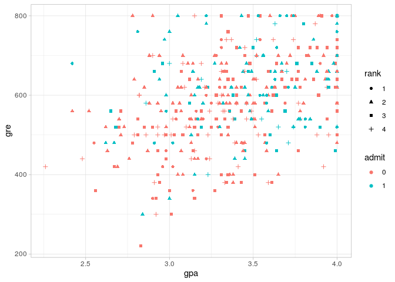
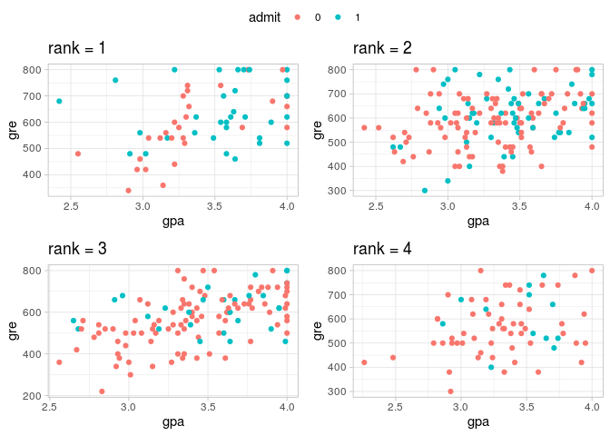
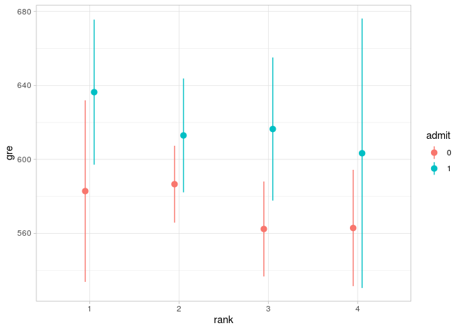
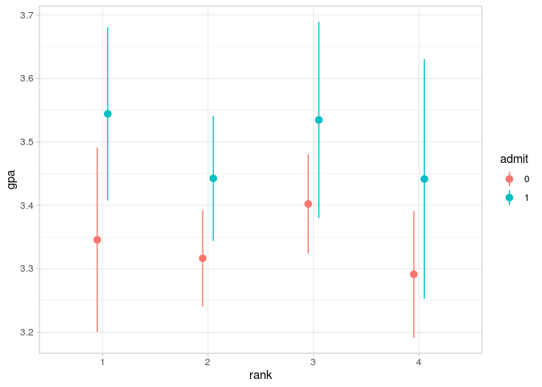
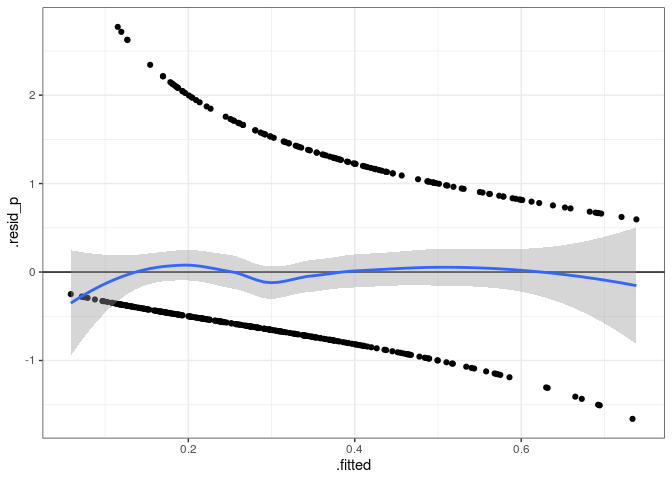
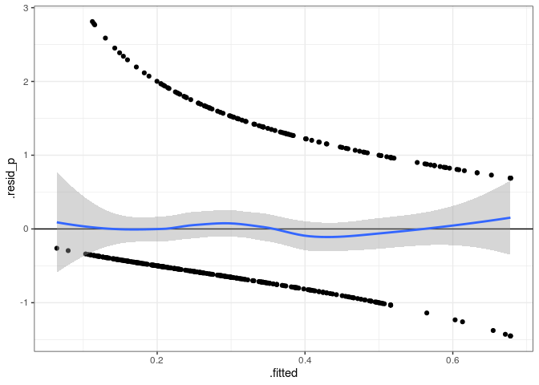
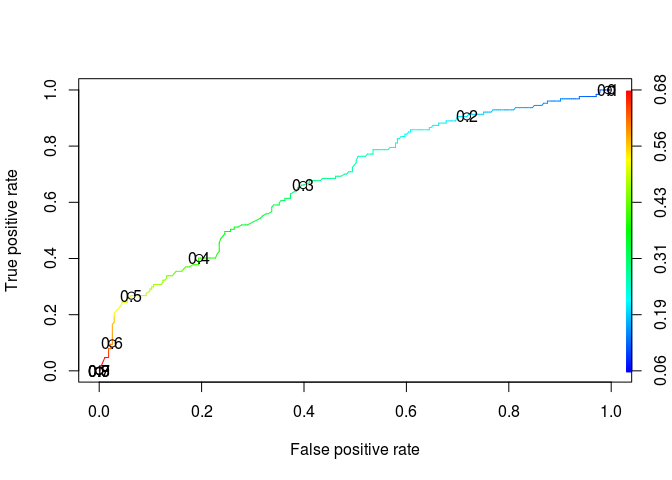
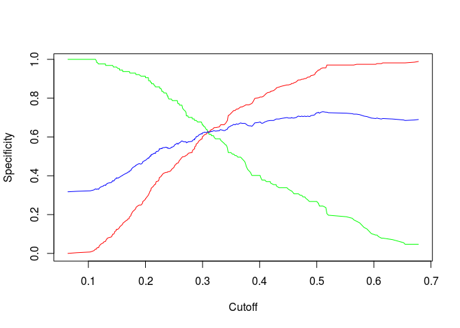
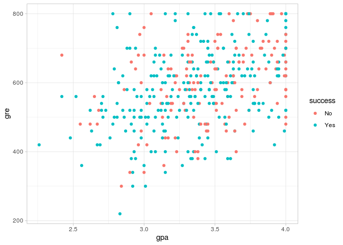

# Libraries

Read data and load libraries


```r
library(tidyverse)
library(ROCR)
library(ggpubr)


setwd('/home/alexey/BI/R/Project_5/')
data <- read.csv('https://stats.idre.ucla.edu/stat/data/binary.csv')
data %>% head()
```

```
##   admit gre  gpa rank
## 1     0 380 3.61    3
## 2     1 660 3.67    3
## 3     1 800 4.00    1
## 4     1 640 3.19    4
## 5     0 520 2.93    4
## 6     1 760 3.00    2
```

```r
data$rank <- as.factor(data$rank)
data$admit <- as.factor(data$admit)
```

# EDA


```r
colSums(is.na(data))
```

```
## admit   gre   gpa  rank 
##     0     0     0     0
```

```r
str(data)
```

```
## 'data.frame':	400 obs. of  4 variables:
##  $ admit: Factor w/ 2 levels "0","1": 1 2 2 2 1 2 2 1 2 1 ...
##  $ gre  : int  380 660 800 640 520 760 560 400 540 700 ...
##  $ gpa  : num  3.61 3.67 4 3.19 2.93 3 2.98 3.08 3.39 3.92 ...
##  $ rank : Factor w/ 4 levels "1","2","3","4": 3 3 1 4 4 2 1 2 3 2 ...
```

```r
ggplot(data, aes(y = gre, x = gpa)) +
  geom_point(aes(color = admit, shape = rank)) +
  theme_light()
```

<!-- -->

Oooom, bad data :( Let's see on different angles, perhaps, we'll find better look


```r
rank_drawer <- function(a){
  ggplot(data %>% filter(rank == a), aes(y = gre, x = gpa)) +
  geom_point(aes(color = admit)) +
  theme_light() + ggtitle(paste("rank =", a))
}

ggarrange(rank_drawer(1), rank_drawer(2),
          rank_drawer(3), rank_drawer(4),
          common.legend = T)
```

<!-- -->

Rank is important, ok, but nothing above it. Perhaps, our groups are equal and we can't find any data for fitting?

## ANOVA

Make two-way ANOVA and try to find out, is there any difference in **gre** and **gpa** according grouping by *admit* + *rank*.


```r
ggplot(data = data, aes(x = rank, y = gre, colour = admit)) +
  stat_summary(geom = 'pointrange', fun.data = mean_cl_normal, position = position_dodge(width = 0.2)) + 
  theme_light()
```

<!-- -->

```r
ggplot(data = data, aes(x = rank, y = gpa, colour = admit)) +
  stat_summary(geom = 'pointrange', fun.data = mean_cl_normal, position = position_dodge(width = 0.2)) + 
  theme_light()
```

<!-- -->

```r
data %>% group_by(rank, admit) %>% summarise(size = n())
```

```
## `summarise()` regrouping output by 'rank' (override with `.groups` argument)
```

```
## # A tibble: 8 x 3
## # Groups:   rank [4]
##   rank  admit  size
##   <fct> <fct> <int>
## 1 1     0        28
## 2 1     1        33
## 3 2     0        97
## 4 2     1        54
## 5 3     0        93
## 6 3     1        28
## 7 4     0        55
## 8 4     1        12
```

Sizes of groups' aren't equal, it isn't good, but not a strict rule. Go ahead.


```r
aov_gre <- aov(gre ~ rank*admit, data = data)
summary(aov_gre)
```

```
##              Df  Sum Sq Mean Sq F value  Pr(>F)   
## rank          3   86445   28815   2.219 0.08549 . 
## admit         1  133025  133025  10.242 0.00148 **
## rank:admit    3   13452    4484   0.345 0.79262   
## Residuals   392 5091362   12988                   
## ---
## Signif. codes:  0 '***' 0.001 '**' 0.01 '*' 0.05 '.' 0.1 ' ' 1
```

```r
aov_gpa <- aov(gpa ~ rank*admit, data = data)
summary(aov_gpa)
```

```
##              Df Sum Sq Mean Sq F value  Pr(>F)    
## rank          3   0.93  0.3103   2.207 0.08679 .  
## admit         1   1.69  1.6876  12.004 0.00059 ***
## rank:admit    3   0.06  0.0199   0.141 0.93524    
## Residuals   392  55.11  0.1406                    
## ---
## Signif. codes:  0 '***' 0.001 '**' 0.01 '*' 0.05 '.' 0.1 ' ' 1
```

O no.. O no, o no, no, no - there is some sense in the data, we must construct classifier. But it will be the ugliest one(

# log-LM


```r
fit <- glm(admit ~ gpa + gre + rank, data = data, family = binomial(link = 'logit'))
summary(fit)
```

```
## 
## Call:
## glm(formula = admit ~ gpa + gre + rank, family = binomial(link = "logit"), 
##     data = data)
## 
## Deviance Residuals: 
##     Min       1Q   Median       3Q      Max  
## -1.6268  -0.8662  -0.6388   1.1490   2.0790  
## 
## Coefficients:
##              Estimate Std. Error z value Pr(>|z|)    
## (Intercept) -3.989979   1.139951  -3.500 0.000465 ***
## gpa          0.804038   0.331819   2.423 0.015388 *  
## gre          0.002264   0.001094   2.070 0.038465 *  
## rank2       -0.675443   0.316490  -2.134 0.032829 *  
## rank3       -1.340204   0.345306  -3.881 0.000104 ***
## rank4       -1.551464   0.417832  -3.713 0.000205 ***
## ---
## Signif. codes:  0 '***' 0.001 '**' 0.01 '*' 0.05 '.' 0.1 ' ' 1
## 
## (Dispersion parameter for binomial family taken to be 1)
## 
##     Null deviance: 499.98  on 399  degrees of freedom
## Residual deviance: 458.52  on 394  degrees of freedom
## AIC: 470.52
## 
## Number of Fisher Scoring iterations: 4
```

## Test model


```r
fit_diag <- data.frame(.fitted = fitted(fit, type = 'response'),
                        .resid_p = resid(fit, type = 'pearson'))

ggplot(fit_diag, aes(y = .resid_p, x = .fitted)) + 
  geom_point() +
  theme_bw() +
  geom_hline(yintercept = 0) +  
  geom_smooth(method = 'loess')
```

```
## `geom_smooth()` using formula 'y ~ x'
```

<!-- -->

Bad one( Perhaps, drop one of predictors?


```r
drop1(fit, test = "Chi")
```

```
## Single term deletions
## 
## Model:
## admit ~ gpa + gre + rank
##        Df Deviance    AIC     LRT  Pr(>Chi)    
## <none>      458.52 470.52                      
## gpa     1   464.53 474.53  6.0143   0.01419 *  
## gre     1   462.88 472.88  4.3578   0.03684 *  
## rank    3   480.34 486.34 21.8265 7.088e-05 ***
## ---
## Signif. codes:  0 '***' 0.001 '**' 0.01 '*' 0.05 '.' 0.1 ' ' 1
```

```r
fit2 <- update(fit, .~.-gre)

fit2_diag <- data.frame(.fitted = fitted(fit2, type = 'response'),
                        .resid_p = resid(fit2, type = 'pearson'))

ggplot(fit2_diag, aes(y = .resid_p, x = .fitted)) + 
  geom_point() +
  theme_bw() +
  geom_hline(yintercept = 0) +  
  geom_smooth(method = 'loess')
```

```
## `geom_smooth()` using formula 'y ~ x'
```

<!-- -->

AIC is bigger at 2, but head is smoother, hmmm... Second model, I choose you!


```r
overdisp_fun <- function(model) {
  rdf <- df.residual(model)  # Число степеней свободы N - p
  if (any(class(model) == 'negbin')) rdf <- rdf - 1 ## учитываем k в NegBin GLMM
  rp <- residuals(model,type='pearson') # Пирсоновские остатки
  Pearson.chisq <- sum(rp^2) # Сумма квадратов остатков, подчиняется Хи-квадрат распределению
  prat <- Pearson.chisq/rdf  # Отношение суммы квадратов остатков к числу степеней свободы
  pval <- pchisq(Pearson.chisq, df=rdf, lower.tail=FALSE) # Уровень значимости
  c(chisq=Pearson.chisq,ratio=prat,rdf=rdf,p=pval)        # Вывод результатов
}

overdisp_fun(fit2)
```

```
##       chisq       ratio         rdf           p 
## 400.7832786   1.0146412 395.0000000   0.4096454
```

# Estimations

Ok, how we can use our classifier, and is it good? First of all, plot ROC


```r
data$responce <- predict(fit2, type = 'response')


prediction <- prediction(data$responce, data$admit)
perf <- performance(prediction, "tpr", "fpr")
plot(perf, colorize=T, print.cutoffs.at = seq(0, 1, by = 0.1))
```

<!-- -->

Too close to diagonal - bad classifier(


```r
spec <- performance(prediction, x.measure = 'cutoff', measure = 'spec')
sens <- performance(prediction, x.measure = 'cutoff', measure = 'sens')
acc <- performance(prediction, x.measure = 'cutoff', measure = 'acc')

plot(spec, col = 'red')
plot(sens, col = 'green', add = T)
plot(acc, col = 'blue', add = T)
```

<!-- -->

Best cutoff is about 0.3. Where exactly?


```r
perf <- performance(prediction, "sens", "spec")
df <- data.frame(cut = perf@alpha.values[[1]], sens = perf@x.values[[1]], spec = perf@y.values[[1]])
df[which.max(df$sens + df$spec), "cut"]
```

```
## [1] 0.2978147
```

Arrr, 0.3 it is.


```r
data$admit.from.lm <- ifelse(data$responce >= 0.3, 1, 0)

res <- data %>% group_by(admit, admit.from.lm) %>% summarise(count = n(), .groups = "keep")
res$group <- c("TN", "FP", "FN", "TP")
res
```

```
## # A tibble: 4 x 4
## # Groups:   admit, admit.from.lm [4]
##   admit admit.from.lm count group
##   <fct>         <dbl> <int> <chr>
## 1 0                 0   165 TN   
## 2 0                 1   108 FP   
## 3 1                 0    43 FN   
## 4 1                 1    84 TP
```


```r
recall <- as.numeric(res[4,3])/(as.numeric(res[4,3]) + as.numeric(res[3,3]))

precision <- as.numeric(res[4,3])/(as.numeric(res[4,3]) + as.numeric(res[2,3]))
```

So, for our classifier, **Recall** is 0.6614173, **Presicion** is 0.4375

# Final plot

Draw final plot - which points are predicted correctly


```r
data$success <- ifelse(data$admit == data$admit.from.lm, "Yes", "No")

ggplot(data, aes(y = gre, x = gpa)) +
  geom_point(aes(color = success)) +
  theme_light()
```

<!-- -->

More green than red! Wow! Such science!
