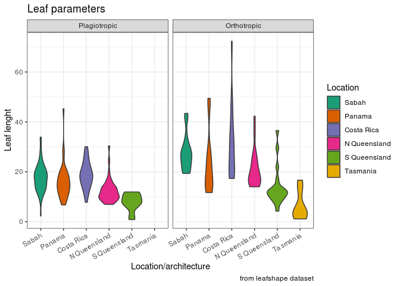

## Replace in dataframe all NA-values by mean


```r
library(dplyr)
library(ggplot2)
library(RColorBrewer)
library(DAAG)
setwd('/home/alexey/BI/Institute Bioinformatic/')
```


```r
df <- read.csv('menu.csv')
# add 20% NA to dataset, except test data in first three columns - googled on
# (https://stackoverflow.com/questions/20873078/how-do-i-add-random-nas-into-a-data-frame)

while(sum(is.na(df) == TRUE) < (nrow(df) * ncol(df) * 0.2)){
  df[sample(nrow(df),1), sample(ncol(df)-3,1)+3] <- NA
}

#Look at random point in Beaverages and Calories - it`s most useful as an example
df[111:120, c(1:2,4:6)]
```

```
##      Category                       Item Calories Calories.from.Fat Total.Fat
## 111 Beverages  Coca-Cola Classic (Small)      140                 0         0
## 112 Beverages Coca-Cola Classic (Medium)      200                 0         0
## 113 Beverages  Coca-Cola Classic (Large)       NA                 0         0
## 114 Beverages  Coca-Cola Classic (Child)       NA                 0         0
## 115 Beverages          Diet Coke (Small)        0                 0         0
## 116 Beverages         Diet Coke (Medium)        0                NA         0
## 117 Beverages          Diet Coke (Large)       NA                 0         0
## 118 Beverages          Diet Coke (Child)        0                 0         0
## 119 Beverages          Dr Pepper (Small)      140                 0         0
## 120 Beverages         Dr Pepper (Medium)      190                NA         0
```

Replace by mean in all column or by mean in their group? Make both of them.

Calculate mean for every group in category - just to be sure, that we do it correct  in downstream


```r
mean.mc_data <- df %>% group_by(Category) %>% summarise_if(is.numeric, mean, na.rm=T)
mean.mc_data[,1:4]
```

```
## # A tibble: 9 x 4
##   Category           Calories Calories.from.Fat Total.Fat
##   <fct>                 <dbl>             <dbl>     <dbl>
## 1 Beef & Pork            491.           215.      24.8   
## 2 Beverages              122.             0.870    0.0962
## 3 Breakfast              540.           244.      28.2   
## 4 Chicken & Fish         594.           218.      27.2   
## 5 Coffee & Tea           289.            74.0      8.31  
## 6 Desserts               252.            73.3      7.36  
## 7 Salads                 335            122.      12.3   
## 8 Smoothies & Shakes     541.           140.      13.4   
## 9 Snacks & Sides         224.            87        9.64
```

```r
#Replace NA by average from all dataset
NA.replaced.by.mean.mc_data <- df %>% 
                                mutate_if(is.numeric, function(x) ifelse(is.na(x), mean(x, na.rm = TRUE),  x))

NA.replaced.by.mean.mc_data[111:120, c(1:2,4:6)]
```

```
##      Category                       Item Calories Calories.from.Fat Total.Fat
## 111 Beverages  Coca-Cola Classic (Small) 140.0000             0.000         0
## 112 Beverages Coca-Cola Classic (Medium) 200.0000             0.000         0
## 113 Beverages  Coca-Cola Classic (Large) 374.1707             0.000         0
## 114 Beverages  Coca-Cola Classic (Child) 374.1707             0.000         0
## 115 Beverages          Diet Coke (Small)   0.0000             0.000         0
## 116 Beverages         Diet Coke (Medium)   0.0000           124.204         0
## 117 Beverages          Diet Coke (Large) 374.1707             0.000         0
## 118 Beverages          Diet Coke (Child)   0.0000             0.000         0
## 119 Beverages          Dr Pepper (Small) 140.0000             0.000         0
## 120 Beverages         Dr Pepper (Medium) 190.0000           124.204         0
```

Make a replacement. Hmm, our medium DrPepper now have lots of calories from fat :)


```r
#Replace by mean in their own groups

NA.replaced.by.group.mean.mc_data <- df %>% 
                                     group_by(Category) %>% 
                                     group_modify(~ {.x %>% 
                                                        mutate_if(is.numeric, function(x) ifelse(is.na(x), mean(x, na.rm =TRUE), x))})
NA.replaced.by.group.mean.mc_data[16:25, c(1:2,4:6)]
```

```
## # A tibble: 10 x 5
## # Groups:   Category [1]
##    Category  Item                       Calories Calories.from.Fat Total.Fat
##    <fct>     <fct>                         <dbl>             <dbl>     <dbl>
##  1 Beverages Coca-Cola Classic (Small)      140              0             0
##  2 Beverages Coca-Cola Classic (Medium)     200              0             0
##  3 Beverages Coca-Cola Classic (Large)      122.             0             0
##  4 Beverages Coca-Cola Classic (Child)      122.             0             0
##  5 Beverages Diet Coke (Small)                0              0             0
##  6 Beverages Diet Coke (Medium)               0              0.870         0
##  7 Beverages Diet Coke (Large)              122.             0             0
##  8 Beverages Diet Coke (Child)                0              0             0
##  9 Beverages Dr Pepper (Small)              140              0             0
## 10 Beverages Dr Pepper (Medium)             190              0.870         0
```
Much better!


---

## Draw a violin plot


```r
data("leafshape")
leafshape$arch <- factor(leafshape$arch, labels = c("Plagiotropic", "Orthotropic"))

ggplot(data = leafshape, aes(x = location, y = bladelen, fill = location)) + 
  geom_violin() + 
  facet_grid(~arch) +
  labs(title = "Leaf parameters", 
       caption = "from leafshape dataset",
       x = "Location/architecture",
       y = "Leaf lenght",
       fill = "Location") + 
  theme_bw() + 
  scale_fill_brewer(palette = "Dark2") +
  theme(axis.text.x = element_text(angle = 30, hjust = 1))
```

<!-- -->


