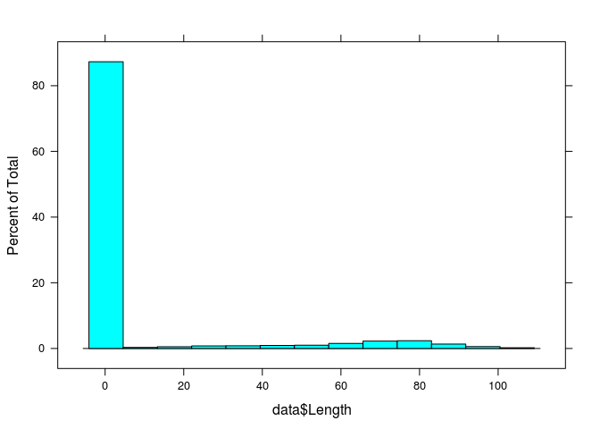
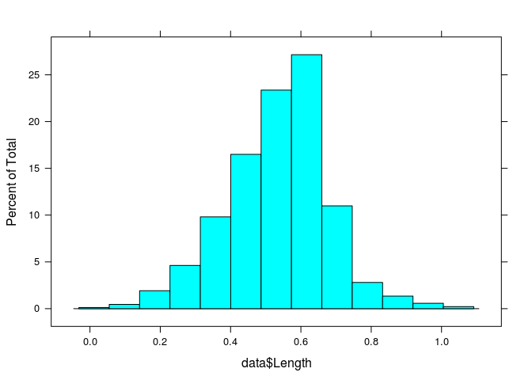

## Libraries


```r
if (!require(ggplot2)) install.packages('ggplot2')
if (!require(car)) install.packages('car')
if (!require(dplyr)) install.packages('dplyr')
if (!require(lattice)) install.packages('lattice')
if (!require(psych)) install.packages('psych')


library(ggplot2)
library(car)
library(dplyr)
library(lattice)
library(psych)
```

---

## Read Data

Function for export our data in batch. Please, use full path to .csv files, and be sure, that you folder contains correct files


```r
read_data <- function(file){
  
  correct_order <- c("Source", "Rings", "Sex", "Length", "Diameter", "Height", "Whole_weight", "Shucked_weight", "Viscera_weight", "Shell_weight")
    
    data <- read.csv(file)
    data %>%
    rename(Sex = starts_with('Sex.')) %>% 
    mutate(Sex = recode_factor(Sex, `1` = "Male", `2` = "Female", `3` = "Juvenile")) %>% 
    mutate(across(!Sex, as.numeric)) %>% 
    mutate(Source = factor(gsub(pattern = "\\.csv$", "", basename(file)))) %>% 
    relocate(all_of(correct_order))
}

batch_read_data <- function(path){
  library(dplyr)
  
  files <- list.files(path = path, pattern = "*.csv", full.names = T)
  sapply(files, read_data, simplify = F) %>% bind_rows()
}
```

Function return a data frame. Use full path, like one below:


```r
data <- batch_read_data("/home/alexey/BI/R/Project_1/Data/")
```

---

## EDA and Pictures


### Correction & Outliers

We have qite many data, so we will use a strict criteria for outliers: drop all before Q1 - 1.5 IQR and above Q3 + 1.5 IQR. But at first, we will see a raw distribution in occasion of incorrect data. Also check at the end, how many NAs we will obtain.

---

#### Factor variables

They are "Source" and "Sex".
"Source" not useful for us, but why not. Let`s see, who is lasy


```r
histogram(data$Source)
```

<!-- -->

Also check the data about sex


```r
histogram(data$Sex)
```

<!-- -->

Ok, here we see some misinformation. Fotrunally, we can correct in easily


```r
data <- data %>% mutate(Sex = replace(Sex, Sex == "three", "Juvenile")) %>% 
  mutate(Sex = replace(Sex, Sex == "male", "Male")) %>% 
  mutate(Sex = replace(Sex, Sex == "one", "Male"))
```

---

#### Numerical variable

It will be "Rings","Length", "Diameter", "Height", "Whole_weight", "Shucked_weight", "Viscera_weight" and "Shell_weight".
It will be boring to analyze them one by one. Draw a common graph for all of them


```r
ggplot(stack(data %>% select(-Source, -Sex)), aes(x = ind, y = values)) +
  geom_boxplot() + 
  coord_flip() +
  theme_minimal()
```

<!-- -->

Obvioustly, there is some troubles with "Length". Let`s see in details
 

```r
histogram(data$Length)
```

<!-- -->

That`s not good. 
Why it happend? Draw a histogram plot for every person in our table


```r
ggplot(data, aes(Length, color = Source)) + geom_bar() + facet_wrap(. ~ Source)
```

<!-- -->

Looks like Sidorov uses mm instead cm. Let's check it: make two datasets, one - with all data (except Sidorov's), and another - with Sidorov`s only ( and divide values by 100), and compare them by t-test. If there will be no difference between them, we will merge them 


```r
data.no.Sidorov <- data %>% filter(Source != "Sidorov")
data.Sidorov <- data %>% filter(Source == "Sidorov") %>% mutate(Length = Length / 100)

res = t.test(data.no.Sidorov$Length, data.Sidorov$Length)
```

p-value of our data is 0, so we can`t find differences between groups. Merge them


```r
data <- bind_rows(data.no.Sidorov, data.Sidorov)
histogram(data$Length)
```

<!-- -->

Looks better. 

Okay, come back and draw another boxplot


```r
ggplot(stack(data %>% select(-Source, -Sex)), aes(x = ind, y = values)) +
  geom_boxplot() + 
  coord_flip() +
  theme_minimal()
```

<!-- -->

Better. Also remove 'Rings' - they are qite big for this plot...


```r
ggplot(stack(data %>% select(-Source, -Sex, -Rings)), aes(x = ind, y = values)) +
  geom_boxplot() + 
  coord_flip() +
  theme_minimal()
```

<!-- -->

Looks good. Cut the outliers for all of them


```r
outliers_cutter <- function(df, column) {
  outliers <- boxplot(df[,column], plot=FALSE)$out
  df[df[,column] %in% outliers, column] <- NA
  return(df)
}

data <- outliers_cutter(data, "Rings")
data <- outliers_cutter(data, "Whole_weight")
data <- outliers_cutter(data, "Shucked_weight")
data <- outliers_cutter(data, "Viscera_weight")
data <- outliers_cutter(data, "Shell_weight")
```

Btw, how about all our introduced NA? Are there a lot of them now?


```r
contain.na.rows <- which(rowSums(is.na(data)) >= 1)
contain.lots.na.rows <- which(rowSums(is.na(data)) >= 2)
do.not.contain.na.rows <- rowSums(!is.na(data))
```

So there is 362 entries vith one or more NAs; 40 entries with two or more NAs in a row. 
Without NA we have 4177 entries. I suppose, we shouldn't eliminate all NA, remove only strings with more than one NA. They are only 40


```r
data <- data[which(rowSums(is.na(data)) <= 2),]
```

---

### Correlation between vars

Roughly see at our data - subsample 100 entries and plot diagrams 

```r
plot(data %>% sample_n(100))
```

<!-- -->

A lot of mess, but obvious idea - "Length", "Diameter", "Height", "Whole_weight", "Shucked_weight", "Viscera_weight", "Shell_weight" have some sort of correlation. How about others? These groups looks similar, so select only two of them - "Length" and "Whole_weight", and redraw the plot


```r
plot(data %>% select(Source, Sex, Rings, Length, Whole_weight) %>% sample_n(100))
```

<!-- -->

So, we can try to reveal three hypotises:

1. There might be a correlation between measured "Length", "Diameter", "Height", "Whole_weight", "Shucked_weight", "Viscera_weight", "Shell_weight"
2. "Sex" as a group is significant: mussels with different gender, perhaps, had different length ("Length") or other body measurements
3. Roughly, "Rings" also can be linked to body measurement

---

## Mean and SD for Length

What is mean and sd for "Length" in every "Sex" in our dataset? Let's find out


```r
male <- data %>% filter(Sex == "Male")
female <- data %>% filter(Sex == "Female")
juvenile <- data %>% filter(Sex == "Juvenile")
```

So, the data is: 

1. Male: mean: 0.575568 sd: 0.1258246,
2. Female: mean: 0.5968196 sd: 0.1109584,
3. For kids: mean: 0.428035 sd: 0.1266914.

---

## Height is no more 0.165

What is a part of our dataset, that "Height" parameter is no more than 0.165? Btw, have we have 2 NA in this data, but is is really small amount, so ignore them and calculate value 


```r
res <- nrow(data %>% filter(Height <= 0.165))/nrow(data %>% filter(!is.na(data)))
```

So, height less than 0.165 (or equal) is in a 0.7617 of entries

---

## Length, which is more than in 92% of entries

What is "Length" value, which corresponds to >92% of our data? Hmm, perhaps, question in 92th percentile of variable? If that,


```r
q <- quantile(data %>% filter(!is.na(data)) %>% select(Length), probs = c(0, 0.92, 1), na.rm = T)
```

0.71 is "Length" value, corresponds to 92% of values in dataset

---

## Z-score of Length


```r
data <- data %>% mutate(Lenght_z_scores = (Length - mean(Length, na.rm = T))/sd(Length, na.rm = T))
```

No visual data provided, just new column in data

---

## Compare diameter of 5- and 15-rings mussels

We suspect greater diameter in mussels with 15 rings rings, so we should use one-way t-test for our data


```r
comp.data <- data %>% filter(Rings == 5 |  Rings == 15) %>% select(Rings, Diameter)

r5 <- comp.data %>% filter(Rings == 5) %>% select(Diameter)
r15 <- comp.data %>% filter(Rings == 15) %>% select(Diameter)

fit <- t.test(r15, r5, alternative = "greater")
```

Diameter of mussles with 5 rings is significantly less, than one with 15 rings in one-way T-test (p-valye is 0). Mean diameter for this musseles are 0.247 and 0.44 respectively.

---

## Diameter and Weight 

We told previously about possible correlation between "Diameter" and "Whole_weight" data. Let's check this idea. All variables is continious, so we can use Pearson correlation


```r
test.data <- data %>% select(Diameter, Whole_weight, Sex)
test.data <- test.data[!rowSums(is.na(test.data)),]

fit <- corr.test(test.data$Diameter, test.data$Whole_weight, method = "spearman")
```

Ok, p-value is 0 and less 0.05, so, there is a correlation. Draw it


```r
ggplot(test.data, aes(x = Diameter, Whole_weight, color = Sex)) +
  geom_point() +
  ylab("Mussel weight") +
  xlab('Mussel diameter') +
  ggtitle(paste0("Correlation between mussle diameter and wheight. R: ", round(fit$r, 3), " (p-value = ", round(fit$p, 3), ")")) +
  theme_minimal()
```

<!-- -->

So, There is a significant correlation.
